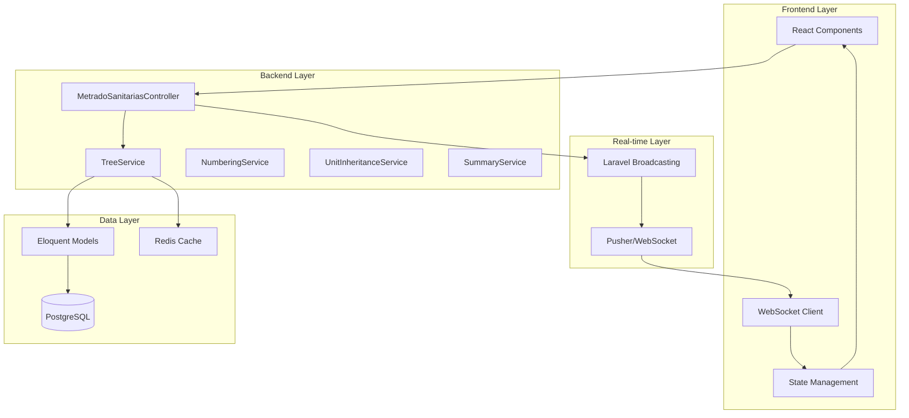

# Design Document: Sistema de Metrados Sanitarios Dinámico

## Overview

El Sistema de Metrados Sanitarios Dinámico es una aplicación web que permite gestionar hojas de cálculo de metrados con estructura jerárquica de árbol, numeración automática, resúmenes dinámicos y sincronización en tiempo real. El sistema se integra en una aplicación Laravel 11 con Inertia.js y React existente.

### Objetivos del Diseño

- Proporcionar una estructura de árbol jerárquica flexible para organizar metrados sanitarios
- Implementar numeración automática descendente compartida entre módulos
- Sincronizar cambios en tiempo real entre múltiples usuarios
- Generar resúmenes dinámicos consolidados por módulo
- Mantener integridad referencial y persistencia robusta en base de datos
- Integrar seamlessly con la arquitectura existente (AguaCalculation, DesagueCalculation)

### Alcance

El diseño cubre:
- Modelo de datos para estructura de árbol jerárquica
- Arquitectura de componentes frontend (React + Inertia.js)
- API backend (Laravel controllers y services)
- Sistema de numeración automática
- Algoritmo de herencia de unidades
- Serialización/deserialización de árbol
- Broadcasting en tiempo real
- Validación de datos

## Architecture

### Arquitectura General


El sistema sigue una arquitectura de tres capas:



### Patrones Arquitectónicos

1. **Repository Pattern**: Abstracción de acceso a datos para nodos del árbol
2. **Service Layer**: Lógica de negocio separada de controladores
3. **Observer Pattern**: Broadcasting de eventos para sincronización en tiempo real
4. **Composite Pattern**: Estructura de árbol con nodos que pueden contener otros nodos
5. **Strategy Pattern**: Diferentes estrategias de cálculo según tipo de nodo

### Flujo de Datos

1. **Lectura**: Frontend → Controller → TreeService → Repository → Database → Deserialización → Estado React
2. **Escritura**: UI Event → Optimistic Update → API Request → Validation → TreeService → Database → Broadcasting → Otros Clientes
3. **Cálculo**: Cambio en Partida → SummaryService → Recálculo de totales → Actualización de Resumen → Broadcasting

## Components and Interfaces

### Frontend Components

#### 1. MetradosTreeView (Componente Principal)

**Responsabilidades**:
- Renderizar la estructura de árbol completa
- Gestionar estado local del árbol (expandido/colapsado)
- Coordinar operaciones CRUD de nodos
- Sincronizar con backend vía API

**Props**:
```typescript
interface MetradosTreeViewProps {
  projectId: number;
  modules: Module[];
  initialTree: TreeNode[];
  canEdit: boolean;
}
```

**Estado**:
```typescript
interface TreeState {
  nodes: TreeNode[];
  expandedNodes: Set<string>;
  selectedNode: string | null;
  isDirty: boolean;
  isSaving: boolean;
}
```

#### 2. TreeNode (Componente Recursivo)

**Responsabilidades**:
- Renderizar un nodo individual y sus hijos
- Manejar interacciones (click, drag, edit)
- Aplicar estilos según tipo de nodo

**Props**:
```typescript
interface TreeNodeProps {
  node: TreeNode;
  level: number;
  onUpdate: (nodeId: string, data: Partial<TreeNode>) => void;
  onDelete: (nodeId: string) => void;
  onAddChild: (parentId: string, type: NodeType) => void;
  onMove: (nodeId: string, newParentId: string, position: number) => void;
  isExpanded: boolean;
  onToggleExpand: (nodeId: string) => void;
}
```

#### 3. ModuleColumns (Componente de Columnas Dinámicas)

**Responsabilidades**:
- Renderizar columnas por cada módulo
- Gestionar input de valores numéricos
- Calcular totales por fila

**Props**:
```typescript
interface ModuleColumnsProps {
  node: TreeNode;
  modules: Module[];
  values: Record<string, number>;
  onValueChange: (moduleId: string, value: number) => void;
  readonly: boolean;
}
```

#### 4. DynamicSummary (Componente de Resumen)

**Responsabilidades**:
- Mostrar tabla consolidada de totales
- Agrupar por títulos y subtítulos
- Actualizar en tiempo real

**Props**:
```typescript
interface DynamicSummaryProps {
  tree: TreeNode[];
  modules: Module[];
}
```

### Backend Services

#### 1. TreeService

**Responsabilidades**:
- Gestionar operaciones CRUD del árbol
- Coordinar servicios de numeración y herencia
- Serializar/deserializar estructura

**Métodos principales**:
```php
class TreeService
{
    public function getTree(int $projectId): array;
    public function createNode(int $projectId, array $data): TreeNode;
    public function updateNode(string $nodeId, array $data): TreeNode;
    public function deleteNode(string $nodeId): void;
    public function moveNode(string $nodeId, ?string $newParentId, int $position): void;
    public function duplicateNode(string $nodeId): TreeNode;
    private function serialize(Collection $nodes): array;
    private function deserialize(array $data): Collection;
}
```

#### 2. NumberingService

**Responsabilidades**:
- Calcular numeración jerárquica automática
- Iniciar en 04 para sanitarias
- Recalcular al mover/eliminar nodos

**Métodos principales**:
```php
class NumberingService
{
    public function calculateNumbering(Collection $nodes, int $startNumber = 4): void;
    public function recalculateAfterMove(string $nodeId): void;
    public function recalculateAfterDelete(string $parentId): void;
    private function assignNumber(TreeNode $node, string $prefix, int $sequence): void;
}
```

#### 3. UnitInheritanceService

**Responsabilidades**:
- Propagar unidades desde subtítulos a hijos
- Actualizar unidades al cambiar jerarquía
- Resolver unidad heredada para cada nodo

**Métodos principales**:
```php
class UnitInheritanceService
{
    public function propagateUnit(string $subtitleId, string $unit): void;
    public function resolveInheritedUnit(TreeNode $node): ?string;
    public function updateInheritanceAfterMove(string $nodeId): void;
}
```

#### 4. SummaryService

**Responsabilidades**:
- Calcular totales por módulo
- Generar estructura de resumen consolidado
- Agregar valores por jerarquía

**Métodos principales**:
```php
class SummaryService
{
    public function calculateSummary(int $projectId): array;
    private function aggregateByHierarchy(Collection $nodes): array;
    private function calculateTotals(array $values): array;
}
```

### API Endpoints

```
GET    /api/projects/{project}/metrados-sanitarias/tree
POST   /api/projects/{project}/metrados-sanitarias/nodes
PUT    /api/projects/{project}/metrados-sanitarias/nodes/{node}
DELETE /api/projects/{project}/metrados-sanitarias/nodes/{node}
POST   /api/projects/{project}/metrados-sanitarias/nodes/{node}/move
POST   /api/projects/{project}/metrados-sanitarias/nodes/{node}/duplicate
GET    /api/projects/{project}/metrados-sanitarias/summary
```

## Data Models

### Base de Datos

#### Tabla: metrado_sanitarias_nodes

```sql
CREATE TABLE metrado_sanitarias_nodes (
    id UUID PRIMARY KEY DEFAULT gen_random_uuid(),
    project_id INTEGER NOT NULL REFERENCES projects(id) ON DELETE CASCADE,
    parent_id UUID REFERENCES metrado_sanitarias_nodes(id) ON DELETE CASCADE,
    node_type VARCHAR(20) NOT NULL CHECK (node_type IN ('titulo', 'subtitulo', 'partida')),
    name VARCHAR(255) NOT NULL,
    numbering VARCHAR(50),
    unit VARCHAR(50),
    level INTEGER NOT NULL,
    position INTEGER NOT NULL,
    created_at TIMESTAMP DEFAULT CURRENT_TIMESTAMP,
    updated_at TIMESTAMP DEFAULT CURRENT_TIMESTAMP,
    
    INDEX idx_project_parent (project_id, parent_id),
    INDEX idx_project_level (project_id, level),
    INDEX idx_position (parent_id, position)
);
```

#### Tabla: metrado_sanitarias_values

```sql
CREATE TABLE metrado_sanitarias_values (
    id BIGSERIAL PRIMARY KEY,
    node_id UUID NOT NULL REFERENCES metrado_sanitarias_nodes(id) ON DELETE CASCADE,
    module_id INTEGER NOT NULL REFERENCES modules(id) ON DELETE CASCADE,
    value DECIMAL(10, 2) NOT NULL DEFAULT 0,
    created_at TIMESTAMP DEFAULT CURRENT_TIMESTAMP,
    updated_at TIMESTAMP DEFAULT CURRENT_TIMESTAMP,
    
    UNIQUE (node_id, module_id),
    INDEX idx_node (node_id)
);
```

#### Tabla: metrado_sanitarias_user_state

```sql
CREATE TABLE metrado_sanitarias_user_state (
    id BIGSERIAL PRIMARY KEY,
    user_id INTEGER NOT NULL REFERENCES users(id) ON DELETE CASCADE,
    project_id INTEGER NOT NULL REFERENCES projects(id) ON DELETE CASCADE,
    expanded_nodes JSONB DEFAULT '[]',
    updated_at TIMESTAMP DEFAULT CURRENT_TIMESTAMP,
    
    UNIQUE (user_id, project_id)
);
```

### Modelos Eloquent

#### TreeNode Model

```php
class MetradoSanitariasNode extends Model
{
    protected $table = 'metrado_sanitarias_nodes';
    protected $keyType = 'string';
    public $incrementing = false;
    
    protected $fillable = [
        'project_id', 'parent_id', 'node_type', 'name',
        'numbering', 'unit', 'level', 'position'
    ];
    
    protected $casts = [
        'level' => 'integer',
        'position' => 'integer',
    ];
    
    // Relationships
    public function parent(): BelongsTo;
    public function children(): HasMany;
    public function values(): HasMany;
    public function project(): BelongsTo;
    
    // Scopes
    public function scopeRootNodes(Builder $query): Builder;
    public function scopeByLevel(Builder $query, int $level): Builder;
    public function scopeOrdered(Builder $query): Builder;
    
    // Methods
    public function isTitle(): bool;
    public function isSubtitle(): bool;
    public function isPartida(): bool;
    public function canHaveChildren(): bool;
    public function getInheritedUnit(): ?string;
    public function getDescendants(): Collection;
}
```

#### NodeValue Model

```php
class MetradoSanitariasValue extends Model
{
    protected $table = 'metrado_sanitarias_values';
    
    protected $fillable = ['node_id', 'module_id', 'value'];
    
    protected $casts = [
        'value' => 'decimal:2',
    ];
    
    public function node(): BelongsTo;
    public function module(): BelongsTo;
}
```

### TypeScript Interfaces

```typescript
enum NodeType {
  TITULO = 'titulo',
  SUBTITULO = 'subtitulo',
  PARTIDA = 'partida'
}

interface TreeNode {
  id: string;
  projectId: number;
  parentId: string | null;
  nodeType: NodeType;
  name: string;
  numbering: string | null;
  unit: string | null;
  level: number;
  position: number;
  children: TreeNode[];
  values: Record<string, number>; // moduleId -> value
  inheritedUnit: string | null;
  createdAt: string;
  updatedAt: string;
}

interface Module {
  id: number;
  name: string;
  order: number;
}

interface SummaryRow {
  nodeId: string;
  name: string;
  numbering: string | null;
  unit: string | null;
  level: number;
  values: Record<string, number>; // moduleId -> total
  exterior: number;
  cisterna: number;
  total: number;
}

interface TreeOperationResult {
  success: boolean;
  node?: TreeNode;
  error?: string;
  affectedNodes?: string[]; // IDs de nodos que necesitan actualización
}
```


## Correctness Properties

A property is a characteristic or behavior that should hold true across all valid executions of a system-essentially, a formal statement about what the system should do. Properties serve as the bridge between human-readable specifications and machine-verifiable correctness guarantees.

### Property Reflection

Después de analizar todos los criterios de aceptación, he identificado las siguientes redundancias:

- **Propiedades 1.1 y 7.1**: Ambas hablan de persistir el nivel jerárquico. Se consolidan en una sola propiedad.
- **Propiedades 1.3 y 7.3**: Ambas hablan de eliminación en cascada. Se consolidan en una sola propiedad.
- **Propiedades 1.4 y 7.5**: Ambas hablan del round-trip de la estructura completa. Se consolidan en una sola propiedad.
- **Propiedades 2.2 y 2.3**: Ambas hablan de qué tipos de hijos pueden tener Titulo y Subtitulo. Se consolidan en una propiedad sobre reglas de jerarquía.
- **Propiedades 2.6 y 3.5**: Ambas hablan de recalcular numeración después de mover/eliminar. Se consolidan en una propiedad sobre consistencia de numeración.
- **Propiedades 4.1 y 4.2**: Ambas hablan de propagación de unidades. Se consolidan en una propiedad sobre herencia de unidades.
- **Propiedades 8.1 y 8.2**: Ambas hablan de validación de valores numéricos. Se consolidan en una sola propiedad.
- **Propiedades 10.3 y 10.4**: Ambas hablan de duplicación de nodos. Se consolidan en una propiedad comprehensiva sobre duplicación.

### Property 1: Persistencia de nodos con nivel jerárquico

*For any* nodo creado o actualizado en el árbol, cuando se persiste en la base de datos, el registro debe incluir el tipo de nodo, nivel jerárquico, y todas las relaciones padre-hijo correctas.

**Validates: Requirements 1.1, 7.1, 7.2**

### Property 2: Actualización de nodos persiste cambios

*For any* nodo existente y cualquier modificación válida de sus atributos (nombre, unidad, valores), después de actualizar el nodo, la base de datos debe reflejar exactamente los cambios realizados.

**Validates: Requirements 1.2**

### Property 3: Eliminación en cascada

*For any* nodo con descendientes, cuando el nodo es eliminado, ni el nodo ni ninguno de sus descendientes deben existir en la base de datos.

**Validates: Requirements 1.3, 7.3**

### Property 4: Round-trip de estructura de árbol

*For any* estructura de árbol válida, si se guarda en la base de datos y luego se recupera, la estructura reconstruida debe ser idéntica a la original, preservando todos los nodos, relaciones padre-hijo, orden de hermanos, y atributos.

**Validates: Requirements 1.4, 7.4, 7.5**

### Property 5: Manejo de errores de sincronización

*For any* operación de sincronización que falla, el sistema debe mantener los datos en memoria sin pérdida y proporcionar información descriptiva del error.

**Validates: Requirements 1.5**

### Property 6: Reglas de jerarquía de tipos de nodos

*For any* nodo en el árbol:
- Si es Titulo o Subtitulo, debe permitir agregar hijos de tipo Subtitulo o Partida
- Si es Partida, debe prohibir agregar cualquier tipo de hijo

**Validates: Requirements 2.2, 2.3, 2.4**

### Property 7: Preservación de relaciones al mover nodos

*For any* nodo movido a una nueva posición, todos sus descendientes deben mantener sus relaciones padre-hijo originales con el nodo movido como raíz.

**Validates: Requirements 2.5**

### Property 8: Consistencia de numeración jerárquica

*For any* árbol de metrados, después de cualquier operación (crear, mover, eliminar nodos):
- Todos los Titulo deben tener numeración única y secuencial
- Todos los Subtitulo deben tener numeración en formato "padre.hijo" única dentro de su padre
- Todas las Partida deben tener numeración null
- No debe haber gaps ni duplicados en la numeración

**Validates: Requirements 2.6, 3.2, 3.3, 3.5, 3.6**

### Property 9: Formato de numeración de subtítulos

*For any* Subtitulo bajo un Titulo con numeración N, el Subtitulo debe tener numeración en formato "N.XX" donde XX es secuencial (01, 02, 03, etc.).

**Validates: Requirements 3.3**

### Property 10: Herencia y propagación de unidades

*For any* Subtitulo con una unidad definida, todos sus descendientes (directos e indirectos) deben heredar esa unidad, a menos que un Subtitulo intermedio defina una unidad diferente.

**Validates: Requirements 4.1, 4.2, 4.3**

### Property 11: Actualización de unidad heredada al mover

*For any* nodo movido a un nuevo padre, su unidad heredada debe actualizarse para reflejar la unidad del Subtitulo ancestro más cercano en la nueva ubicación.

**Validates: Requirements 4.5**

### Property 12: Recálculo de totales al cambiar valores

*For any* partida, cuando se modifica el valor de cualquier módulo, el total calculado debe ser exactamente la suma de todos los valores de módulos más exterior más cisterna.

**Validates: Requirements 5.6, 6.6**

### Property 13: Eliminación de módulo actualiza totales

*For any* módulo eliminado, todos los valores asociados a ese módulo deben ser removidos y los totales de todas las partidas deben recalcularse correctamente sin incluir el módulo eliminado.

**Validates: Requirements 5.4**

### Property 14: Resumen refleja cambios en partidas

*For any* cambio en los valores de una partida, el resumen dinámico debe actualizarse para reflejar los nuevos totales en todos los niveles de la jerarquía (Titulo y Subtitulo que contienen la partida).

**Validates: Requirements 6.2**

### Property 15: Resumen contiene todos los títulos y subtítulos

*For any* árbol de metrados, el resumen dinámico debe contener exactamente una fila por cada Titulo y Subtitulo en el árbol, con sus totales acumulados correctamente.

**Validates: Requirements 6.3**

### Property 16: Resumen se actualiza al modificar estructura

*For any* operación que agrega o elimina nodos (Titulo, Subtitulo, o Partida), el resumen dinámico debe recalcularse completamente y reflejar la estructura actual del árbol.

**Validates: Requirements 6.5**

### Property 17: Unidades en resumen coinciden con herencia

*For any* fila en el resumen dinámico, la unidad mostrada debe coincidir exactamente con la unidad heredada del nodo correspondiente en el árbol.

**Validates: Requirements 6.7**

### Property 18: Validación de valores numéricos

*For any* input de valor en una celda de módulo, si el input no es un número válido, debe ser rechazado y el valor anterior debe mantenerse sin cambios.

**Validates: Requirements 8.1, 8.2**

### Property 19: Precisión decimal de valores

*For any* valor decimal ingresado con hasta 2 dígitos de precisión, debe ser aceptado, almacenado y recuperado con la misma precisión.

**Validates: Requirements 8.3**

### Property 20: Validación de nombres no vacíos

*For any* intento de crear o actualizar un nodo con nombre vacío o compuesto solo de whitespace, la operación debe ser rechazada.

**Validates: Requirements 8.4**

### Property 21: Límite de longitud de nombres

*For any* intento de crear o actualizar un nodo con nombre mayor a 255 caracteres, la operación debe ser rechazada.

**Validates: Requirements 8.5**

### Property 22: Validación de unidades reconocidas

*For any* intento de asignar una unidad a un Subtitulo, si la unidad no está en la lista de unidades reconocidas del sistema, la operación debe ser rechazada.

**Validates: Requirements 8.6**

### Property 23: Duplicación completa de nodos

*For any* nodo duplicado, debe existir un nuevo nodo con:
- Los mismos atributos (nombre, tipo, unidad) que el original
- Una copia completa de todos sus descendientes con la misma estructura
- Numeración jerárquica única y válida
- IDs únicos para el nodo y todos sus descendientes

**Validates: Requirements 10.3, 10.4**

### Property 24: Integridad jerárquica al reordenar

*For any* operación de reordenamiento de nodos, todas las relaciones padre-hijo deben mantenerse válidas y la estructura del árbol debe permanecer consistente (sin ciclos, sin nodos huérfanos).

**Validates: Requirements 10.6**

### Property 25: Persistencia de estado de expansión por usuario

*For any* usuario, el estado de expansión/colapso de nodos debe ser guardado y recuperado correctamente en sesiones futuras, manteniendo exactamente qué nodos estaban expandidos.

**Validates: Requirements 10.7**

### Property 26: Serialización completa de nodos

*For any* nodo serializado, la representación debe incluir todos los campos requeridos: id, tipo de nodo, nombre, numeración, unidad, valores por módulo, nivel jerárquico, y referencias a padre e hijos.

**Validates: Requirements 11.2**

### Property 27: Round-trip de serialización

*For any* estructura de árbol válida, serializar, deserializar y volver a serializar debe producir exactamente el mismo resultado JSON.

**Validates: Requirements 11.5**

### Property 28: Manejo de errores de deserialización

*For any* input inválido durante la deserialización, el sistema debe fallar gracefully, registrar un error descriptivo con detalles del formato inválido, y no corromper el estado existente.

**Validates: Requirements 11.6**


## Error Handling

### Categorías de Errores

#### 1. Errores de Validación

**Escenarios**:
- Nombre de nodo vacío o mayor a 255 caracteres
- Valor no numérico en celda de módulo
- Unidad no reconocida
- Intento de agregar hijo a Partida

**Manejo**:
- Validación en frontend antes de enviar al backend
- Validación en backend con Laravel Form Requests
- Respuesta HTTP 422 con detalles de errores
- Mensajes de error descriptivos en UI
- Estado anterior se mantiene sin cambios


#### 2. Errores de Base de Datos

**Escenarios**:
- Fallo de conexión a base de datos
- Violación de constraint de integridad referencial
- Timeout en operación de escritura
- Deadlock en transacción

**Manejo**:
- Transacciones para operaciones complejas
- Retry automático con exponential backoff (máximo 3 intentos)
- Rollback completo en caso de fallo
- Logging detallado del error
- Mensaje al usuario: "Error al guardar cambios. Por favor intente nuevamente."
- Estado en memoria se preserva para no perder trabajo del usuario

#### 3. Errores de Sincronización

**Escenarios**:
- Conflicto de edición concurrente
- Nodo eliminado por otro usuario mientras se edita
- Estructura de árbol inconsistente entre clientes

**Manejo**:
- Optimistic locking con versioning
- Detección de conflictos en backend
- Notificación al usuario sobre conflicto
- Opción de recargar datos o forzar actualización
- Broadcasting de cambios para mantener sincronización

#### 4. Errores de Serialización

**Escenarios**:
- JSON malformado en request
- Estructura de árbol con ciclos
- Referencias a nodos inexistentes
- Tipos de datos incorrectos

**Manejo**:
- Validación de schema JSON en backend
- Detección de ciclos antes de persistir
- Validación de referencias de parent_id
- Logging detallado con estructura recibida
- Respuesta HTTP 400 con descripción del error

#### 5. Errores de Lógica de Negocio

**Escenarios**:
- Intento de mover nodo a su propio descendiente (crear ciclo)
- Eliminación de nodo que causaría inconsistencia
- Numeración duplicada después de operación

**Manejo**:
- Validación preventiva antes de ejecutar operación
- Recálculo automático de numeración si se detecta inconsistencia
- Transacciones para garantizar atomicidad
- Rollback si la operación deja el árbol en estado inválido

### Estrategia de Logging

```php
// Niveles de logging
Log::error('Tree operation failed', [
    'operation' => 'moveNode',
    'node_id' => $nodeId,
    'user_id' => $userId,
    'error' => $exception->getMessage(),
    'trace' => $exception->getTraceAsString()
]);

Log::warning('Conflict detected', [
    'node_id' => $nodeId,
    'expected_version' => $expectedVersion,
    'actual_version' => $actualVersion
]);

Log::info('Tree structure updated', [
    'project_id' => $projectId,
    'affected_nodes' => $affectedNodeIds,
    'operation' => 'recalculateNumbering'
]);
```

### Recuperación de Errores

1. **Graceful Degradation**: Si el broadcasting falla, el sistema sigue funcionando sin sincronización en tiempo real
2. **Estado Consistente**: Siempre mantener el árbol en estado válido, incluso si una operación falla parcialmente
3. **Feedback al Usuario**: Mensajes claros sobre qué salió mal y qué puede hacer el usuario
4. **Retry Automático**: Para errores transitorios (red, timeout), reintentar automáticamente
5. **Modo Offline**: Permitir ediciones locales si el backend no está disponible, con sincronización posterior


## Testing Strategy

### Enfoque Dual de Testing

El sistema requiere tanto unit tests como property-based tests para garantizar correctness comprehensiva:

- **Unit tests**: Verifican ejemplos específicos, casos edge, y condiciones de error
- **Property tests**: Verifican propiedades universales a través de múltiples inputs generados

Ambos tipos de tests son complementarios y necesarios. Los unit tests capturan bugs concretos y casos específicos, mientras que los property tests verifican correctness general a través de muchos inputs aleatorios.

### Property-Based Testing

#### Librería Seleccionada

Para PHP (backend): **Eris** (https://github.com/giorgiosironi/eris)
Para TypeScript (frontend): **fast-check** (https://github.com/dubzzz/fast-check)

#### Configuración de Property Tests

Cada property test debe:
- Ejecutar mínimo 100 iteraciones con inputs aleatorios
- Incluir un comentario que referencie la propiedad del diseño
- Usar el formato: `// Feature: sistema-metrados-sanitarios-dinamico, Property {N}: {descripción}`

#### Ejemplo de Property Test (PHP con Eris)

```php
/**
 * Feature: sistema-metrados-sanitarios-dinamico, Property 4: Round-trip de estructura de árbol
 * 
 * For any estructura de árbol válida, si se guarda en la base de datos y luego se recupera,
 * la estructura reconstruida debe ser idéntica a la original.
 */
public function testTreeRoundTrip(): void
{
    $this->forAll(
        Generator\associative([
            'nodes' => Generator\seq(Generator\associative([
                'type' => Generator\elements('titulo', 'subtitulo', 'partida'),
                'name' => Generator\string(),
                'parent_id' => Generator\oneOf(Generator\constant(null), Generator\nat())
            ]))->map(fn($nodes) => $this->buildValidTree($nodes))
        ])
    )
    ->then(function ($treeData) {
        // Arrange: crear proyecto
        $project = Project::factory()->create();
        
        // Act: guardar árbol
        $service = app(TreeService::class);
        $service->saveTree($project->id, $treeData);
        
        // Act: recuperar árbol
        $retrieved = $service->getTree($project->id);
        
        // Assert: debe ser idéntico
        $this->assertEquals(
            $this->normalizeTree($treeData),
            $this->normalizeTree($retrieved)
        );
    })
    ->withMaxSize(100); // 100 iteraciones
}
```

#### Ejemplo de Property Test (TypeScript con fast-check)

```typescript
/**
 * Feature: sistema-metrados-sanitarios-dinamico, Property 8: Consistencia de numeración jerárquica
 * 
 * For any árbol de metrados, después de cualquier operación, la numeración debe ser consistente.
 */
test('numbering consistency after operations', () => {
  fc.assert(
    fc.property(
      fc.array(treeNodeArbitrary()),
      fc.constantFrom('create', 'move', 'delete'),
      (nodes, operation) => {
        // Arrange
        const tree = buildValidTree(nodes);
        
        // Act
        const modified = performOperation(tree, operation);
        
        // Assert
        const numbering = extractNumbering(modified);
        expect(hasNoDuplicates(numbering)).toBe(true);
        expect(followsHierarchicalPattern(numbering)).toBe(true);
        expect(partidasHaveNoNumbering(modified)).toBe(true);
      }
    ),
    { numRuns: 100 }
  );
});
```

### Unit Testing

#### Áreas de Cobertura

1. **Servicios de Backend**
   - TreeService: CRUD operations, serialización
   - NumberingService: cálculo de numeración
   - UnitInheritanceService: propagación de unidades
   - SummaryService: cálculo de resúmenes

2. **Modelos Eloquent**
   - Relaciones (parent, children)
   - Scopes (rootNodes, byLevel, ordered)
   - Métodos helper (isTitle, canHaveChildren, getInheritedUnit)

3. **Validación**
   - Form Requests para cada endpoint
   - Reglas de validación custom

4. **Componentes React**
   - Renderizado de TreeNode
   - Interacciones de usuario (click, drag, edit)
   - Actualización de estado

5. **Casos Edge**
   - Árbol vacío
   - Nodo sin hijos
   - Nodo con muchos niveles de profundidad
   - Valores decimales en límites de precisión
   - Nombres en límite de 255 caracteres

#### Ejemplo de Unit Test

```php
public function test_deleting_node_cascades_to_children(): void
{
    // Arrange
    $project = Project::factory()->create();
    $parent = MetradoSanitariasNode::factory()->create([
        'project_id' => $project->id,
        'node_type' => 'titulo'
    ]);
    $child1 = MetradoSanitariasNode::factory()->create([
        'project_id' => $project->id,
        'parent_id' => $parent->id,
        'node_type' => 'subtitulo'
    ]);
    $child2 = MetradoSanitariasNode::factory()->create([
        'project_id' => $project->id,
        'parent_id' => $child1->id,
        'node_type' => 'partida'
    ]);
    
    // Act
    $service = app(TreeService::class);
    $service->deleteNode($parent->id);
    
    // Assert
    $this->assertDatabaseMissing('metrado_sanitarias_nodes', ['id' => $parent->id]);
    $this->assertDatabaseMissing('metrado_sanitarias_nodes', ['id' => $child1->id]);
    $this->assertDatabaseMissing('metrado_sanitarias_nodes', ['id' => $child2->id]);
}
```

### Integration Testing

1. **API Endpoints**: Probar cada endpoint con requests reales
2. **Broadcasting**: Verificar que eventos se disparan correctamente
3. **Transacciones**: Probar rollback en caso de error
4. **Concurrencia**: Simular ediciones simultáneas

### Frontend Testing

1. **Component Tests**: React Testing Library para componentes
2. **Integration Tests**: Probar flujos completos de usuario
3. **E2E Tests**: Cypress para escenarios críticos

### Cobertura de Testing

**Objetivo**: 80% de cobertura de código mínimo

**Prioridades**:
1. Alta prioridad: Servicios de lógica de negocio (TreeService, NumberingService, etc.)
2. Media prioridad: Controladores y modelos
3. Baja prioridad: Helpers y utilidades

### CI/CD Integration

```yaml
# .github/workflows/tests.yml
- name: Run Unit Tests
  run: php artisan test --parallel

- name: Run Property Tests
  run: php artisan test --group=property

- name: Frontend Tests
  run: npm run test

- name: E2E Tests
  run: npm run test:e2e
```

### Estrategia de Generadores para Property Tests

Para property-based testing efectivo, necesitamos generadores que produzcan:

1. **Árboles válidos**: Sin ciclos, con relaciones padre-hijo correctas
2. **Nombres variados**: Strings de diferentes longitudes, con caracteres especiales
3. **Valores numéricos**: Enteros, decimales, negativos, cero
4. **Operaciones aleatorias**: Secuencias de crear, mover, eliminar, actualizar
5. **Estructuras edge**: Árboles muy profundos, muy anchos, vacíos

```php
// Generador de árbol válido
private function treeGenerator(): Generator
{
    return Generator\associative([
        'depth' => Generator\choose(1, 5),
        'breadth' => Generator\choose(1, 10),
        'types' => Generator\seq(
            Generator\elements('titulo', 'subtitulo', 'partida')
        )
    ])->map(fn($config) => $this->buildTree($config));
}
```

