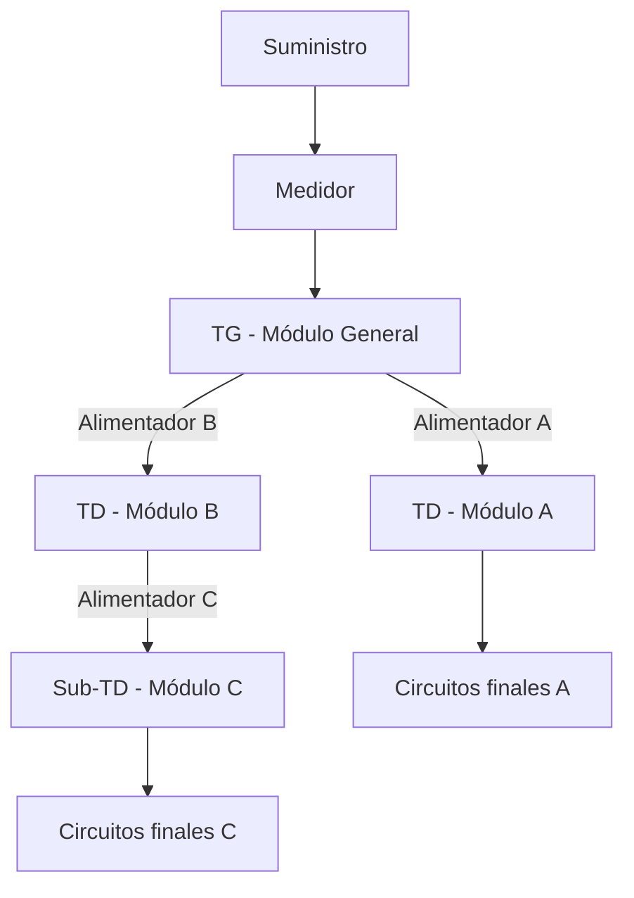

# Plan maestro: módulo General y red eléctrica entre módulos — DIALux v2

## 1. Propósito

Diseñar e implementar un **módulo General** único por proyecto DIALux v2 que represente el origen de energía y conecte eléctricamente el TG con los TD y Sub-TD ubicados en los demás módulos.

La experiencia visual será similar a un editor de nodos como n8n, pero el dominio se restringirá a una red eléctrica radial válida. El diagrama no será sólo decorativo: será la representación editable de una topología persistente usada para potencia, máxima demanda, corriente, selección de conductor y caída de tensión acumulada.

Este documento está pensado para:

- Guiar la implementación incremental.
- Registrar decisiones de arquitectura.
- Evitar que la lógica eléctrica quede acoplada al canvas.
- Permitir modificaciones futuras sin perder compatibilidad.

## 2. Documentos relacionados

- `planes/plan_modulos_v2_dialux.md`: arquitectura Proyecto → Módulos.
- `planes/plan_caida_tension.md`: fórmulas, tablas y jerarquía TG → TD → circuitos.
- `planes/formulas_caida_tension_B5_AI21.md`: trazabilidad de fórmulas de caída de tensión.

Este plan complementa esos documentos. No reemplaza las fórmulas técnicas ya validadas.

## 3. Estado actual verificado

El sistema ya cuenta con:

- Proyectos DIALux v2 con módulos independientes.
- Un `moduleId` dentro del documento del editor.
- Dispositivos `main_panel` y `sub_panel`.
- Roles `main`, `distribution` y `sub_distribution`.
- Ámbitos `project`, `module` y `floor`.
- Relación local `upstreamPanelId` entre tableros.
- Propiedades de tensión, fases, longitud, sección y tipo de conductor.
- Cálculo TG → TD → circuitos dentro de las escenas de un documento.
- Caída propia y acumulada, resumen de tableros y corrección de secciones.

### Brecha principal

Cada módulo conserva su propio documento. La relación `upstreamPanelId` referencia dispositivos del documento actual y no constituye por sí sola una topología persistente a nivel del proyecto padre.

Por ello todavía no existe una fuente confiable para representar:

```text
Módulo General / TG
├── TD del módulo A
├── TD del módulo B
│   └── Sub-TD del módulo C
└── TD del módulo exterior
```

## 4. Principios de diseño

1. **El dominio manda sobre el dibujo.** El canvas representa una red eléctrica; no contiene las reglas de negocio.
2. **Una sola fuente de verdad.** Los TD no se copian al módulo General: se referencian mediante puertos eléctricos.
3. **Topología radial inicialmente.** Un tablero tiene como máximo un padre activo y no se permiten ciclos.
4. **Compatibilidad progresiva.** Los proyectos existentes deben abrir sin una red global y poder migrarse.
5. **Cálculos puros y verificables.** El motor recibe datos normalizados y no depende de React, SVG ni del backend.
6. **Separación lógica/física.** La posición del nodo en el diagrama no reemplaza la ubicación real en el plano.
7. **Sin dependencia visual obligatoria.** La primera versión debe poder construirse con React y SVG existentes.

## 5. Alcance funcional

### Primera versión

- Crear automáticamente un módulo General por proyecto.
- Registrar suministro, medidor, ATS opcional y TG.
- Descubrir TD y Sub-TD publicados por los módulos.
- Conectar nodos arrastrando entre puertos.
- Editar las propiedades del alimentador.
- Validar la estructura del árbol.
- Calcular carga, corriente y caída de tensión por tramo y acumulada.
- Mostrar cumplimiento y advertencias.
- Persistir posiciones, nodos, conexiones y parámetros.
- Incluir una vista de árbol accesible además del canvas.

### Fuera de la primera versión

- Redes malladas o múltiples alimentaciones simultáneas.
- Estudios de cortocircuito y selectividad completos.
- Coordinación avanzada de protecciones.
- Flujo de potencia bidireccional.
- Generación distribuida o inyección a red.
- Simulación temporal de transferencia automática.

Estos casos deben poder agregarse después sin reemplazar el modelo base.

## 6. Modelo conceptual



### Separación de responsabilidades

| Capa | Responsabilidad |
|---|---|
| Proyecto v2 | Contiene módulos y una red eléctrica global |
| Módulo General | Editor y configuración del suministro/TG |
| Módulo arquitectónico | Conserva geometría, TD, Sub-TD y circuitos finales |
| Puerto eléctrico | Publica un tablero del módulo hacia la red global |
| Nodo | Representa un origen, equipo o puerto dentro del diagrama |
| Enlace | Representa un alimentador real entre dos nodos |
| Motor | Recorre el grafo y calcula resultados eléctricos |

## 7. Modelo de datos propuesto

Los nombres son provisionales y deben revisarse contra las convenciones Laravel existentes antes de crear migraciones.

### 7.1 Tipo de módulo

Agregar un discriminador a `dialux_modules`:

```ts
type DialuxV2ModuleKind = 'general' | 'building' | 'exterior' | 'custom';
```

Reglas:

- Sólo un módulo `general` activo por proyecto.
- No cuenta dentro del límite de módulos de diseño, decisión pendiente.
- No debe eliminarse mientras existan conexiones globales, salvo un flujo explícito de reinicio.

### 7.2 Red global

```ts
interface ElectricalNetwork {
    id: string;
    projectId: number;
    version: number;
    rootNodeId?: string;
    settings: ElectricalNetworkSettings;
    nodes: ElectricalNode[];
    edges: ElectricalEdge[];
}
```

```ts
interface ElectricalNetworkSettings {
    nominalVoltageV: number;
    phases: 1 | 3;
    connectionType: 'star' | 'delta';
    frequencyHz: 50 | 60;
    conductorMaterial: 'copper' | 'aluminium';
    workingTemperatureC: number;
    defaultPowerFactor: number;
    finalCircuitDropLimitPercent: number;
    feederDropLimitPercent: number;
    totalDropLimitPercent: number;
}
```

### 7.3 Nodos

```ts
type ElectricalNodeType =
    | 'service'
    | 'meter'
    | 'ats'
    | 'generator'
    | 'ups'
    | 'main_panel'
    | 'module_panel_port';

interface ElectricalNode {
    id: string;
    type: ElectricalNodeType;
    label: string;
    moduleId?: number;
    sceneId?: string;
    deviceId?: string;
    position: { x: number; y: number };
    collapsed?: boolean;
}
```

`moduleId + sceneId + deviceId` constituye la referencia al tablero real. El ID del nodo sólo identifica su representación dentro de la red.

### 7.4 Puertos publicados por módulos

```ts
interface ModuleElectricalPort {
    key: string;
    moduleId: number;
    moduleName: string;
    sceneId: string;
    sceneName: string;
    panelId: string;
    panelLabel: string;
    panelRole: 'distribution' | 'sub_distribution';
    nominalVoltageV: number;
    phases: 1 | 3;
    installedPowerW: number;
    demandPowerW: number;
    circuitsCount: number;
    revision: string;
}
```

Los puertos son una proyección derivada de cada módulo, no una copia editable del dispositivo.

### 7.5 Alimentadores

```ts
interface ElectricalEdge {
    id: string;
    sourceNodeId: string;
    targetNodeId: string;
    label?: string;
    lengthMode: 'manual' | 'plan' | 'combined';
    horizontalLengthM: number;
    verticalLengthM: number;
    conductorType: string;
    conductorMaterial: 'copper' | 'aluminium';
    sectionMm2: number;
    earthSectionMm2?: number;
    wireConfiguration: string;
    tubeDiameterMm?: number;
    breaker?: string;
    demandFactor?: number;
    powerFactor?: number;
    phaseAssignment?: 'R' | 'S' | 'T' | 'RS' | 'ST' | 'TR' | 'RST';
}
```

La longitud calculada será:

```text
longitud total = longitud horizontal + longitud vertical
```

Si `lengthMode = plan`, se resolverá desde la geometría disponible. Si no puede resolverse, el enlace quedará incompleto y no se inventará una distancia.

## 8. Persistencia recomendada

### Alternativa recomendada para v1

Una entidad de red por proyecto con snapshot JSON versionado:

```text
dialux_electrical_networks
- id
- dialux_project_id (unique)
- version
- data JSON
- created_at
- updated_at
```

Ventajas:

- Encaja con el patrón actual de snapshots del editor.
- Reduce el número inicial de migraciones.
- Facilita versionar el contrato antes de normalizarlo.

### Evolución posterior

Cuando se requieran búsquedas, auditoría o edición concurrente detallada, separar:

- `dialux_electrical_nodes`
- `dialux_electrical_edges`
- `dialux_module_electrical_ports`

El código de dominio no debe depender del formato de persistencia para permitir esta transición.

## 9. Reglas e invariantes

### Reglas bloqueantes

- Sólo puede existir una raíz activa.
- Un tablero no puede alimentarse a sí mismo.
- Un nodo no puede tener más de un padre eléctrico activo.
- No se permiten ciclos directos ni indirectos.
- Un enlace debe conectar una salida con una entrada compatible.
- No se puede conectar hacia un puerto inexistente o eliminado.
- Tensión y fases deben ser compatibles, salvo que exista un nodo transformador explícito.
- El TG debe pertenecer al módulo General.

### Advertencias no bloqueantes

- Módulo sin TD publicado.
- TD publicado pero desconectado.
- Alimentador sin longitud.
- Sección, conductor o protección incompletos.
- Caída de tensión sobre el límite.
- Desbalance de fases.
- Referencia a una revisión anterior del módulo.

### Política de eliminación

- Eliminar un enlace desconecta, pero no elimina el tablero físico.
- Eliminar un nodo referenciado exige confirmación y conserva el tablero del módulo.
- Eliminar un TD dentro de un módulo convierte su nodo global en referencia rota hasta que el usuario lo repare o elimine.
- Eliminar un módulo debe listar previamente los enlaces afectados.

## 10. Motor de cálculo

### Recorrido

1. Validar el grafo.
2. Localizar la raíz.
3. Obtener puertos y cargas publicadas.
4. Recorrer en postorden para acumular potencia y demanda hacia el TG.
5. Recorrer en preorden para propagar tensión y caída acumulada hacia los hijos.
6. Evaluar ampacidad, sección, protección y límites.
7. Emitir resultados y diagnósticos sin mutar el grafo.

### Resultados por alimentador

```ts
interface ElectricalEdgeResult {
    edgeId: string;
    installedPowerW: number;
    demandPowerW: number;
    currentA: number;
    ownVoltageDropV: number;
    ownVoltageDropPercent: number;
    accumulatedVoltageDropV: number;
    accumulatedVoltageDropPercent: number;
    receivingVoltageV: number;
    ampacityA?: number;
    status: 'complete' | 'warning' | 'non_compliant' | 'incomplete';
    issues: ElectricalIssue[];
}
```

### Fórmulas base

Monofásico:

```text
ΔV = 2 × ρ × L × I × cosφ / S
```

Trifásico:

```text
ΔV = √3 × ρ × L × I × cosφ / S
```

Porcentaje:

```text
ΔV% = ΔV / Vnominal × 100
```

Acumulación:

```text
ΔV acumulada del hijo = ΔV acumulada del padre + ΔV propia del alimentador
```

Las fórmulas definitivas y tablas de ampacidad deben reutilizar las fuentes descritas en `plan_caida_tension.md`; no se duplicarán constantes técnicas en componentes visuales.

## 11. Experiencia de usuario

### Distribución principal

```text
┌───────────────┬──────────────────────────────────┬────────────────────┐
│ Biblioteca    │ Diagrama                         │ Propiedades        │
│               │                                  │                    │
│ Suministro    │ [Medidor] ──► [TG]               │ Alimentador TG-TD  │
│ Medidor       │                  ├──► [TD Piso 1] │ Longitud           │
│ ATS           │                  └──► [TD Piso 2] │ Cable / sección    │
│ Módulos       │                                  │ ΔV y cumplimiento  │
└───────────────┴──────────────────────────────────┴────────────────────┘
```

### Interacciones

- Arrastrar nodos desde una biblioteca.
- Arrastrar desde un puerto de salida a un puerto de entrada.
- Vista previa de compatibilidad antes de soltar.
- Selección de nodo o enlace para editar propiedades.
- Zoom, pan, centrar, ajustar al contenido y minimapa.
- Autoorden vertical y horizontal.
- Deshacer y rehacer.
- Confirmación en operaciones destructivas.
- Indicador visible de cambios pendientes y sincronización.

### Estados visuales

| Estado | Color sugerido | Significado |
|---|---|---|
| Correcto | Verde | Datos completos y cumplimiento |
| Advertencia | Ámbar | Próximo al límite o dato recomendable ausente |
| Error | Rojo | No cumple o conexión inválida |
| Incompleto | Gris | Faltan datos para calcular |
| Seleccionado | Cian | Elemento activo |

El color nunca será el único indicador; cada estado tendrá icono, texto y detalle accesible.

### Responsive

- Escritorio amplio: biblioteca, canvas y propiedades visibles.
- Portátil: paneles laterales colapsables y canvas prioritario.
- Pantalla estrecha: biblioteca y propiedades como drawers.
- Vista de árbol como alternativa usable con teclado.
- Ningún formulario crítico dependerá de hover.

## 12. Organización de frontend

```text
resources/js/pages/dialux/v2/electrical-network/
├── domain/
│   ├── types.ts
│   ├── graphValidation.ts
│   ├── graphTraversal.ts
│   ├── modulePorts.ts
│   └── calculations.ts
├── store/
│   └── useElectricalNetworkStore.ts
├── components/
│   ├── ElectricalNetworkEditor.tsx
│   ├── ElectricalCanvas.tsx
│   ├── ElectricalNode.tsx
│   ├── ElectricalEdge.tsx
│   ├── ElectricalPalette.tsx
│   ├── ElectricalPropertiesPanel.tsx
│   ├── ElectricalTreeView.tsx
│   └── ElectricalMinimap.tsx
├── hooks/
│   ├── useModuleElectricalPorts.ts
│   ├── useElectricalNetworkSync.ts
│   └── useElectricalNetworkHistory.ts
└── tests/
    ├── graphValidation.test.ts
    ├── graphTraversal.test.ts
    ├── modulePorts.test.ts
    └── calculations.test.ts
```

Los componentes no deben importar directamente fórmulas del editor v1. La compatibilidad se resolverá mediante adaptadores dentro de `domain/`.

## 13. Organización de backend

Propuesta inicial:

```text
app/Domain/Dialux/ElectricalNetwork/
├── ElectricalNetworkData.php
├── ElectricalNetworkValidator.php
└── ModuleElectricalPortResolver.php

app/Http/Controllers/Dialux/V2/
└── ElectricalNetworkController.php

app/Http/Requests/Dialux/V2/
└── UpdateElectricalNetworkRequest.php
```

Endpoints tentativos:

```text
GET  /dialux-v2/projects/{project}/electrical-network
PUT  /dialux-v2/projects/{project}/electrical-network
GET  /dialux-v2/projects/{project}/electrical-ports
POST /dialux-v2/projects/{project}/electrical-network/validate
```

Las rutas definitivas deben generarse y consumirse con Wayfinder siguiendo el patrón existente.

## 14. Estrategia de sincronización

### Publicación desde módulos

Cada guardado de módulo actualiza una proyección de sus tableros:

- ID estable del dispositivo.
- Nombre del módulo y escena.
- Rol del tablero.
- Tensión y fases.
- Potencia instalada y máxima demanda.
- Número de circuitos.
- Revisión del documento.

### Consumo desde el módulo General

- El nodo conserva la referencia estable al puerto.
- Los datos calculados se refrescan sin mover el nodo.
- Las propiedades del tablero se editan en su módulo de origen.
- Las propiedades del alimentador se editan en la red global.
- Las referencias rotas se conservan para facilitar reparación manual.

### Conflictos

- No guardar silenciosamente sobre una revisión más reciente.
- Comparar `version` o `updated_at`.
- Mostrar conflicto y permitir recargar o reintentar.
- No implementar colaboración en tiempo real en la primera fase.

## 15. Migración y compatibilidad

1. Los proyectos existentes continúan funcionando sin red global.
2. Al abrir el módulo General por primera vez se propone detectar TG/TD existentes.
3. El asistente genera candidatos usando `upstreamPanelId` y roles actuales.
4. El usuario revisa el árbol antes de persistirlo.
5. No se modifica automáticamente el documento de un módulo durante la detección.
6. Los cálculos locales actuales permanecen disponibles durante la transición.
7. Una bandera de versión decide si el consolidado usa la red global o el cálculo legado.

## 16. Fases de implementación

### Fase 0 — Inventario y contrato

- Inventariar modelos, rutas y tablas actuales de v2.
- Confirmar cómo se persiste `dialux_electrical_projects`.
- Mapear todos los usos de `upstreamPanelId`.
- Definir contrato JSON v1 de la red.
- Crear fixtures con TG, varios TD, Sub-TD y módulo desconectado.

**Terminado cuando:** existe un contrato aprobado y fixtures representativos sin cambiar comportamiento productivo.

### Fase 1 — Dominio global

- Crear tipos y esquema versionado.
- Implementar validación de nodos, enlaces, ciclos y padres múltiples.
- Implementar recorrido topológico.
- Implementar adaptador desde tableros actuales.
- Cubrir el dominio con tests unitarios.

**Terminado cuando:** un árbol entre módulos puede validarse y recorrerse sin UI ni backend.

### Fase 2 — Persistencia y puertos

- Crear migración y modelo de red.
- Crear Form Request y controlador.
- Publicar puertos de todos los módulos.
- Resolver permisos y pertenencia al proyecto.
- Añadir control de versión para concurrencia.

**Terminado cuando:** la red se guarda, recarga y conserva referencias entre módulos.

### Fase 3 — Módulo General mínimo

- Crear módulo `general` único.
- Organizar el módulo General en tres vistas del mismo contexto: `Plano 2D`, `Modelo 3D` y `Red y CT`.
- Usar 2D/3D para construir y visualizar físicamente TG, canalizaciones, alimentadores y equipos generales.
- Usar `Red y CT` para enlazar los puertos publicados por los demás módulos y resolver el árbol eléctrico global.
- Crear biblioteca de nodos.
- Construir canvas SVG con selección, drag, zoom y pan.
- Crear y eliminar enlaces.
- Añadir panel de propiedades.
- Añadir vista de árbol accesible.

**Terminado cuando:** el usuario puede representar y editar visualmente TG → TD → Sub-TD.

### Fase 4 — Cálculo consolidado

- Adaptar el motor actual a entradas globales normalizadas.
- Calcular potencia, demanda, corriente, caída propia y acumulada.
- Evaluar ampacidad y límites.
- Mostrar diagnóstico por enlace y nodo.
- Incorporar sugerencia de sección sin aplicarla automáticamente.

**Terminado cuando:** los resultados coinciden con fixtures y casos Excel previamente validados.

### Fase 5 — UX profesional

- Auto-layout horizontal/vertical.
- Minimap y buscador.
- Breadcrumb del camino eléctrico.
- Colapsar ramas y módulos.
- Deshacer/rehacer.
- Atajos de teclado.
- Estados vacíos, errores y referencias rotas.
- Responsive completo y modos claro/oscuro.

**Terminado cuando:** el flujo es usable en portátil sin ocultar acciones esenciales.

### Fase 6 — Reportes y exportación

- Diagrama unifilar general.
- Tabla de alimentadores.
- Resumen TG/TD/Sub-TD.
- Caída por tramo y acumulada.
- Lista de incumplimientos y datos faltantes.
- PDF y DXF.

**Terminado cuando:** el reporte puede auditarse desde el origen hasta cada tablero final.

### Fase 7 — Capacidades avanzadas

- ATS, generador y UPS.
- Fuente normal/emergencia.
- Selectividad y coordinación.
- Cortocircuito.
- Balance automático de fases.
- Escenarios comparables.

Esta fase requiere validación normativa y eléctrica específica antes de implementarse.

## 17. Estrategia de pruebas

### Dominio

- Rechaza ciclos.
- Rechaza múltiples padres.
- Detecta nodos huérfanos.
- Ordena correctamente un árbol de varios niveles.
- Conserva IDs al mover nodos.

### Cálculo

- TG → TD.
- TG → TD → Sub-TD.
- TG con varios TD hermanos.
- Módulos con tensiones incompatibles.
- Alimentador sin longitud.
- Caída propia correcta.
- Caída acumulada correcta.
- Potencia y demanda suben hasta la raíz sin duplicarse.
- Coincidencia con casos del Excel.

### Backend

- Autorización por propietario del proyecto.
- Validación del payload.
- Conflicto de versión.
- Eliminación de módulo con enlaces.
- Límite de un módulo General.

### UI

- Crear conexión válida.
- Impedir conexión inválida.
- Reconectar enlace.
- Editar alimentador.
- Deshacer/rehacer.
- Navegación por teclado.
- Responsive y claro/oscuro.

## 18. Riesgos y mitigaciones

| Riesgo | Mitigación |
|---|---|
| Duplicar tableros entre módulo y red | Referencias mediante puertos, nunca copias editables |
| IDs locales no estables | Clave compuesta y migración controlada |
| Ciclos creados por drag | Validación previa y validación de servidor |
| Doblar potencia al consolidar | Recorrido único postorden con nodos visitados |
| Fórmulas distintas entre local/global | Un motor puro compartido y fixtures comunes |
| Diagrama lento | Render selectivo, memoización y virtualización si resulta necesaria |
| Referencias rotas al duplicar módulos | Mapeo explícito de IDs y enlaces inicialmente desconectados |
| Canvas inaccesible | Vista de árbol y formularios equivalentes |

## 19. Decisiones pendientes

- ¿El módulo General cuenta dentro del máximo de 25 módulos?
- ¿Se crea automáticamente con todo proyecto nuevo o bajo demanda?
- ¿Puede existir más de un TG en modo normal/emergencia?
- ¿La distancia entre módulos será manual, tomada de planos o ambas?
- ¿Editar un nodo de tablero desde el General abre su módulo o permite edición parcial?
- ¿Qué límites normativos exactos se usarán para alimentador, circuito final y total?
- ¿Se permitirá aluminio en la primera versión?
- ¿Qué datos deben incluirse en el primer PDF consolidado?

Ninguna de estas decisiones debe resolverse implícitamente en un componente visual.

## 20. Primer incremento recomendado

Implementar Fase 0 y Fase 1 antes del canvas:

1. Definir el contrato `ElectricalNetwork` v1.
2. Construir un fixture con tres módulos.
3. Publicar TG, TD y Sub-TD como puertos.
4. Validar `TG general → TD módulo A → Sub-TD módulo B`.
5. Recorrer el árbol y acumular carga.
6. Integrar caída de tensión usando el motor existente.

El canvas debe llegar después, como editor del modelo ya probado. Así la experiencia tipo n8n será una interfaz confiable y no una colección de líneas sin significado eléctrico.

## 21. Registro de progreso

| Fase | Estado | Fecha | Notas |
|---|---|---|---|
| 0. Inventario y contrato | Completada | 2026-08-21 | Contrato JSON v1 y brecha entre snapshots confirmados |
| 1. Dominio global | Completada | 2026-08-21 | Tipos, validación radial, recorrido y tests unitarios |
| 2. Persistencia y puertos | Completada | 2026-08-21 | Snapshot versionado, endpoints, autorización y publicación de paneles |
| 3. Módulo General mínimo | Completada | 2026-08-21 | Canvas SVG, nodos, enlaces, propiedades, guardado y árbol accesible |
| 4. Cálculo consolidado | Completada | 2026-08-21 | Cargas reales, demanda, ampacidad, protección y sección recomendada integradas |
| 5. UX profesional | En progreso | 2026-08-21 | Navegación General 2D/3D/Red integrada; faltan auto-layout, minimapa e historial |
| 6. Reportes y exportación | Pendiente | — | — |
| 7. Capacidades avanzadas | Pendiente | — | — |

Cada avance debe actualizar esta tabla y registrar las decisiones que cambien el contrato.

### Implementación inicial — 2026-08-21

- Se añadió `kind` a los módulos y se crea un módulo General único al crear o migrar proyectos.
- La red se persiste en `dialux_electrical_networks` mediante un snapshot JSON con control de versión optimista.
- Los tableros TG/TD de módulos arquitectónicos se publican como puertos referenciados por módulo, escena y dispositivo.
- La topología se valida tanto en TypeScript como en Laravel: raíz, nodos existentes, autoenlaces, padres múltiples y ciclos.
- El editor General cuenta con biblioteca, canvas SVG, movimiento de nodos, conexión mediante puertos, edición de alimentadores y vista de árbol.
- El cálculo inicial entrega corriente, caída del tramo y caída acumulada.
- El documento eléctrico de cada módulo publica un resumen derivado versionado por tablero, separando carga propia y agregada para evitar duplicaciones.
- La red General consume potencia instalada, máxima demanda, corriente y protección reales de los módulos.
- El cálculo consolidado reutiliza las fórmulas y el catálogo de conductores existentes para evaluar ampacidad, seleccionar protección y recomendar sección por corriente y caída de tensión.
- El panel de propiedades muestra diagnósticos del alimentador y permite aplicar explícitamente la sección recomendada.
- El módulo General comparte una navegación estable entre Plano 2D, Modelo 3D y Red y CT; 2D/3D reutilizan el mismo documento físico y la red conserva su snapshot topológico independiente.
- La vista Red muestra el resumen CT consolidado de todos los alimentadores conectados: demanda, corriente de diseño, caída acumulada y conformidad.
- Cada módulo con información eléctrica publica una entrada conectable aunque su tablero no esté materializado o su ID no coincida con el resumen de cálculo; cuando existe un tablero real, éste conserva prioridad.
- La biblioteca de la red permite añadir y conectar esa entrada directamente al TG en una sola acción, manteniendo el cableado interior encapsulado dentro del módulo de origen.
- La publicación conserva `parentPanelId`: al sincronizar un módulo se reconstruye su subárbol real y sólo sus tableros raíz se alimentan desde el TG General.
- La fuente prioritaria de jerarquía es la misma del motor CT: `properties.upstreamPanelId`; el sentido visual `sourceId/targetId` del conductor no se interpreta como dirección eléctrica.
- Los nodos muestran módulo, nivel e ID de tablero; el canvas convierte correctamente el movimiento del puntero a coordenadas SVG y permite eliminar nodos importados desde un control visible.
- La interacción diferencia puertos: la salida derecha inicia una conexión y la entrada izquierda la finaliza o reconecta, impidiendo crear relaciones invertidas por ambigüedad.
- El resumen CT excluye los enlaces internos de infraestructura del conteo y muestra `Pendiente` cuando falta longitud, en lugar de presentar una caída de tensión de 0 % como resultado válido.
- Próximo incremento: completar la Fase 5 con auto-layout, minimapa e historial de deshacer/rehacer.
