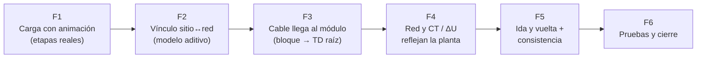

# Plan: Carga con animación + Compatibilización Planta General ↔ Módulos ↔ Red y CT

> **Objetivo**: (1) Que el cliente vea claramente que el Módulo General está cargando, con avance real por etapas. (2) Que lo que se dibuja y cablea en la Planta General (TG, sub tableros, cables, salidas, bloques de módulo) aparezca en **Red y CT** y en la **caída de tensión**, y que un cable que llega a un bloque se conecte al tablero real de ese módulo.
>
> **Regla principal: agregar, no destruir.** Nada de lo que ya existe se borra ni se reemplaza: módulos, puertos de módulo, nodos y aristas que el usuario ya creó en la Red, longitudes manuales, trazados de alimentador (`FeederPath`) y el tablero virtual de alumbrado exterior siguen funcionando igual. Todo lo nuevo se **fusiona por id**.

---

## 0. Diagnóstico (verificado en código, 2026-09-23)

### 0.1 Por qué "se queda pegado" al cargar

| Etapa | Dónde | Qué ve hoy el cliente |
|---|---|---|
| Inicializar el store del módulo | `v2/Module.tsx` (`ready`) | Texto gris "Cargando módulo…", sin animación |
| Snapshot de la red (fetch) | `site/hooks/useNetworkSnapshotForSite.ts` | Nada en el canvas (solo "Cargando alimentadores…" en la paleta) |
| Plano CAD de fondo: IndexedDB → servidor → `initViewer` → `openFile` → render | `site/hooks/useSiteCadPlan.ts` (`status: idle/loading/ready/deferred/missing/error`) | Nada visible mientras dura `loading`; es la etapa **más larga** (DWG pesados tardan segundos) |
| Teselas satelitales | `SiteCanvas2D.tsx` | Aparecen de a poco, sin aviso |
| Visor 3D (Babylon), primera vez | `SiteViewer3DPage.tsx` | "Cargando emplazamiento…" |

**Causa:** el estado ya existe (`useSiteCadPlan.status`, `useNetworkSnapshotForSite.loading`), pero no se muestra en ningún indicador visual.

### 0.2 Por qué los 2 TG, sus cables y salidas no aparecen en Red ni en caída de tensión

Hoy hay **dos modelos que no se comunican**:

| Planta General (`SiteData`, `v2/site/domain/types.ts`) | Red y CT (`ElectricalNetworkData`, `v2/electrical-network/domain/types.ts`) |
|---|---|
| `tg_location`, `sub_panel`, `transformer`, `generator`, `ats` → `SiteElement` **sin ningún vínculo a un nodo de la red** | Nodos `service → meter → main_panel (TG único)` creados por `ElectricalNetworkService::defaultData()` |
| `SiteCircuit` (TG → poste/tomacorriente/tablero/bloque, con `tgOutputId`) → el propio tipo dice *"no entra hoy al cálculo de caída de tensión — es informativo"* | Aristas = alimentadores, solo entre nodos de la red |
| `TgConfig.outputs[]` (salidas del TG) → solo esquema 2D | No existen como filas CT |
| `building_block.moduleId` → vínculo al módulo, solo para 3D/etiqueta | Los puertos de módulo (`module_panel_port`) se cuelgan **automáticamente del único TG** (`useElectricalNetwork.ts` ~l.298) |
| `FeederPath.networkEdgeId` → **único puente real**: solo copia la longitud a una arista que ya existe | — |

Además, el backend `ElectricalNetworkService::portsFor()` excluye `kind = 'general'` (l.124): **correcto** para los puertos de módulos interiores, pero significa que nada del Módulo General entra a la red por el backend. El único aporte del sitio hoy es `buildExteriorLightingPort` (suma de postes → un tablero virtual), armado en el frontend (`ElectricalNetwork.tsx` l.65).

**Consecuencia:** con 2 TG dibujados en la planta, la red sigue teniendo **un solo TG**, todos los módulos cuelgan de él, y los cables/salidas dibujados no suman carga ni longitud a ninguna caída de tensión.

**Buena noticia:** `ElectricalNetworkController::show` ya manda `siteData` junto con la red y los puertos → el puente se puede hacer **en el frontend, sin endpoints nuevos**, con el mismo patrón de fusión que ya usan los puertos de módulo.

---

## Arquitectura de fases



F1 es independiente y se puede entregar primero (mejora visible para el cliente). F2→F5 son la compatibilización y van en orden.

---

## Fase 1 — Carga con animación por etapas

**Meta:** el cliente siempre ve qué se está cargando, que avanza, y cuánto lleva.

### 1.1 Componente de carga reutilizable
- **[NEW]** `v2/components/ModuleLoadingOverlay.tsx`: overlay centrado con
  - spinner/animación con Tailwind (`animate-spin`, `animate-pulse`; **sin librerías nuevas**),
  - lista de etapas con estado (pendiente / en curso / listo / omitido / error) y check animado,
  - barra de progreso = etapas completas / total,
  - tiempo transcurrido ("12 s") y, si pasa de ~8 s, un mensaje tipo *"El plano es pesado, sigue cargando…"*.
- Soporta modo claro/oscuro con los mismos colores del resto del módulo.

### 1.2 Etapas reales (no simuladas)
- **[NEW]** `v2/site/hooks/useSiteLoadingStages.ts`: junta los estados que YA existen:
  1. Datos del módulo → `ready` de `Module.tsx`
  2. Red eléctrica → `useNetworkSnapshotForSite.loading`
  3. Plano de fondo → `useSiteCadPlan.status` (`missing` = omitido, `deferred` = "plano grande, clic para abrir", ya existente)
  4. Imagen satelital → solo si está activa (conteo de teselas cargadas/25)
- Sub-etapas del CAD (desde `useSiteCadPlan`, sin cambiar su lógica): "Leyendo archivo" → "Iniciando visor" → "Abriendo plano" → "Dibujando". Solo se agrega un campo `phase` al estado del hook.

### 1.3 Dónde se muestra
- `Module.tsx`: reemplazar "Cargando módulo…" por el overlay (modo pantalla completa).
- `SiteEditor2D`/`SiteCanvas2D`: overlay **semitransparente sobre el canvas** mientras el plano carga — el usuario puede empezar a ver sus objetos ya dibujados debajo (no se bloquea el trabajo; el overlay se puede minimizar a una pastilla en la esquina "Cargando plano… 40%").
- `SiteViewer3DPage`: mismo overlay en la primera apertura del 3D.
- Módulos interiores (`EditorLayout`): solo la etapa de datos + plano, reusando el componente (opcional, sin tocar la lógica del editor v1).

**Archivos:** `Module.tsx`, `SiteEditor2D.tsx`, `SiteCanvas2D.tsx` (retirar el texto suelto de l.429), `SiteViewer3DPage.tsx`, `useSiteCadPlan.ts` (+`phase`), 2 archivos nuevos.
**Verificación:** `npm run types`, `npm run build`; prueba visual la hace el usuario con un DWG pesado.

**Implementado (2026-09-23):**
- `v2/components/ModuleLoadingOverlay.tsx` (variantes `screen`/`overlay`, minimizable, % + segundos, aviso a los 8 s, acciones).
- Etapas como función pura `v2/site/lib/siteLoadingStages.ts` (+ test) en vez de un hook.
- `useSiteCadPlan` expone `phase` (`reading`/`initializing`/`opening`) y `fileBytes`; su lógica de apertura no cambió.
- Conectado en `Module.tsx`, `SiteCanvas2D.tsx` (reemplaza la pastilla "Abriendo plano CAD…", conserva "Usar imagen"), `SiteViewer3DPage.tsx` y `SiteViewer3D.tsx` (hasta la primera construcción de la escena).
- **No incluido:** etapa de teselas satelitales (bajo valor, se ven cargar de a poco); overlay en `EditorLayout` de módulos interiores (opcional).

---

## Fase 2 — Vínculo Planta ↔ Red (modelo aditivo)

**Meta:** cada tablero dibujado en la planta tiene su nodo en la red, y cada cable entre tableros tiene su alimentador.

### 2.1 Campos nuevos (todos opcionales → datos viejos siguen válidos)
- `SiteElement.networkNodeId?: string` → para `tg_location`, `sub_panel`, `transformer`, `generator`, `ats`.
- `SiteCircuit.networkEdgeId?: string` → cuando el circuito une dos tableros o un tablero con un bloque (es un **alimentador**, no una salida).
- `ElectricalNode.origin?: 'site'` y `ElectricalNode.siteElementId?: string` → marca los nodos que vienen de la planta (para mostrar el distintivo "Planta" y no confundirlos con los creados a mano).
- Nuevo tipo de nodo `'site_panel'` (sub tablero de la planta), o reusar `main_panel` con `panelRole` → **decisión P3**.

### 2.2 Puente puro y testeable
- **[NEW]** `v2/site/domain/siteNetworkBridge.ts` (+ `.test.ts`):
  - `deriveSiteNetwork(siteData, network, ports)` → devuelve los nodos/aristas que **faltan** en la red.
  - **Primer TG dibujado → se vincula al TG que ya existe** en la red (no se crea uno duplicado). Los siguientes TG → nodos nuevos.
  - Cada nuevo TG se cuelga de `Medidor` por defecto (o de su propio suministro, según **P1**).
  - Fusión **por id** (`networkNodeId` / `networkEdgeId`): si el nodo ya existe se actualiza solo la etiqueta; nunca se borran nodos/aristas del usuario.
  - Posición inicial en el diagrama derivada de la posición en planta (escalada), editable después.
- Se ejecuta dentro del mismo efecto de resincronización de `useElectricalNetwork.ts` que ya fusiona puertos de módulo y corre `syncFeederLengths` — mismo punto, mismo patrón.

### 2.3 Cuándo se crea el vínculo
- Al colocar un TG/sub tablero en la planta, `siteSlice` le asigna un `networkNodeId` (uuid) de inmediato; la red crea el nodo la próxima vez que se abre/refresca.
- Datos existentes (tus 2 TG actuales): un botón **"Vincular tableros de la planta con la red"** en Red y CT hace la primera fusión y muestra lo que va a crear antes de guardar (ver **P4**).

**Verificación:** `vitest` del puente (casos: 0/1/2 TG, TG ya vinculado, red con nodos manuales, re-ejecutar = sin duplicados).

---

**Implementado (2026-09-23):**
- `v2/site/domain/siteNetworkBridge.ts` (+ 9 tests): `applySiteToNetwork(network, siteData)`, puro e idempotente. **Desvío del diseño 2.1:** el vínculo se guarda solo en la RED (`node.siteElementId`, `edge.siteCircuitId`, `origin:'site'`) con ids deterministas (`site-<id>`, `site-supply-<id>`, `site-meter-<id>`, `site-circuit-<id>`); NO se agregaron campos a `SiteData` → la planta no se reescribe y no hay dos guardados sobre el mismo documento.
- Tipos: `ElectricalNodeType` + `'site_panel'`; `origin`/`siteElementId` en nodos; `origin`/`siteCircuitId` en aristas.
- Varias raíces: `networkRootIds()` (en `graph.ts`) = `rootNodeId` + todo Suministro sin alimentador; lo usan `validateElectricalNetwork`, `calculateElectricalNetwork`, `ElectricalTreeView` y el backend `validateTopology`.
- Automático (P4): se aplica al cargar Red y CT y tras cada edición (`change()` de `useElectricalNetwork`); también en `useNetworkSnapshotForSite` (colores de los cables en planta).
- Suministro dinámico (P1): TG de planta sin alimentador → cadena propia; reconectado a otro medidor/TG → la cadena propia vacía se retira sola. Selector "Alimentado desde" en propiedades de TG y sub tablero ("Suministro propio").
- Cables TG↔TG / TG↔TD de la planta → alimentadores `lengthMode:'site'` con la misma longitud que la lista de objetos (`siteCircuitLengthM`). Se orientan aguas abajo aunque se dibujen al revés. Un alimentador puesto a mano no se pisa (aviso `feeder-taken`); ciclos se rechazan.
- UI: distintivo "PLANTA" en el diagrama; aviso desplegable con conflictos/huérfanos.
- **Bug previo corregido:** `UpdateElectricalNetworkRequest` rechazaba `lengthMode:'site'` (422 al guardar una red con trazado de alimentador) y descartaba campos no declarados; ahora acepta `site`, `site_panel`, `origin`, `siteElementId`, `siteCircuitId` (+ test Pest).
- Pendiente para fases siguientes: `ElectricalCtTable`/`ElectricalCtSummary` y `connectModuleToTg` aún toman el PRIMER `main_panel` (F3/F4); transformador/GE/ATS de la planta no se vinculan todavía.

---

## Fase 3 — Un cable que llega a un bloque se conecta a ese módulo

**Meta:** en la planta general dibujas los 15 módulos como bloques; si un cable del TG llega al bloque del Módulo 7, en la red ese cable **es** el alimentador del tablero raíz del Módulo 7.

### 3.1 Resolución bloque → tablero del módulo
- `building_block.moduleId` ya existe. Se resuelve el/los **puerto(s) raíz** del módulo (`ModuleElectricalPort` sin `parentPanelId`).
- 1 puerto raíz → se conecta directo. Varios → el cable pide elegir cuál (selector en propiedades del cable). Ninguno → aviso "El Módulo 7 aún no tiene tablero; se conectará cuando lo crees" (el vínculo queda guardado y se completa solo).
- **Se cambia el padre** del puerto: deja de colgar del TG por defecto y pasa al TG/sub tablero de la planta de donde sale el cable. La arista vieja TG→puerto **no se borra si el usuario la editó** (longitud/sección manual): se reutiliza cambiando solo su origen, conservando sus datos.

### 3.2 Longitud
- La longitud del alimentador = recorrido dibujado (`feederPathLengthM`, ya existente: catenaria, zanja, cajas de paso) → `lengthMode: 'site'`, igual que `FeederPath` hoy.
- Tramo interior (del borde del bloque al tablero dentro del módulo): se suma la distancia ya calculada por `panelFeederGeometry` si existe; si no, queda editable como "longitud interior adicional".

### 3.3 Qué se ve en 2D
- Extremo del cable "se imanta" al bloque (snap al contorno del `building_block`).
- Etiqueta en el bloque: *"TD-01 · desde TG-2 · ΔU 1,8 %"* con color verde/ámbar/rojo (reusa `feederStatusColor`).
- Bloque sin módulo vinculado o módulo sin tablero → contorno punteado ámbar con aviso.

**Verificación:** tests del puente con bloque 0/1/N tableros raíz; `npm run types`.

---

**Implementado (2026-09-23):**
- Puente (`siteNetworkBridge.ts`, opción `ports` + `panelVerticalM`): cable tablero de planta ↔ `building_block` con `moduleId` → importa TODOS los tableros del módulo que falten en la red (y sus tramos internos padre→hijo, que la resincronización mide con la geometría del módulo) y alimenta el tablero raíz. Longitud = recorrido del cable (horizontal) + subida real al tablero (elevación del piso + altura de montaje).
- Si el módulo ya estaba conectado (p.ej. "Agregar estructura al lienzo" → TG), su alimentador se REUTILIZA: conserva conductor/sección/factores, cambia solo origen y longitud.
- `SiteCircuit.modulePanelId` (opcional): selector "Tablero del módulo al que llega" en las propiedades del cable cuando el módulo tiene más de un tablero.
- Avisos: bloque sin módulo (`block-unlinked`), módulo sin tablero (`module-no-panel`, se conecta solo cuando se cree), varios tableros raíz sin elegir (`module-panel-ambiguous`).
- 2D en vivo (`siteNetworkLive.ts`): el editor combina la red guardada con la planta ACTUAL; el bloque muestra "TD · desde TG-2 · ΔU x %" en color de estado y el cable dice a qué tablero alimenta.
- Extras pedidos antes de F3: los cables siguen a la caja de pase (y a cualquier objeto) al moverla (`wireFollow.ts`, en `moveSiteElements`/`updateSiteElement`); caja de pase con mínimo visible de 18 px (sin cambiar su tamaño real); TG repetidos se numeran (TG-2); resumen CT cuenta todos los suministros y sub tableros de planta.

---

## Fase 4 — Red y CT y caída de tensión reflejan la planta

**Meta:** lo que colocaste en la planta se ve y se calcula en Red y CT.

### 4.1 Diagrama de red
- Nodos de la planta con distintivo "Planta" y botón "Ver en planta" (navega a `?view=2d` y selecciona el objeto — mismo mecanismo que ya existe con `feederEdge`).
- 2 TG → 2 ramas en el diagrama, cada una con sus módulos colgando.

### 4.2 Salidas del TG → filas CT
- `TgConfig.outputs[]` + `SiteCircuit` con `tgOutputId` hacia postes/tomacorrientes/cargas → cada salida pasa a ser una **fila de circuito** bajo su TG en la Tabla CT global, con potencia (postes: `poleInstalledPowerW` ya existente; tomacorrientes: potencia editable), longitud del recorrido dibujado y sección del cable.
- El tablero virtual "Alumbrado exterior" actual se **divide por TG** (cada TG suma solo los postes que alimenta); los postes sin cable siguen yendo al tablero virtual como hoy (compatibilidad).

### 4.3 Caída de tensión
- `calculateElectricalNetwork` (motor de la red) ya calcula ΔU por arista y la acumula aguas abajo: con los nodos/aristas nuevos entra solo, **sin cambiar fórmulas**.
- `VoltageDropAlertPanel` y "Verificar árbol multimódulo" incluyen los tableros de la planta, respetando la regla ya acordada: **el veredicto se evalúa por tablero, nunca por salida**.
- ΔU acumulada visible por salida en la tabla (informativa, como hoy).

**Verificación:** test de extremo a extremo `siteNetworkBridge` + `calculateElectricalNetwork` (2 TG, 3 módulos, 1 salida a postes → ΔU esperada calculada a mano); regresión de `calculations.test.ts` y `ctTableRows.test.ts` sin cambios.

---

**Implementado (2026-09-23):**
- `v2/site/domain/siteOutputs.ts` (+ tests): `analyzeSiteOutputs` recorre los cables que salen de cada TG/sub tablero de la planta hacia postes, tomacorrientes y portones con luces (directo, por cajas de pase/buzones o de poste en poste); una fila por tramo con carga aguas abajo, I, ITM, longitud, sección, ΔU propia y ΔU acumulada desde el suministro. Supuestos declarados por fila (2–3 conductores = 1Φ a V/√3; sección ausente = 2.5 mm²; tomacorriente sin potencia = 180 W de referencia; demanda = instalada).
- Motor de la red: `calculateElectricalNetwork(..., extraLoads)` — la carga de las salidas sube al tablero de la planta (fórmulas sin cambios). `calculateNetworkWithSite` (en `siteNetworkLive.ts`) lo usa en Red y CT y en el 2D en vivo.
- "Alumbrado exterior" virtual excluye los postes/portones ya cableados a un tablero (sin doble conteo).
- UI: `SiteOutputsCtTable` bajo la Tabla CT global (una sección por tablero con su alimentador entrante; solo lectura, se edita en el cable). Campo "Potencia para CT (W)" en tomacorrientes.
- El veredicto del árbol sigue por tablero; las filas de salida son informativas (regla del usuario).

**Pendiente detectado (para F5 o después):**
- La fila resumen "TG" de `ElectricalCtTable` (`GeneralRow`) y "Agregar estructura al lienzo" (`connectModuleToTg`) siguen usando el PRIMER `main_panel`.
- Sección/conductor: se copian del cable a la red solo al crear el alimentador; editar en un lado no actualiza el otro.
- Huérfanos (objeto/cable borrado en la planta) solo se avisan; falta la acción "retirar de la red".
- Transformador / grupo electrógeno / ATS de la planta no se vinculan a la red.
- Vista 3D exterior colorea con el snapshot del servidor (sin la planta en vivo ni las cargas de salidas).

---

## Fase 5 — Ida y vuelta y consistencia

- **Red → Planta:** sección/conductor editados en la red se ven en las propiedades del cable en planta (una sola fuente: la arista de la red; el cable guarda solo el `networkEdgeId`).
- **Borrado protegido:** borrar un TG o cable en la planta **no borra** el nodo/arista de la red: queda marcado "sin objeto en planta" con aviso y opción "eliminar también de la red". Al revés igual.
- **Ciclos:** el puente rechaza conexiones que crean ciclos (reusa `validateTopology`/`graph.ts`), para no repetir el bug de `upstreamPanelId` circular.
- **Autosave sin carreras:** la planta se guarda por `useDialuxModuleSync` (documento del módulo) y la red por su propio endpoint; el puente solo **lee** `siteData` en la página de la red y **escribe** en la red → no hay dos guardados sobre el mismo documento.

---

**Implementado (2026-09-24):**
- **Corrección de P1 (el usuario, 2026-09-24):** en su proyecto UN solo suministro alimenta los dos TG. Nuevo comportamiento por defecto: un TG de la planta sin cable cuelga del MEDIDOR PRINCIPAL (`site-feed-<id>`); "Suministro propio" es opcional (`ElectricalNode.supplyMode: 'own'`, se elige en "Alimentado desde"). Las cadenas propias automáticas de la versión F2 se migran solas al medidor principal.
- **Transformador de la planta = suministro:** el primero reclama el Suministro raíz de la red; otro transformador crea su propia cadena Suministro → Medidor. Un cable transformador → TG alimenta el TG desde el medidor de ese suministro, con la longitud del cable.
- **El cable dibujado manda** (`feedWithCable`, común a tablero↔tablero, transformador→tablero y tablero→bloque): reutiliza el alimentador existente (conserva conductor/sección/factores) y solo cambia origen y longitud; solo se rechaza si otro cable de la planta ya alimenta ese tablero o si crea un ciclo.
- **Sección/conductor ida y vuelta:** definidos en el cable → pasan a la red; sin definir → manda la red (corrector de la Tabla CT) y el cable en 2D muestra "X mm² (de la red)".
- **Huérfanos:** botón "Retirar de la red lo que ya no está en la planta" (nodo creado desde la planta se elimina; nodo original reclamado solo se desvincula).
- **"Agregar estructura al lienzo"** con selector "Colgar módulos de" cuando hay varios TG/sub tableros.
- **3D exterior** colorea con la red en vivo (`deriveSiteNetworkLive`).
- Backend: regla `data.nodes.*.supplyMode` (+ Pest).

**Sigue pendiente:** la fila resumen "TG" de `ElectricalCtTable` (`GeneralRow`) toma el alimentador del PRIMER TG; con varios TG su fila agrega todo. Grupo electrógeno / ATS de la planta aún no se vinculan.

---

**Cierre de pendientes + reutilización del motor V1 (2026-09-24, pedido del usuario):**
- **Salidas de la planta con el motor CT por luminaria de la V1** (`hooks/wireLengthCalculations.ts::calculatePanelCircuitSummaries`, SIN modificarlo): `siteOutputs.ts` ahora traduce cada tablero de la planta a una escena V1 (tablero → `sub_panel` con `upstreamVoltageDropV` de la red y `lengthM/sectionMm2 = 0` para no contar dos veces su alimentador; poste/portón → luminaria; tomacorriente → `outlet_waterproof`; caja/buzón → `junction_box`; cable → conductor `floor` con la longitud exacta de la planta, compensando los 5 cm por extremo que suma la V1). Filas por SALIDA (convención V1), con ITM/DIF, K1/K2, I adm., fase R/S/T repartida, ΔU con límite 4 % y alerta de circuito mixto. `DEFAULT_OUTLET_POWER_W` (180 W) de la V1 reemplaza la constante propia.
- **Una fila resumen por TG** en la Tabla CT principal (`GeneralRow` con `tgNodeId`): sus módulos + sus salidas de la planta, su propio alimentador.
- **ATS de la planta** → nodo `ats` en el camino suministro → TG (sin cable, cuelga del medidor principal). **Grupo electrógeno**: aviso `backup-source`, no entra al cálculo (la red modela una fuente por tablero).
- Observación para la revisión F6 (no se tocó): en `calculatePanelCircuitSummaries` el comentario dice que se quitó el `× powerFactor` de `circuitOwnDropV`, pero el código aún lo multiplica.

---

**Listo para F6 (2026-09-24):**
- **Carrera 2D → Red y CT corregida:** la pestaña "Red y CT" ahora espera el guardado pendiente (`flushDialuxModuleSave()` en `useDialuxModuleSync.ts`) antes de navegar; antes la página nueva podía leer la planta sin el último cable dibujado.
- **Resultado de las salidas en 2D:** al seleccionar un cable de salida (TG → postes/tomas) el panel muestra su fila CT del motor V1 (circuito, cargas, fase, I, ITM, longitud de la rama, sección, ΔU/límite, capacidad, circuito mixto) — `editor.circuitOutputs`, `SiteOutputRow.circuitIds`.
- **× cos φ de la V1:** NO es un bug — se restauró a propósito en `1ad77b7` (planilla: ΔV = K·I·ρ·L·cosφ/S). Solo se actualizó el comentario desactualizado. Diferencia abierta: el motor de alimentadores de la red (`formulas.ts::voltageDropPct`) no lleva cos φ → decisión del usuario.

---

**Cálculo luminotécnico exterior con el motor V1 (2026-09-24, pedido del usuario):**
- Botón **"Calcular alumbrado"** en el Emplazamiento 2D (`SiteLightingCalcPanel.tsx` + `useSiteLightingCalculation.ts`), a pedido como el "Calcular" de recintos de la V1; se marca "Desactualizado" si la planta cambia.
- `domain/siteLightingCalculation.ts` (+ tests): una superficie de cálculo por área exterior (cancha, estacionamiento, calle, vereda, jardín, plataforma, zona, techado, terreno) → `calculateLightingResult` de la V1 SIN modificarlo (plano útil 0 m, sin zona marginal, malla adaptativa ≤ 2500 pts); cabezas de poste en planta con la misma geometría que `SiteBuilder3D.buildPole`, z relativa a la cota del área (plataformas/relieve), fotometría IES/LDT del catálogo compartido, C0 = rumbo del brazo, MF por poste aplicado al flujo; edificios con altura → cajas de oclusión (sombras). Cielo abierto = sin reflexiones; ρ del suelo (estimación no normativa) solo para L = E·ρ/π.
- Resultados Ēm/Emín/Emáx/U0/L por superficie + comparación numérica con la norma elegida (`checkAgainstNorm`, "≥ norma / < norma"); falsos colores sobre la planta (`SiteIsoluxLayer.tsx`, misma escala `luxColor` que el mapa 3D) con leyenda; clic en una fila = solo esa superficie.
- Test analítico: un poste lambertiano da E nadir = I/h² exacto; sombra de edificio verificada.
- Pendiente (opcional): el mapa de lux del 3D y el panel de normas del 3D siguen con el cálculo exterior simplificado (`exteriorLighting.ts`); luces de portones/techados aún no entran al cálculo V1.

---

**Compatibilización 3D + portones/techados + decisión ΔU (2026-09-24):**
- **2D ↔ 3D:** el resultado de "Calcular alumbrado" vive en un store compartido (`useSiteLightingStore`). El 3D arma el mapa de lux con las mallas del motor V1 a la cota de cada superficie (`SiteBuilder3D.setCalculatedLux`) y su resumen/panel de normas usan esos mismos valores; sin cálculo, la estimación rápida queda rotulada como tal.
- **Portones y techados:** `siteLightPlacement.ts` = fuente única de posición (cálculo, 2D, 3D). Luces del portón con producto del catálogo (`GateLights.productId`); techado con luminarias nuevas opcionales (`CanopyConfig.lights`: cantidad, montaje, lm, W, producto) en grilla bajo la cubierta; símbolo en 2D, cabeza en 3D, carga en CT y en "Alumbrado exterior". Cubierta opaca = losa de oclusión (sombra a los postes, no a sus propias luminarias).
- **Decisión ΔU (el usuario pidió la opción más precisa, para tesis):** alimentadores de la red → IEC 60364-5-52:2009 Anexo G completo, u = b·(ρ₁·L·cosφ/S + λ·L·sinφ)·I_B, λ = 0.08 mΩ/m, ρ(T) = misma expresión de la V1 (Cu) / IEC 60228 (Al) a la temperatura de trabajo (`feederVoltageDrop.ts`, caso a mano verificado: 100 A·100 m·50 mm² → 1.5735 %). Motor V1 y `formulas.ts` sin cambios. Redes nuevas con temperatura de trabajo 40 °C (igual que la V1); las existentes conservan su valor (editable en la Tabla CT).

---

**Proyectar luminarias en exteriores (2026-09-24, pedido del usuario para empezar a testear):**
- `domain/siteFixtureProjection.ts` (+ tests): mismo flujo que la proyección de recintos de la V1, con sus funciones SIN modificar — `calculateLumensRequired`/`calculateExactQuantity` (método de lúmenes, fórmula literal), `suggestFixtureGridSize` + `calculateFixtureGridPositions` (grilla por proporción, centrada en el polígono), y ajuste con `estimatePhotometricFixtureQuantity` iterando con el motor luminotécnico V1 (`calculateSiteLighting`, incluye luminarias existentes y sombras) hasta el Ēm objetivo con la menor cantidad. Techado: proyecta la cantidad de luminarias bajo la cubierta (`projectCanopyLights`).
- UI `SiteProjectionPanel.tsx` en Config. de toda superficie de cálculo: Ēm objetivo (por defecto el de la norma elegida para el espacio), poste (altura, brazo, lm, Fm, producto del catálogo) o luminaria de techado; muestra método de lúmenes → iteraciones → resultado; "Colocar N postes" (un paso de deshacer, reemplaza solo los proyectados antes para esa área vía `metadata.projectedFor`) y recalcula el alumbrado.
- Robustez: el cálculo y la proyección esperan la fotometría IES/LDT de todos los productos (`loadSitePhotometry`) y leen la planta más reciente del store (sin carreras con lo recién colocado).

---

**Proyección en 2 clics + paleta por categorías (2026-09-24, feedback: "muchos clics", "no veo el botón"):**
- Paleta izquierda rediseñada (`SitePalette.tsx`): riel de categorías estilo DIALux evo + buscador + mosaico; pestaña **Iluminación** con Calcular alumbrado, falsos colores, lista de superficies y la proyección del área seleccionada (único lugar; en Propiedades → Config. solo queda una indicación).
- Proyección interactiva (`SiteProjectionPanel.tsx`): al seleccionar la superficie aparece al instante la propuesta filas × columnas = máx(método de lúmenes V1 con `suggestFixtureGridSize`, regla de separación ≤ k·h con k = 3 de referencia, ajustable) con luminarias fantasma en el plano (`projectionPreview` en `useSiteLightingStore`); [−]/[+] en filas/columnas (o cantidad en techados) con Ēm/Emín/U0/separación en vivo (motor V1 solo sobre esa superficie, `calculateSiteLighting(…, onlyAreaIds)`); "Ajustar al objetivo" itera; "Colocar N" inserta y recalcula.

---

**Proyección horizontal × vertical + reglas + sin duplicados (2026-09-24, feedback del usuario):**
- Panel de proyección muestra "columnas × filas = N" y cada dirección con su reparto ½-1-1-½ ("40 m ÷ 4 = 10 m entre sí · 5 m al borde") y [−]/[+] por dirección.
- Techados con grilla filas × columnas (`CanopyLights.rows/columns`; `count` queda como legado): grilla de la V1, altura 15 cm bajo la cubierta EN ESE PUNTO (sigue la pendiente, misma geometría que `buildRoofStructure`), y regla de 2 caídas: la cantidad a lo ancho (a través de las caídas) se sube a par → ninguna luminaria en la cumbrera (`applyRoofRule`). Luces fantasma también en techados.
- Sin duplicados: las luminarias del techado se proyectan/editan solo en Iluminación; en Propiedades queda un resumen + botón que abre la pestaña (`useSitePaletteStore`).

---

## Fase 6 — Pruebas y cierre

```bash
npx vitest run resources/js/pages/dialux/v2/        # puente, cálculos, regresión
npm run types
npm run build
php artisan test --compact --filter=ElectricalNetwork   # solo si se toca backend
```
Revisión con agentes: `dialux-electrical-reviewer` (ΔU/secciones) y `dialux-site-render-reviewer` (2D/3D del cable al bloque). **Prueba en navegador: la hace el usuario**; se confirma con él cada fase antes de pasar a la siguiente.

---

### Estado de la Fase 6 (2026-09-24)
- **Prueba integral** `site/domain/fase6Integration.test.ts`: colegio en miniatura (transformador → TG1/TG2, TG2 → módulo con TD/sub-TD, TG1 → caja → 2 postes, techado 2 caídas con luminarias, cancha). Encontró un bug real: la losa de sombra de un techado a 2 caídas estaba a la altura del alero, por debajo de sus propias luminarias (0 lx) → ahora a la cumbrera.
- **Revisión `dialux-electrical-reviewer`** — corregido:
  1. ΔU acumulada sumaba voltios de bases distintas (√3·I·Z de línea en 3Φ + 2·I·Z de fase en 1Φ) → ahora se acumula en % (exacto en estrella balanceada) y los voltios se expresan en la base del tablero receptor. Test de cascada 3Φ→1Φ.
  2. Tableros de la planta sin sistema propio → `ElectricalNode.phases/nominalVoltageV` ("Sistema del tablero" en Red y CT; 1Φ por defecto a V/√3).
  3. Salidas de la planta: la longitud ahora suma la subida por el equipo (altura del poste / luminaria / tomacorriente), una vez por equipo; la caída de aguas arriba se suma en % a la de cada salida (no se inyecta en voltios al motor V1).
  4. Guardas anti-ciclo en `calculateElectricalNetwork`; `canConnect` en el suministro por defecto.
  5. Límites 2,5 % / 4 %: citados como referencia CNE-Utilización Regla 050-102 (edición a confirmar).
- **V1 corregida sin romperla (autorizado por el usuario):** el motor CT de la V1 (`wireLengthCalculations.ts`) sumaba voltios de bases distintas en la cascada TG→TD→C y entre pisos. Nuevo `convertDropToBase(volts, base_padre, base_receptor)` = volts × base_receptor/base_padre (≡ acumular en %), con la base de cada fila = la del % (`220` si 1Φ, su tensión si 3Φ). Con bases iguales el factor es 1: resultado idéntico al anterior (test de regresión). 3 tests V1 que codificaban la mezcla se actualizaron (el de "NUNCA sube el calibre de C" ahora usa un alimentador de 600 m para que su premisa siga dándose).
- **Revisión `dialux-calc-reviewer`** — corregido: rumbo C0 de luminarias de portón (hacia el interior) y techado (a lo largo de la cumbrera); radio de influencia `max(60 m, 15·h)` para mástiles altos; luminarias por debajo de la superficie se excluyen **y se avisan**; nota de metodología sobre la cubierta aproximada. Con tests.
- **Revisión `dialux-site-render-reviewer`** — sin bugs reales. Informativo: `deriveSiteNetworkLive` corre en cada render de `SiteViewer3DPage` (el React Compiler probablemente lo memoiza; verificar con el log `[site3D] elems=`); `SiteAttachedLightsLayer` recalcula posiciones en cada render (barato).
- **Preexistentes, no tocados:** `fileSizeBudget.test.ts` falla (archivos grandes ya existentes + nuevos listados); 4 errores de eslint ya presentes en HEAD (`import/order` y var sin uso en `wireLengthCalculations.ts`, `set-state-in-effect` en `useElectricalNetwork.ts`).
- **Pendiente:** prueba en navegador del usuario.

---

## Lo que NO se toca
- Motor de cálculo luminotécnico v1 y el editor interior (`EditorLayout`, `House3DBuilder`).
- Fórmulas de `calculateElectricalNetwork` y de `electrical/engine/*`.
- `portsFor()` del backend (sigue excluyendo el Módulo General; el puente es del frontend).
- `FeederPath` existentes y su sincronización de longitud.
- Nodos/aristas creados a mano en la red.

---

## Decisiones del usuario (2026-09-23)

| # | Decisión |
|---|---|
| **P1** | (Corregido 2026-09-24: un solo suministro alimenta ambos TG; suministro propio es opcional.) Original: cada TG tiene **su propio suministro**, pero debe ser **dinámico**: cada TG de la planta elige su origen (suministro propio nuevo, o el medidor/suministro de otro TG). Por defecto, cada TG nuevo crea su propia cadena `Suministro → Medidor → TG`; el primer TG reutiliza la cadena existente. |
| **P2** | "Caída de tensión" = la **Tabla CT / alertas de Red y CT de Dialux v2**. El módulo aparte `caida-tension/` queda fuera. |
| **P3** | Recomendado y adoptado: un sub tablero dibujado en la planta es **nodo propio de la planta** (`site_panel`) por defecto; opcionalmente se puede marcar "pertenece al Módulo X" y entonces se trata como tablero de ese módulo (sin duplicar el que ya tenga dentro). |
| **P4** | Enlace **automático** (sin botón), priorizando ahorrar tiempo al cliente; la fusión es idempotente y nunca borra, así que re-ejecutarla es seguro. |

Orden de trabajo: fases en orden, desde F1.

## Estado

| Fase | Estado |
|---|---|
| 0 Diagnóstico | Hecho (2026-09-23) |
| 1 Carga con animación | Hecho (2026-09-23) — falta prueba visual del usuario |
| 2 Vínculo sitio↔red | Hecho (2026-09-23) — falta prueba del usuario |
| 3 Cable → módulo | Hecho (2026-09-23) — falta prueba del usuario |
| 4 Red y CT / ΔU | Hecho (2026-09-23) — falta prueba del usuario |
| 5 Ida y vuelta | Hecho (2026-09-24) — falta prueba del usuario |
| 6 Pruebas y cierre | Hecho lo automático (2026-09-24): revisiones eléctrica/cálculo/render aplicadas, V1 corregida (bases de ΔU); falta prueba del usuario |
