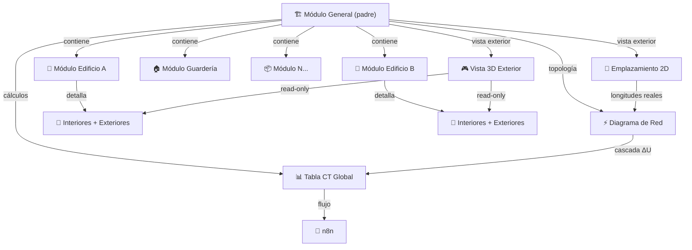

# Módulo General v2 — Plan de Implementación Completo

Evolución integral del módulo general de DIALux v2: diagrama de red interactivo con estados visuales, geolocalización del terreno, editor 2D de emplazamiento exterior, vista 3D con módulos hijos read-only, y sincronización con tabla CT global.

---

## Contexto Arquitectónico



> **Módulo General** = representación exterior del terreno completo. Cada módulo hijo detalla interiores y exteriores de su edificación. El módulo general reúne todo: emplazamiento, red eléctrica (TG → TDs), tabla CT global y visualización 3D consolidada.

---

## Estado Actual del Sistema

| Componente | Archivo(s) clave | Estado |
|---|---|---|
| **Canvas SVG de red** | [`ElectricalCanvas.tsx`](file:///c:/laragon/www/proyectopcl/resources/js/pages/dialux/v2/electrical-network/components/ElectricalCanvas.tsx) | Drag, connect, remove — sin estados de color |
| **Lógica de grafo** | [`graph.ts`](file:///c:/laragon/www/proyectopcl/resources/js/pages/dialux/v2/electrical-network/domain/graph.ts) | Validación: ciclos, huérfanos, multi-padre |
| **Cálculos eléctricos** | [`calculations.ts`](file:///c:/laragon/www/proyectopcl/resources/js/pages/dialux/v2/electrical-network/domain/calculations.ts) | ΔU propia + acumulada, cascada a módulos |
| **Hook del editor** | [`useElectricalNetwork.ts`](file:///c:/laragon/www/proyectopcl/resources/js/pages/dialux/v2/electrical-network/hooks/useElectricalNetwork.ts) | CRUD nodos/aristas, persist con versionado |
| **Tabla CT global** | [`ElectricalCtTable.tsx`](file:///c:/laragon/www/proyectopcl/resources/js/pages/dialux/v2/electrical-network/components/ElectricalCtTable.tsx) | 36 columnas CNE |
| **Tabs módulo general** | [`GeneralWorkspaceTabs.tsx`](file:///c:/laragon/www/proyectopcl/resources/js/pages/dialux/v2/components/GeneralWorkspaceTabs.tsx) | 3 tabs: 2D, 3D, Red y CT |
| **Motor 3D interior** | [`House3DBuilder.ts`](file:///c:/laragon/www/proyectopcl/resources/js/pages/dialux/engine/House3DBuilder.ts) | Babylon.js 9 — rooms, walls, fixtures |
| **Editor 2D CAD** | [`MlightcadCanvas2D.tsx`](file:///c:/laragon/www/proyectopcl/resources/js/pages/dialux/components/canvas/MlightcadCanvas2D.tsx) | Planta interior con rooms, paredes |

### Lo que NO existe aún
- ❌ Geolocalización y búsqueda de coordenadas del terreno
- ❌ Editor 2D de emplazamiento exterior
- ❌ Vista 3D exterior con módulos hijos read-only
- ❌ Estados de color en conexiones de red (rojo/verde)
- ❌ Alertas visuales de ΔU en el canvas
- ❌ Desconexión directa desde el canvas
- ❌ Trazado de alimentadores en el plano 2D por el cliente
- ❌ Sincronización longitudes emplazamiento ↔ red eléctrica

---

## Arquitectura de Carpetas (Escalable)

Toda la funcionalidad nueva del módulo general se organiza bajo `resources/js/pages/dialux/v2/` con separación clara por responsabilidad:

```
dialux/v2/
├── electrical-network/            # ← YA EXISTE (Fase 1 lo mejora)
│   ├── components/
│   │   ├── ElectricalCanvas.tsx   # [MODIFY] estados color, zoom, minimap
│   │   ├── ElectricalCtTable.tsx  # sin cambios
│   │   ├── ElectricalCtSummary.tsx
│   │   ├── ElectricalPalette.tsx
│   │   ├── ElectricalPropertiesPanel.tsx
│   │   ├── ElectricalTreeView.tsx
│   │   └── VoltageDropAlertPanel.tsx   # [NEW] panel alertas ΔU
│   ├── domain/
│   │   ├── types.ts               # [MODIFY] connectionStatus
│   │   ├── graph.ts
│   │   ├── calculations.ts
│   │   └── ctTableRows.ts
│   ├── hooks/
│   │   └── useElectricalNetwork.ts # [MODIFY] lengthMode:'site'
│   └── lib/
│       └── networkApi.ts
│
├── site/                          # ← NUEVO (Fases 2, 3, 4)
│   ├── domain/
│   │   ├── types.ts               # [NEW] SiteElement, SiteData, FeederPath
│   │   ├── geometry.ts            # [NEW] área, perímetro, distancias
│   │   └── feederSync.ts          # [NEW] sync longitudes → red eléctrica
│   ├── components/
│   │   ├── SiteCanvas2D.tsx       # [NEW] canvas SVG del emplazamiento
│   │   ├── SitePalette.tsx        # [NEW] paleta herramientas dibujo
│   │   ├── SitePropertiesPanel.tsx # [NEW] panel propiedades elemento
│   │   ├── SiteViewer3D.tsx       # [NEW] visor 3D Babylon.js
│   │   ├── SiteToolbar.tsx        # [NEW] barra herramientas superior
│   │   └── GeoSearchPanel.tsx     # [NEW] búsqueda coordenadas
│   ├── hooks/
│   │   ├── useSiteEditor.ts       # [NEW] hook principal editor 2D
│   │   └── useGeoSearch.ts        # [NEW] hook geolocalización
│   ├── engine/
│   │   └── SiteBuilder3D.ts       # [NEW] motor 3D exterior Babylon.js
│   └── lib/
│       ├── siteApi.ts             # [NEW] persistencia datos sitio
│       ├── geoApi.ts              # [NEW] API geocoding (Nominatim OSM)
│       └── siteDefaults.ts        # [NEW] colores, materiales por defecto
│
├── components/
│   ├── GeneralWorkspaceTabs.tsx   # [MODIFY] labels actualizados
│   ├── ModuleCard.tsx
│   ├── ModuleSidebar.tsx
│   └── ProjectSummaryView.tsx
│
├── ElectricalNetwork.tsx          # [MODIFY] integrar alertas ΔU
├── Module.tsx                     # [MODIFY] condicional general → site
├── types.ts                       # sin cambios aquí (tipos site van en site/domain/)
└── ...
```

> [!TIP]
> **Principio de escalabilidad**: cada subsistema (`electrical-network/`, `site/`) es auto-contenido con su propio `domain/`, `components/`, `hooks/`, `lib/`, y `engine/`. Para agregar nuevos tipos de elementos exteriores o funcionalidades, solo se extiende dentro de `site/` sin tocar la red eléctrica.

---

## Proposed Changes

### Fase 1: Diagrama de Red Mejorado (UX + Alertas Visuales)

Mejora la experiencia del diagrama de red existente sin tocar el modelo de datos backend.

---

#### Fase 1.1: Estados de Color en Conexiones y Desconexiones

##### [MODIFY] [`types.ts`](file:///c:/laragon/www/proyectopcl/resources/js/pages/dialux/v2/electrical-network/domain/types.ts)
- Agregar campo derivado `connectionStatus: 'connected' | 'disconnected' | 'alert'` al tipo `ElectricalNode` (no persiste, se calcula en el hook)

##### [MODIFY] [`ElectricalCanvas.tsx`](file:///c:/laragon/www/proyectopcl/resources/js/pages/dialux/v2/electrical-network/components/ElectricalCanvas.tsx)

**Nodos — indicadores visuales de estado:**
| Estado | Borde | Fondo | Badge |
|---|---|---|---|
| Conectado (con arista entrante OK) | `stroke-emerald-500` | `fill-emerald-50` | ✓ verde |
| Desconectado (sin arista entrante, issue `disconnected`) | `stroke-red-500` | `fill-red-50` | "DESCONECTADO" rojo + animación pulso |
| Alerta ΔU (conectado pero excede límite) | `stroke-amber-500` | `fill-amber-50` | "⚠ ΔU 4.2%" naranja |
| TG / Service / Meter (nodos fijos) | `stroke-slate-500` | sin cambio | — |

**Aristas — color por estado de caída de tensión:**
| Condición | Color |
|---|---|
| ΔU OK (< 80% del límite) | `stroke-emerald-500` (verde) |
| ΔU Warning (80%–100% del límite) | `stroke-amber-500` (naranja) |
| ΔU Excede límite | `stroke-red-500` (rojo) |
| Sin datos de cálculo (longitud pendiente) | `stroke-slate-400` (gris punteado) |

**Interacciones nuevas:**
- **Botón `×` en arista**: al seleccionar una arista, mostrar ícono de tijeras/desconexión en el punto medio → llama `removeById(edge.id)` → nodo target cambia a rojo
- **Menú contextual en nodo** (clic derecho): "Conectar desde…", "Desconectar alimentador", "Eliminar del diagrama", "Ver en tabla CT"
- **Tooltip hover en arista**: muestra ΔU%, corriente (A), sección (mm²), longitud total (m)
- **Badge de ΔU acumulada en nodo**: pill dentro del nodo con `accumulatedVoltageDropPercent` formateado

---

#### Fase 1.2: Panel de Alertas de Caída de Tensión

##### [NEW] `electrical-network/components/VoltageDropAlertPanel.tsx`
```
Panel colapsable que lista alimentadores con problemas:
├── 🔴 Críticos (excede límite ΔU)
│   └── "TG → Edificio A: ΔU 5.1% > 4.0%"  [clic → selecciona en canvas]
├── 🟠 Advertencias (>80% del límite)  
│   └── "TD-1 → Sub-TD: ΔU 3.4%"
├── 🟡 Incompletos (sin longitud o sin demanda)
│   └── "TG → Guardería: longitud pendiente"
└── ✅ Conformes: 5 de 8 alimentadores
```

##### [MODIFY] [`ElectricalNetwork.tsx`](file:///c:/laragon/www/proyectopcl/resources/js/pages/dialux/v2/ElectricalNetwork.tsx)
- Integrar `VoltageDropAlertPanel` debajo de `ElectricalCtSummary`
- Badge con conteo de alertas en el header: `⚠ 3 alertas`

---

#### Fase 1.3: Zoom, Pan y Minimap en el Canvas

##### [MODIFY] [`ElectricalCanvas.tsx`](file:///c:/laragon/www/proyectopcl/resources/js/pages/dialux/v2/electrical-network/components/ElectricalCanvas.tsx)

| Funcionalidad | Implementación |
|---|---|
| **Zoom** | `onWheel` → escalar `viewBox` dinámicamente (min 0.3x, max 3x) |
| **Pan** | `onPointerDown` en fondo vacío → arrastrar viewBox |
| **Minimap** | SVG secundario 150×84px en esquina inferior derecha con rectángulo de viewport |
| **Fit-to-view** | Botón que calcula bounding box de todos los nodos y ajusta viewBox |
| **Zoom controls** | Botones `+` / `−` / `⊡` (fit) sobre el canvas |

---

### Fase 2: Geolocalización y Terreno

Buscar coordenadas reales del terreno, ver tipo de suelo, ubicación y contexto geográfico.

---

#### Fase 2.1: Búsqueda de Coordenadas

##### [NEW] `site/hooks/useGeoSearch.ts`
Hook que encapsula la búsqueda geográfica:
```typescript
interface GeoSearchResult {
  lat: number;
  lon: number;
  displayName: string;
  boundingBox: [number, number, number, number];
  type: string; // 'building', 'road', 'residential', etc.
}

function useGeoSearch(): {
  query: string;
  setQuery: (q: string) => void;
  results: GeoSearchResult[];
  searching: boolean;
  search: () => Promise<void>;
  selectedLocation: GeoSearchResult | null;
  selectLocation: (result: GeoSearchResult) => void;
}
```

##### [NEW] `site/lib/geoApi.ts`
Cliente API para geocoding usando **Nominatim OpenStreetMap** (gratuito, sin API key):
- `searchLocation(query)` → buscar dirección/lugar
- `reverseGeocode(lat, lon)` → obtener dirección desde coordenadas
- `getTerrainInfo(lat, lon)` → tipo de zona (residencial, comercial, educativo)
- Throttle de 1 request/segundo (política de Nominatim)
- Sin dependencias nuevas: usa `fetch` nativo

##### [NEW] `site/components/GeoSearchPanel.tsx`
Panel de búsqueda integrado en la vista 2D del emplazamiento:
```
┌─────────────────────────────────────────┐
│ 📍 Ubicación del proyecto               │
│ ┌─────────────────────────────┐ 🔍     │
│ │ Colegio San Martín, Lima    │ Buscar  │
│ └─────────────────────────────┘         │
│                                         │
│ Resultados:                             │
│ • Colegio San Martín de Porres, Av...   │
│ • Colegio San Martín, Surco, Lima       │
│                                         │
│ 📌 Coordenadas: -12.0464, -77.0428     │
│ 🏘️ Zona: Residencial                   │
│ 🧭 Orientación: N-S                     │
│ 📐 Terreno: ~4,500 m²                  │
│                                         │
│ [Usar como fondo del emplazamiento]     │
└─────────────────────────────────────────┘
```

**Funcionalidades:**
- Buscar por dirección, nombre del colegio/edificio, o coordenadas directas
- Al seleccionar un resultado, se posiciona el terreno en esas coordenadas
- La coordenada se guarda en `SiteData.location` para referencia
- Opcionalmente cargar imagen satélite como fondo del canvas 2D (tile de OpenStreetMap)
- Mostrar tipo de zona, orientación sugerida del lote y área estimada

---

#### Fase 2.2: Modelo de Datos del Emplazamiento

##### [NEW] `site/domain/types.ts`

```typescript
// ── Geolocalización ──────────────────────────────
export interface GeoLocation {
  lat: number;
  lon: number;
  displayName: string;
  boundingBox?: [number, number, number, number];
  zoneType?: string;
}

// ── Elementos del emplazamiento ──────────────────
export type SiteElementType =
  | 'terrain'          // Polígono del terreno/lote completo
  | 'building_block'   // Bloque de edificación → referencia DialuxModule
  | 'street'           // Calle, vereda, pasaje
  | 'green_area'       // Grass, jardín, parque
  | 'fence'            // Cerco perimetral, muro
  | 'pool'             // Piscina
  | 'ramp'             // Rampa con inclinación
  | 'court'            // Cancha deportiva
  | 'parking'          // Estacionamiento
  | 'tg_location'      // Tablero General (posicionado por el cliente)
  | 'transformer'      // Subestación / transformador
  | 'pole'             // Poste de alumbrado exterior
  | 'gate'             // Puerta / portón de acceso
  | 'custom_zone';     // Zona personalizada

export interface Point2D {
  x: number;
  y: number;
}

export interface SiteElement {
  id: string;
  type: SiteElementType;
  label: string;
  vertices: Point2D[];      // Polígono o polilínea
  heightM?: number;          // Altura (cercos, edificios para 3D)
  rotation?: number;         // Grados
  moduleId?: number;         // → DialuxModule.id si es building_block
  moduleName?: string;       // Nombre del módulo referenciado
  locked?: boolean;          // No editable (para bloques importados)
  visible?: boolean;         // Toggle visibilidad
  zIndex?: number;           // Orden de apilamiento
  style: SiteElementStyle;
  metadata?: Record<string, unknown>;
}

export interface SiteElementStyle {
  fillColor: string;
  strokeColor: string;
  strokeWidth?: number;
  opacity?: number;
  pattern?: 'solid' | 'hatch' | 'dots' | 'grass' | 'water';
}

// ── Trazado de alimentadores ─────────────────────
export interface FeederPath {
  id: string;
  networkEdgeId: string;     // → ElectricalEdge.id en la red
  waypoints: Point2D[];      // Puntos del recorrido sobre el terreno
  calculatedLengthM: number; // Longitud total del recorrido
  label?: string;
  style?: {
    color: string;           // verde/naranja/rojo según ΔU
    dashArray?: string;
  };
}

// ── Documento principal ──────────────────────────
export interface SiteData {
  schemaVersion: 1;
  location?: GeoLocation;
  terrainScaleM: number;     // metros por unidad de coordenada
  gridSizeM: number;         // tamaño de cuadrícula visible
  canvasWidth: number;       // ancho del canvas en unidades
  canvasHeight: number;      // alto del canvas en unidades
  elements: SiteElement[];
  feederPaths: FeederPath[];
  layers: SiteLayer[];
}

export interface SiteLayer {
  id: string;
  label: string;
  types: SiteElementType[];  // qué tipos pertenecen a esta capa
  visible: boolean;
  locked: boolean;
}

// ── Herramientas del editor ──────────────────────
export type SiteTool =
  | 'select'
  | 'pan'
  | 'draw_polygon'
  | 'draw_polyline'
  | 'draw_rect'
  | 'place_block'
  | 'place_tg'
  | 'draw_feeder'
  | 'measure';
```

##### [NEW] `site/domain/geometry.ts`
Funciones puras de geometría para el emplazamiento:
- `polygonArea(vertices)` → área en m² (fórmula de Shoelace)
- `polygonPerimeter(vertices)` → perímetro en m
- `polylineLength(points)` → longitud total de una polilínea (para alimentadores)
- `pointInPolygon(point, vertices)` → test de inclusión
- `boundingBox(vertices)` → `{ minX, minY, maxX, maxY }`
- `snapToGrid(point, gridSize)` → snap a cuadrícula
- Reutiliza la lógica existente de [`ambientSpaces.ts`](file:///c:/laragon/www/proyectopcl/resources/js/pages/dialux/hooks/ambientSpaces.ts) donde sea posible

##### [NEW] `site/domain/feederSync.ts`
Lógica de sincronización entre trazados de alimentadores y la red eléctrica:
- `syncFeederLengths(feederPaths, networkEdges)` → genera patches para actualizar `horizontalLengthM` de cada arista
- `deriveFeederStatus(edgeId, calculations)` → retorna color verde/naranja/rojo según ΔU
- `buildFeederPathFromNetwork(edge, sourceElement, targetElement)` → genera un `FeederPath` inicial recto entre dos bloques

---

### Fase 3: Editor 2D del Emplazamiento Exterior

Canvas interactivo para dibujar y editar el emplazamiento.

---

#### Fase 3.1: Canvas SVG y Herramientas

##### [NEW] `site/components/SiteCanvas2D.tsx`
Canvas SVG interactivo principal:

**Capas de renderizado (de fondo a frente):**
1. Imagen satelital de fondo (si hay geolocalización) — `<image>` SVG
2. Grilla métrica con labels de distancia
3. Polígono del terreno (capa base)
4. Calles / veredas
5. Áreas verdes / canchas / estacionamientos
6. Piscinas
7. Cercos / muros
8. Bloques de edificación (con label del módulo)
9. Rampas
10. TG y equipos eléctricos (íconos posicionables)
11. Trazado de alimentadores (polilíneas con color por ΔU)
12. Capa de selección / edición / handles de vértices

**Interacciones:**
- Zoom/Pan con misma infra que Fase 1.3
- Snap a cuadrícula configurable (1m, 5m, 10m)
- Dibujo de polígonos punto a punto (clic para agregar vértice, doble-clic o Enter para cerrar)
- Arrastrar vértices individuales para editar forma
- Selección → mostrar propiedades en panel lateral
- El **cliente posiciona el TG** arrastrándolo al lugar deseado
- El **cliente dibuja los alimentadores** como polilíneas desde el TG hasta cada bloque
- Al cerrar un polilínea de alimentador, se calcula la longitud y se sincroniza con la red eléctrica

##### [NEW] `site/components/SitePalette.tsx`
Paleta lateral organizada por categorías:
```
┌─────────────────────────┐
│ 🔧 Herramientas          │
│ ├── ↖ Seleccionar        │
│ ├── ✋ Mover (Pan)        │
│ └── 📏 Medir              │
│                          │
│ 🏗️ Terreno               │
│ ├── ⬡ Terreno/Lote       │
│ ├── 🛣️ Calle/Vereda      │
│ └── 🟩 Área verde         │
│                          │
│ 🏢 Edificaciones         │
│ ├── 🧱 Bloque edificio   │
│ ├── 🚧 Cerco/Muro        │
│ └── 🚪 Portón/Acceso     │
│                          │
│ 🏊 Instalaciones         │
│ ├── 🏊 Piscina            │
│ ├── ⛹️ Cancha deportiva   │
│ ├── 🅿️ Estacionamiento   │
│ └── ♿ Rampa               │
│                          │
│ ⚡ Red eléctrica          │
│ ├── 🔲 Tablero General   │
│ ├── 🔌 Transformador     │
│ ├── 💡 Poste exterior    │
│ └── 🔗 Alimentador       │
│                          │
│ 📍 Geolocalización       │
│ └── 🔍 Buscar ubicación  │
└─────────────────────────┘
```

##### [NEW] `site/components/SitePropertiesPanel.tsx`
Panel lateral de propiedades del elemento seleccionado:
- **Todos**: nombre, tipo, color, opacidad, visibilidad, locked
- **Polígonos**: área (m²), perímetro (m), vértices editables
- **Bloques**: módulo vinculado (dropdown de módulos del proyecto), pisos/altura
- **TG**: etiqueta, potencia nominal
- **Alimentadores**: longitud calculada (m), arista de red vinculada, ΔU estado
- **Cercos**: altura (m), material

##### [NEW] `site/components/SiteToolbar.tsx`
Barra de herramientas superior del editor 2D:
- Undo / Redo
- Toggle grilla y snap
- Escala del terreno (m/unidad)
- Toggle capas (checkboxes)
- Exportar imagen PNG
- Guardar

---

#### Fase 3.2: Hook del Editor y Persistencia

##### [NEW] `site/hooks/useSiteEditor.ts`
Hook principal del editor de emplazamiento:
```typescript
interface UseSiteEditorReturn {
  // Estado
  siteData: SiteData;
  activeTool: SiteTool;
  selectedElementId: string | null;
  drawing: boolean;           // en proceso de dibujar polígono
  pendingVertices: Point2D[]; // vértices parciales durante dibujo
  
  // Herramientas
  setActiveTool: (tool: SiteTool) => void;
  
  // CRUD elementos
  addElement: (element: Omit<SiteElement, 'id'>) => string;
  updateElement: (id: string, patch: Partial<SiteElement>) => void;
  removeElement: (id: string) => void;
  duplicateElement: (id: string) => void;
  
  // Dibujo
  addVertex: (point: Point2D) => void;
  finishDrawing: () => void;
  cancelDrawing: () => void;
  
  // Alimentadores
  addFeederPath: (path: Omit<FeederPath, 'id' | 'calculatedLengthM'>) => void;
  updateFeederPath: (id: string, waypoints: Point2D[]) => void;
  removeFeederPath: (id: string) => void;
  
  // Bloques de edificio
  importModuleAsBlock: (moduleId: number, position: Point2D) => void;
  
  // Geo
  setLocation: (location: GeoLocation) => void;
  
  // Selección
  selectElement: (id: string | null) => void;
  moveElement: (id: string, delta: Point2D) => void;
  moveVertex: (elementId: string, vertexIndex: number, position: Point2D) => void;
  
  // Capas
  toggleLayer: (layerId: string) => void;
  lockLayer: (layerId: string, locked: boolean) => void;
  
  // Historial
  undo: () => void;
  redo: () => void;
  canUndo: boolean;
  canRedo: boolean;
  
  // Persistencia
  save: () => Promise<void>;
  saving: boolean;
  dirty: boolean;
}
```

##### [NEW] `site/lib/siteApi.ts`
API client:
- `saveSiteData(projectId, moduleId, siteData)` → `PATCH /dialux-v2/projects/{id}/modules/{moduleId}` con `{ data: { ...existingData, siteData } }`
- Reutiliza el mismo endpoint de [`moduleApi.ts`](file:///c:/laragon/www/proyectopcl/resources/js/pages/dialux/v2/lib/moduleApi.ts) ya existente
- Sin nuevos endpoints backend — los datos del emplazamiento se almacenan en `DialuxModule.data.siteData`

##### [NEW] `site/lib/siteDefaults.ts`
Colores, estilos y materiales por defecto para cada tipo de elemento:
```typescript
export const SITE_ELEMENT_DEFAULTS: Record<SiteElementType, {
  label: string;
  style: SiteElementStyle;
  heightM?: number;
}> = {
  terrain:        { label: 'Terreno', style: { fillColor: '#d4c5a9', strokeColor: '#a89270', opacity: 0.4, pattern: 'solid' } },
  building_block: { label: 'Edificio', style: { fillColor: '#64748b', strokeColor: '#334155', opacity: 0.8 }, heightM: 9 },
  street:         { label: 'Calle', style: { fillColor: '#6b7280', strokeColor: '#4b5563', pattern: 'solid' } },
  green_area:     { label: 'Área verde', style: { fillColor: '#22c55e', strokeColor: '#16a34a', opacity: 0.5, pattern: 'grass' } },
  fence:          { label: 'Cerco', style: { fillColor: '#92400e', strokeColor: '#78350f', strokeWidth: 3 }, heightM: 3 },
  pool:           { label: 'Piscina', style: { fillColor: '#38bdf8', strokeColor: '#0284c7', opacity: 0.6, pattern: 'water' } },
  ramp:           { label: 'Rampa', style: { fillColor: '#a8a29e', strokeColor: '#78716c' } },
  court:          { label: 'Cancha', style: { fillColor: '#84cc16', strokeColor: '#65a30d' } },
  parking:        { label: 'Estacionamiento', style: { fillColor: '#9ca3af', strokeColor: '#6b7280', pattern: 'hatch' } },
  tg_location:    { label: 'TG', style: { fillColor: '#f59e0b', strokeColor: '#d97706' } },
  transformer:    { label: 'Transformador', style: { fillColor: '#ef4444', strokeColor: '#dc2626' } },
  pole:           { label: 'Poste', style: { fillColor: '#fbbf24', strokeColor: '#f59e0b' } },
  gate:           { label: 'Portón', style: { fillColor: '#a16207', strokeColor: '#854d0e', strokeWidth: 4 } },
  custom_zone:    { label: 'Zona', style: { fillColor: '#c084fc', strokeColor: '#a855f7', opacity: 0.3 } },
};
```

---

#### Fase 3.3: Sincronización Emplazamiento ↔ Red Eléctrica

##### [MODIFY] [`types.ts`](file:///c:/laragon/www/proyectopcl/resources/js/pages/dialux/v2/electrical-network/domain/types.ts)
- Agregar `lengthMode: 'site'` al tipo `ElectricalEdge['lengthMode']` (unión: `'manual' | 'plan' | 'combined' | 'site'`)

##### [MODIFY] [`useElectricalNetwork.ts`](file:///c:/laragon/www/proyectopcl/resources/js/pages/dialux/v2/electrical-network/hooks/useElectricalNetwork.ts)
- Aceptar `feederPaths?: FeederPath[]` como parámetro opcional
- Cuando `edge.lengthMode === 'site'`, derivar `horizontalLengthM` desde la longitud del `FeederPath` correspondiente en lugar de la geometría del módulo
- Efecto reactivo: cuando cambian los `feederPaths`, recalcular longitudes de aristas con `lengthMode: 'site'`

##### [MODIFY] [`ElectricalNetwork.tsx`](file:///c:/laragon/www/proyectopcl/resources/js/pages/dialux/v2/ElectricalNetwork.tsx)
- Al hacer clic en un alimentador, mostrar opción "Ver trazado en emplazamiento" que navega al tab 2D y resalta el `FeederPath`

---

### Fase 4: Vista 3D Exterior + Módulos Hijos Read-Only

Vista tridimensional del emplazamiento completo con Babylon.js.

---

#### Fase 4.1: Motor 3D del Emplazamiento

##### [NEW] `site/engine/SiteBuilder3D.ts`
Motor 3D para el emplazamiento usando `@babylonjs/core ^9.2.0` (ya instalado):

**Elementos que genera:**
| Elemento 2D | Mesh 3D | Material |
|---|---|---|
| `terrain` | Plano con extrusión de polígono | Tierra/arena |
| `building_block` | Extrusión del polígono × `heightM` | Fachada genérica gris |
| `street` | Plano a ras de suelo | Asfalto oscuro |
| `green_area` | Plano a ras de suelo | Verde césped |
| `fence` | Muro delgado extruido × `heightM` | Ladrillo/concreto |
| `pool` | Caja hundida con plano translúcido | Agua azul |
| `ramp` | Plano inclinado | Concreto |
| `court` | Plano con textura líneas | Verde/rojo según tipo |
| `parking` | Plano con slots pintados | Gris con líneas blancas |
| `tg_location` | Box con mesh de gabinete | Amarillo/naranja |
| `transformer` | Cilindro + caja | Gris industrial |
| `pole` | Cilindro delgado + esfera | Gris + amarillo |
| Alimentadores | Tubos que siguen `FeederPath.waypoints` | Verde/Naranja/Rojo según ΔU |

**Cámara y escena:**
- `ArcRotateCamera` con target en centroide del terreno
- `HemisphericLight` (luz ambiente) + `DirectionalLight` (sol) con `ShadowGenerator`
- Skybox simple con gradiente cielo-horizonte
- Controles: órbita, zoom, vista cenital (planta), vista isométrica

**Módulos hijos read-only (opcional, si la data existe):**
- Para cada `building_block` que referencia un `moduleId`, intentar cargar `DialuxModule.data.scenes` del módulo hijo
- Si hay data, usar `House3DBuilder` existente para generar los meshes interiores (rooms, walls, fixtures) **dentro del bloque** posicionado en el emplazamiento
- Los meshes de módulos hijos se marcan como `isPickable = false` (no seleccionables/editables)
- Toggle de visibilidad: "Mostrar interiores de edificios" → activa/desactiva esta capa
- Si el módulo hijo no tiene data o es muy pesado, se muestra solo la caja extruida

##### [NEW] `site/components/SiteViewer3D.tsx`
Componente React que monta el canvas 3D:
```typescript
interface Props {
  siteData: SiteData;
  moduleScenes?: Array<{
    moduleId: number;
    moduleName: string;
    data: Record<string, unknown> & { scenes: Scene[] };
  }>;
  feederCalculations?: EdgeCalculation[];
  onReady?: () => void;
}
```
- Crea `<canvas>` y monta Babylon.js `Engine` + `Scene`
- Instancia `SiteBuilder3D` para construir meshes
- **Controles de UI superpuestos**: botones de vista (cenital, iso, perspectiva), toggle capas, toggle interiores
- Responsive: se adapta al contenedor

---

#### Fase 4.2: Integración en el Módulo General

##### [MODIFY] [`Module.tsx`](file:///c:/laragon/www/proyectopcl/resources/js/pages/dialux/v2/Module.tsx)
Para módulos `kind === 'general'`:
```tsx
// Antes (v1): siempre renderiza EditorLayout (interiores)
// Después (v2): renderiza editor de emplazamiento exterior

if (module.kind === 'general') {
  if (initialView === '2d') return <SiteEditor2D siteData={...} />;
  if (initialView === '3d') return <SiteViewer3D siteData={...} moduleScenes={...} />;
}
// Para otros módulos (building, exterior, custom): EditorLayout normal
return <EditorLayout />;
```

##### [MODIFY] [`GeneralWorkspaceTabs.tsx`](file:///c:/laragon/www/proyectopcl/resources/js/pages/dialux/v2/components/GeneralWorkspaceTabs.tsx)
Actualizar labels para el módulo general:
```typescript
const views = [
  { key: '2d',      label: 'Emplazamiento 2D', icon: Map },
  { key: '3d',      label: 'Vista 3D Exterior', icon: Box },
  { key: 'network', label: 'Red y CT',          icon: Network },
] as const;
```

---

## Resumen de Archivos

### Archivos Nuevos (14)

| # | Archivo | Fase | Propósito |
|---|---|---|---|
| 1 | `electrical-network/components/VoltageDropAlertPanel.tsx` | 1.2 | Panel alertas ΔU |
| 2 | `site/domain/types.ts` | 2.2 | Tipos del emplazamiento |
| 3 | `site/domain/geometry.ts` | 2.2 | Funciones geométricas puras |
| 4 | `site/domain/feederSync.ts` | 3.3 | Sync alimentadores ↔ red |
| 5 | `site/hooks/useGeoSearch.ts` | 2.1 | Hook geolocalización |
| 6 | `site/hooks/useSiteEditor.ts` | 3.2 | Hook principal editor 2D |
| 7 | `site/lib/geoApi.ts` | 2.1 | API Nominatim OSM |
| 8 | `site/lib/siteApi.ts` | 3.2 | Persistencia datos sitio |
| 9 | `site/lib/siteDefaults.ts` | 3.1 | Estilos por defecto |
| 10 | `site/components/GeoSearchPanel.tsx` | 2.1 | UI búsqueda coordenadas |
| 11 | `site/components/SiteCanvas2D.tsx` | 3.1 | Canvas SVG emplazamiento |
| 12 | `site/components/SitePalette.tsx` | 3.1 | Paleta herramientas |
| 13 | `site/components/SitePropertiesPanel.tsx` | 3.1 | Panel propiedades |
| 14 | `site/components/SiteToolbar.tsx` | 3.1 | Barra herramientas |
| 15 | `site/engine/SiteBuilder3D.ts` | 4.1 | Motor 3D Babylon.js |
| 16 | `site/components/SiteViewer3D.tsx` | 4.1 | Visor 3D React |

### Archivos Modificados (8)

| # | Archivo | Fase | Cambios |
|---|---|---|---|
| 1 | `electrical-network/domain/types.ts` | 1.1, 3.3 | `connectionStatus`, `lengthMode:'site'` |
| 2 | `ElectricalCanvas.tsx` | 1.1, 1.3 | Estados color, zoom/pan, minimap, menú ctx |
| 3 | `ElectricalNetwork.tsx` | 1.2, 3.3 | Panel alertas, link a emplazamiento |
| 4 | `useElectricalNetwork.ts` | 3.3 | Aceptar `feederPaths`, sync longitudes |
| 5 | `Module.tsx` | 4.2 | Condicional `kind=general` → site editor |
| 6 | `GeneralWorkspaceTabs.tsx` | 4.2 | Labels e íconos actualizados |
| 7 | `DialuxModule.php` | — | Solo documentación de `siteData` en `data` |

---

## Dependencias

> [!TIP]
> **Cero dependencias nuevas**. Todo se implementa con la infraestructura existente:
> - **Canvas 2D**: SVG nativo (igual que `ElectricalCanvas.tsx` y `DiagramaRed.tsx`)
> - **Canvas 3D**: `@babylonjs/core ^9.2.0` + `@babylonjs/gui ^9.2.0` (ya instalados)
> - **Geocoding**: `fetch` nativo → API Nominatim OSM (gratuito, sin API key)
> - **Geometría**: funciones puras TypeScript + reutilización de `ambientSpaces.ts`

---

## Cronograma por Fases

| Fase | Descripción | Archivos | Estimación |
|---|---|---|---|
| **1.1** | Estados de color y desconexión visual | 2 | ~2.5h |
| **1.2** | Panel de alertas ΔU | 2 | ~1.5h |
| **1.3** | Zoom, pan y minimap | 1 | ~2h |
| **2.1** | Geolocalización (search + API) | 3 | ~2h |
| **2.2** | Modelo de datos del emplazamiento | 2 | ~1h |
| **3.1** | Canvas 2D + paleta + propiedades + toolbar | 5 | ~5h |
| **3.2** | Hook editor + persistencia + defaults | 3 | ~3h |
| **3.3** | Sincronización emplazamiento ↔ red | 3 | ~2h |
| **4.1** | Motor 3D exterior + visor | 2 | ~4h |
| **4.2** | Integración en módulo general | 2 | ~1.5h |
| | **Total estimado** | | **~24.5h** |

---

## Verification Plan

### Automated Tests
```bash
# TypeScript check completo
npm run types

# Build de producción
npm run build

# Tests unitarios de la red eléctrica
npx vitest run resources/js/pages/dialux/v2/electrical-network/

# Tests backend
php artisan test --compact --filter=Dialux
```

### Manual Verification
- [ ] Desconectar nodo → cambia a rojo con badge "DESCONECTADO" y animación
- [ ] Reconectar nodo → cambia a verde con badge ✓
- [ ] Arista con ΔU > 80% del límite → color naranja
- [ ] Arista con ΔU > 100% del límite → color rojo
- [ ] Panel de alertas muestra alimentadores ordenados por severidad
- [ ] Zoom/pan/minimap funcionales en el canvas de red
- [ ] Buscar "Colegio San Martín Lima" → resultados de Nominatim
- [ ] Seleccionar resultado → coordenadas guardadas en SiteData
- [ ] Dibujar polígono de terreno en canvas 2D
- [ ] Colocar bloque de edificio vinculado a módulo existente
- [ ] Posicionar TG y trazar alimentador hasta un edificio
- [ ] Longitud del alimentador se refleja en la red eléctrica
- [ ] Vista 3D renderiza el emplazamiento con todos los elementos
- [ ] Toggle "Mostrar interiores" carga meshes del módulo hijo (read-only)
- [ ] Alimentadores en 3D coloreados según ΔU
