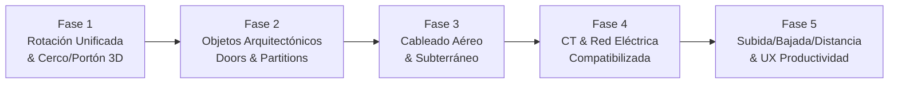

# Plan Maestro: Compatibilidad 2D↔3D + Cableado + CT — "Dialux Mejorado"

> **Objetivo**: Lograr que lo que en Dialux toma 1 día, aquí tome medio día. Corregir todas las inconsistencias de rotación/posición entre 2D y 3D, integrar cableado aéreo por postes, cableado subterráneo con caja, compatibilizar con la red eléctrica y CT, y mantener intacto el motor de cálculo v1.

---

## Estado Actual — Diagnóstico

Tras auditar ~50 archivos del sistema, se identificaron **6 categorías de problemas**:

### 🔴 Problemas Críticos de Compatibilidad 2D↔3D

| # | Problema | Archivo(s) | Impacto |
|---|---------|-----------|---------|
| 1 | **Cercos/Fences en 3D se renderizan como muros sólidos** — No muestran postes ni paneles separados | [House3DBuilder.ts](file:///c:/laragon/www/proyectopcl/resources/js/pages/dialux/engine/House3DBuilder.ts) | Alto |
| 2 | **Portones/Gates no existen en el editor de edificio** — Solo están en el site editor (`SiteBuilder3D.ts`), causando rotación de 45° al intentar alinearlos con cercos | [House3DBuilder.ts](file:///c:/laragon/www/proyectopcl/resources/js/pages/dialux/engine/House3DBuilder.ts), [types.ts](file:///c:/laragon/www/proyectopcl/resources/js/pages/dialux/hooks/types.ts) | Alto |
| 3 | **Convención de rotación inconsistente entre tipos de objetos** — Fixtures usan `+degToRad()`, structural surfaces usan `-degToRad()`, wall-snapped devices mezclan bases East(0°) vs North(0°) | [House3DBuilder.ts](file:///c:/laragon/www/proyectopcl/resources/js/pages/dialux/engine/House3DBuilder.ts) | Alto |
| 4 | **Handle de puertas invertido** — `- sin(angle) * hSide` invierte la posición lateral en muros orientados al Norte | [House3DBuilder.ts](file:///c:/laragon/www/proyectopcl/resources/js/pages/dialux/engine/House3DBuilder.ts) | Medio |
| 5 | **Puertas de particiones sin hoja 3D** — `buildDoor` busca solo en `allWalls`, ignora `partitionId` | [House3DBuilder.ts](file:///c:/laragon/www/proyectopcl/resources/js/pages/dialux/engine/House3DBuilder.ts) | Medio |
| 6 | **Conductores 2D (Bezier curvo) vs 3D (segmentos rectos)** — Trayectorias visuales no coinciden | [OverlayWires.tsx](file:///c:/laragon/www/proyectopcl/resources/js/pages/dialux/components/canvas/OverlayWires.tsx), [conductor3DPath.ts](file:///c:/laragon/www/proyectopcl/resources/js/pages/dialux/engine/conductor3DPath.ts) | Medio |

### 🟡 Funcionalidades Faltantes para Cableado

| # | Funcionalidad | Estado |
|---|--------------|--------|
| 7 | **Cableado aéreo entre postes** — No existe modelo de catenaria/línea aérea exterior | Ausente |
| 8 | **Postes desconectados del grafo de conductores** — No se pueden asignar a circuitos ni dibujar cables hacia ellos | Ausente |
| 9 | **Cableado subterráneo con caja de paso** — Feeders del site no modelan cajas de paso intermedias | Parcial |
| 10 | **Subida/bajada/distancia en postes exteriores** — `wireLengthCalculations.ts` solo maneja indoor | Ausente |

### 🟠 Compatibilidad CT y Red Eléctrica

| # | Funcionalidad | Estado |
|---|--------------|--------|
| 11 | **CT cascada desde poste/trafo hasta panel** — El upstream voltage drop no incluye tramo aéreo/subterráneo exterior | Parcial |
| 12 | **Feeders de site planos en 3D** — Tubos a 0.06m fijo, sin transiciones verticales a edificios | Limitado |

---

## Arquitectura de Fases

> [!IMPORTANT]
> El motor de cálculo de luminarias v1 (`lightingEngineCore.ts`, `directIlluminance.ts`, `fixtureGrid.ts`) **NO se toca** en ninguna fase. Se mantiene intacto el `LIGHTING_ENGINE_VERSION = 'direct-preview-v1'`, las fórmulas, defaults, y la pureza de funciones.



---

## Fase 1 — Rotación Unificada + Cercos y Portones en 3D

**Meta**: Que todo objeto dibujado en 2D aparezca en la misma posición y orientación en 3D.

### 1.1 Sistema de Rotación Unificado

#### [MODIFY] [House3DBuilder.ts](file:///c:/laragon/www/proyectopcl/resources/js/pages/dialux/engine/House3DBuilder.ts)

**Problema raíz**: Las convenciones de rotación no son consistentes:
- Muros: `rotation.y = -atan2(dy, dx)` → correcto (CCW math → CW Babylon)
- Fixtures/devices free-standing: `rotation.y = +degToRad(rotation)` → asume 0° = Norte
- Fixtures/devices wall-snapped: `rotation.y = -θwall + degToRad(rotation)` → mezcla base East con offset North
- Structural surfaces: `rotation.y = -degToRad(orientationDeg)` → signo opuesto a fixtures

**Solución**: Crear una función helper canónica:

```typescript
/**
 * Convierte rotación de usuario (grados CW desde Norte en plano 2D)
 * a rotation.y de Babylon (radianes CW mirando desde arriba).
 * Norte-2D = +Z-Babylon, Este-2D = +X-Babylon.
 */
function userRotationToY(degrees: number): number {
    return (degrees * Math.PI) / 180;
}

/**
 * Combina ángulo de muro (atan2 en math coords) con rotación de usuario.
 * Para objetos snapped a muros: la base es la tangente del muro.
 */
function wallSnappedRotationY(wallAngleRad: number, userDegrees: number): number {
    return -wallAngleRad + userRotationToY(userDegrees);
}
```

**Aplicar en**:
- `buildFixtureLight` (free-standing y wall-mounted)
- `buildLightSwitch`
- `buildElectricalDevice`
- `buildStructuralSurface` (cambiar signo negativo a positivo via helper)
- `buildDoor` (corregir handle position)

### 1.2 Cercos con Postes y Paneles en 3D

#### [MODIFY] [House3DBuilder.ts](file:///c:/laragon/www/proyectopcl/resources/js/pages/dialux/engine/House3DBuilder.ts)

Añadir detección de `wall.wallType === 'cerco'` dentro de `buildWall`:
- **Postes**: Cilindros o cajas en cada vértice y cada `postSpacing` metros a lo largo del cerco
- **Paneles**: Cajas delgadas entre postes (altura = `wall.height`, espesor reducido ~0.05m)
- **Material diferenciado**: Color verde/gris metálico (`#4a7c59`) distinto al muro (`#e8e0d4`)

### 1.3 Portón como Entidad del Editor de Edificio

> [!IMPORTANT]
> Actualmente los portones solo existen en `v2/site`. Para que el usuario dibuje un portón sobre un cerco en el editor de módulo, necesitamos:

#### [MODIFY] [types.ts](file:///c:/laragon/www/proyectopcl/resources/js/pages/dialux/hooks/types.ts)
- Añadir `doorType: 'single' | 'double' | 'sliding' | 'folding' | 'bathroom' | 'opening' | 'gate'` (agregar `'gate'`)
- Añadir propiedades opcionales para gate: `gateLeafCount?: number`, `gateSliding?: boolean`

#### [MODIFY] [House3DBuilder.ts](file:///c:/laragon/www/proyectopcl/resources/js/pages/dialux/engine/House3DBuilder.ts)
- En `buildDoor`, cuando `door.doorType === 'gate'`:
  - Renderizar hojas dobles/corredizas con material metálico
  - Alinear al cerco usando la tangente del wall (`-atan2`) — **no sumar 90° extra**
  - Aplicar la fórmula correcta del site: `rotation.y = -(bearingDeg - 90) * π / 180` adaptada al contexto del building editor

#### [MODIFY] [OverlayDoors.tsx](file:///c:/laragon/www/proyectopcl/resources/js/pages/dialux/components/canvas/OverlayDoors.tsx)
- Renderizar símbolo 2D de portón (líneas dobles con arco de apertura o símbolo de corredera)

### 1.4 Tests de Fase 1

#### [NEW] `engine/rotationHelpers.ts` — helpers puros, testeables
#### [NEW] `engine/rotationHelpers.test.ts` — cobertura de todas las convenciones
#### [MODIFY] `engine/sceneWorldOrigin.test.ts` — validar que la origin translation no rompe rotaciones

---

## Fase 2 — Objetos Arquitectónicos Corregidos

**Meta**: Puertas de particiones, handles, y consistencia visual completa.

### 2.1 Puertas en Particiones con Hoja 3D

#### [MODIFY] [House3DBuilder.ts](file:///c:/laragon/www/proyectopcl/resources/js/pages/dialux/engine/House3DBuilder.ts)
- En `buildDoor`: si `door.partitionId` y no `door.wallId`, buscar en `allPartitions` en vez de `allWalls`
- Usar el mismo código de hoja/jamb/dintel/handle, adaptando thickness de partición

### 2.2 Corrección Handle de Puerta

#### [MODIFY] [House3DBuilder.ts](file:///c:/laragon/www/proyectopcl/resources/js/pages/dialux/engine/House3DBuilder.ts)
- Reemplazar la fórmula actual del handle:
  ```typescript
  // ANTES (buggy para muros N/S):
  pt.x + cos(angle)*hSide + sin(angle)*hDepth
  pt.y - sin(angle)*hSide + cos(angle)*hDepth
  
  // DESPUÉS (consistente):
  // tangent = (cos(angle), sin(angle)), normal = (-sin(angle), cos(angle))
  pt.x + cos(angle)*hSide - sin(angle)*hDepth
  pt.y + sin(angle)*hSide + cos(angle)*hDepth
  ```

### 2.3 Tests de Fase 2

#### [NEW] `engine/buildDoor.test.ts` — handle positions, partition doors, gate alignment

---

## Fase 3 — Cableado Aéreo por Postes y Subterráneo con Caja

**Meta**: Poder cablear luminarias exteriores a postes por aire, y alimentadores subterráneos con cajas de paso.

### 3.1 Integrar Postes al Grafo de Conductores

#### [MODIFY] [types.ts](file:///c:/laragon/www/proyectopcl/resources/js/pages/dialux/hooks/types.ts)
- Extender `Conductor.sourceId | targetId` para aceptar IDs de postes del site
- Añadir `routeType: 'floor' | 'wall_ceiling' | 'aerial' | 'underground'`:
  - `'aerial'`: Cable aéreo entre postes (catenaria)
  - `'underground'`: Cable subterráneo en ducto/zanja

#### [NEW] `hooks/aerialCableGeometry.ts`
- Función de catenaria simplificada:
  $$y(x) = a \cdot \cosh\left(\frac{x - x_c}{a}\right) + y_0$$
  donde $a$ = parámetro de flecha (configurable, default = 95% de la distancia entre postes)
- Cálculo de longitud de cable aéreo:
  $$L = 2a \cdot \sinh\left(\frac{d}{2a}\right)$$
- Input: coordenadas de poste origen y destino, altura de amarre, flecha máxima

#### [NEW] `hooks/aerialCableGeometry.test.ts`

### 3.2 Renderizado 2D de Cables Aéreos

#### [MODIFY] [OverlayWires.tsx](file:///c:/laragon/www/proyectopcl/resources/js/pages/dialux/components/canvas/OverlayWires.tsx)
- `routeType === 'aerial'`: Línea con marcadores de poste (●) y estilo de trazo punto-raya (`strokeDasharray: '8,3,2,3'`)
- `routeType === 'underground'`: Línea con marcadores de caja (■) y estilo de trazo largo (`strokeDasharray: '12,4'`)

### 3.3 Renderizado 3D de Cables Aéreos (Catenaria)

#### [MODIFY] [House3DBuilder.ts](file:///c:/laragon/www/proyectopcl/resources/js/pages/dialux/engine/House3DBuilder.ts) o [conductor3DPath.ts](file:///c:/laragon/www/proyectopcl/resources/js/pages/dialux/engine/conductor3DPath.ts)
- Para `routeType === 'aerial'`: Generar curva catenaria 3D con `BABYLON.Curve3` y `MeshBuilder.CreateTube`
- Para `routeType === 'underground'`: Tubo a profundidad configurable (default -0.60m bajo terreno) con transiciones verticales en cajas de paso

### 3.4 Cajas de Paso para Cables Subterráneos

#### [MODIFY] [types.ts](file:///c:/laragon/www/proyectopcl/resources/js/pages/dialux/hooks/types.ts)
- Añadir `Conductor.junctionBoxes?: Array<{ x: number; y: number; depth?: number }>` — puntos intermedios donde hay cajas de paso
- Cada caja de paso añade tramo vertical (subida desde profundidad + bajada)

#### [MODIFY] [OverlayWires.tsx](file:///c:/laragon/www/proyectopcl/resources/js/pages/dialux/components/canvas/OverlayWires.tsx)
- Renderizar cuadrados con "X" en cada junction box

### 3.5 Tests de Fase 3

#### [NEW] `hooks/aerialCableGeometry.test.ts` — longitudes de catenaria vs valores conocidos
#### [MODIFY] `hooks/wireLengthCalculations.test.ts` — cubrir aerial y underground route types

---

## Fase 4 — CT y Red Eléctrica Compatibilizada

**Meta**: Que el cálculo de caída de tensión incluya tramos aéreos y subterráneos, y que la red desde el transformador hasta el último poste sea coherente.

### 4.1 Longitud de Cable para Nuevos Route Types

#### [MODIFY] [wireLengthCalculations.ts](file:///c:/laragon/www/proyectopcl/resources/js/pages/dialux/hooks/wireLengthCalculations.ts)

Extender `conductorPlanLength()` y `nodeVerticalAllowance()`:

- **`aerial`**:
  - Horizontal: longitud de catenaria (no Manhattan)
  - Vertical: subida desde panel/caja al amarre del poste + bajada en poste destino
  - $$L_{total} = L_{catenaria} + h_{subida,origen} + h_{bajada,destino}$$

- **`underground`**:
  - Horizontal: distancia Euclidiana entre puntos (tramo recto en zanja)
  - Vertical: profundidad de zanja × 2 (baja + sube) en cada extremo, más subidas/bajadas en cajas de paso intermedias
  - $$L_{total} = L_{euclidiana} + \sum_{i} 2 \times d_{caja_i} + h_{subida,origen} + h_{bajada,destino}$$

### 4.2 CT Cascada con Tramo Exterior

#### [MODIFY] [ElectricalNetwork.tsx](file:///c:/laragon/www/proyectopcl/resources/js/pages/dialux/v2/ElectricalNetwork.tsx) (o sus helpers)
- Incluir voltage drop del tramo aéreo/subterráneo desde CT (transformador) → TG (tablero general)
- Incluir voltage drop de feeders de site en el `upstreamVoltageDropV` que se inyecta a cada módulo
- Mostrar en la tabla CT el tramo "Acometida" con tipo de cable, longitud real (aérea o subterránea), y su $\Delta V\%$

### 4.3 Feeders 3D con Transiciones Verticales

#### [MODIFY] `v2/site/engine/SiteBuilder3D.ts`
- Feeders underground: modelar transición vertical al entrar/salir de edificios
- Feeders aéreos: usar catenaria 3D entre postes de la red

### 4.4 Tests de Fase 4

#### [MODIFY] `hooks/wireLengthCalculations.test.ts` — CT cascada con tramos aerial/underground
#### [NEW] `v2/electrical-network/ctCascade.test.ts` — voltage drop end-to-end

---

## Fase 5 — Subida/Bajada/Distancia + UX de Productividad

**Meta**: Hacer el flujo de dibujo más rápido y preciso, con métricas de longitud siempre visibles.

### 5.1 Panel de Métricas de Cable en Tiempo Real

#### [MODIFY] [PropertiesPanel.tsx](file:///c:/laragon/www/proyectopcl/resources/js/pages/dialux/components/PropertiesPanel.tsx)
- Al seleccionar un conductor, mostrar desglose:
  - **Distancia horizontal** (plan length según route type)
  - **Subida** (m) — tramo vertical origen
  - **Bajada** (m) — tramo vertical destino
  - **Cajas de paso** — cantidad y profundidad
  - **Longitud total** (m) — suma de todo
  - **Caída de tensión** (V y %) — calculada en tiempo real

### 5.2 Herramienta de Dibujo Rápido de Cables

#### [MODIFY] [useCanvasInteraction.ts](file:///c:/laragon/www/proyectopcl/resources/js/pages/dialux/hooks/useCanvasInteraction.ts)
- **Draw wire tool mejorado**:
  - Click en poste/panel → auto-detectar `routeType` basado en contexto (interior=`wall_ceiling`, exterior=`aerial` si hay postes, `underground` si no)
  - Mostrar longitud estimada en tooltip mientras se arrastra
  - Snap a postes, paneles, y cajas de paso

### 5.3 Consistencia de Anotaciones 2D↔3D

#### [MODIFY] [OverlayWires.tsx](file:///c:/laragon/www/proyectopcl/resources/js/pages/dialux/components/canvas/OverlayWires.tsx)
- Mostrar longitud total calculada como label sobre cada conductor en 2D
- Usar color diferenciado por tipo de ruta:
  - `wall_ceiling` → naranja (actual)
  - `floor` → naranja punteado (actual)
  - `aerial` → azul punto-raya
  - `underground` → marrón rayas largas

### 5.4 Tests de Fase 5

#### [MODIFY] Tests existentes para validar que no hay regresión en longitudes indoor

---

## Resumen de Archivos por Fase

| Fase | Archivos Modificados | Archivos Nuevos |
|------|---------------------|----------------|
| **1** | `House3DBuilder.ts`, `types.ts`, `OverlayDoors.tsx` | `rotationHelpers.ts`, `rotationHelpers.test.ts` |
| **2** | `House3DBuilder.ts` | `buildDoor.test.ts` |
| **3** | `types.ts`, `OverlayWires.tsx`, `House3DBuilder.ts` o `conductor3DPath.ts` | `aerialCableGeometry.ts`, `aerialCableGeometry.test.ts` |
| **4** | `wireLengthCalculations.ts`, `ElectricalNetwork.tsx`, `SiteBuilder3D.ts` | `ctCascade.test.ts` |
| **5** | `PropertiesPanel.tsx`, `useCanvasInteraction.ts`, `OverlayWires.tsx` | — |

---

## Lo Que NO Se Toca (Integridad v1)

> [!CAUTION]
> Los siguientes archivos y constantes **NO se modifican** en ninguna fase:

- `lightingEngineCore.ts` — motor de cálculo punto-por-punto
- `directIlluminance.ts` — kernel de iluminancia directa
- `fixtureGrid.ts` — distribución geométrica de luminarias
- `roomLighting.ts` — motor normativo y helpers de dominio
- `LIGHTING_ENGINE_VERSION = 'direct-preview-v1'`
- Fórmula del método lumínico: $\Phi = \frac{A \times E}{F_m} \times F_u$
- Fórmula de zona marginal: $p = 0.2 \times 5^{\log_{10}(d)}$
- Centroide Shoelace con sustracción de origen ($v_i - v_0$)
- Grid ratio 1:2:1 de distribución de luminarias
- `hooks/__fixtures__/` — golden files de regresión

---

## Verificación Plan

### Tests Automatizados
```bash
# Fase 1: Rotaciones
npx vitest run resources/js/pages/dialux/engine/rotationHelpers.test.ts
npx vitest run resources/js/pages/dialux/engine/sceneWorldOrigin.test.ts

# Fase 2: Puertas
npx vitest run resources/js/pages/dialux/engine/buildDoor.test.ts

# Fase 3: Cableado
npx vitest run resources/js/pages/dialux/hooks/aerialCableGeometry.test.ts
npx vitest run resources/js/pages/dialux/hooks/wireLengthCalculations.test.ts

# Fase 4: CT
npx vitest run resources/js/pages/dialux/v2/electrical-network/ctCascade.test.ts

# Regresión v1 (DEBE pasar sin cambios):
npx vitest run resources/js/pages/dialux/hooks/lightingEngineCore
npx vitest run resources/js/pages/dialux/hooks/fixtureGrid.test.ts
npx vitest run resources/js/pages/dialux/hooks/roomLighting.test.ts

# Build completo:
npm run types && npm run build
```

### Verificación Manual
- Dibujar un cerco con portón en 2D → verificar que en 3D aparezca alineado, con postes y hojas de portón
- Rotar fixtures, switches, y dispositivos → verificar que 2D y 3D coincidan en orientación
- Cablear un poste exterior por aire → verificar catenaria en 3D y longitud calculada
- Cablear un feeder subterráneo con 2 cajas de paso → verificar subida/bajada y CT
- Verificar que cálculos de luminarias existentes no cambian (comparar con golden results)

---

## Open Questions

> [!IMPORTANT]
> **Q1**: ¿El portón debe poder colocarse **solo sobre cercos** (`wallType === 'cerco'`), o también sobre muros exteriores normales?

> [!IMPORTANT]
> **Q2**: Para cables aéreos, ¿la flecha de la catenaria debe ser configurable por el usuario, o usamos un default fijo (ej. 3% del vano)?

> [!IMPORTANT]
> **Q3**: ¿Las cajas de paso subterráneas deben tener dimensiones configurables (ancho × largo × profundidad), o usamos un estándar fijo?

> [!IMPORTANT]
> **Q4**: En la tabla CT, ¿el tramo "Acometida aérea" desde el transformador al TG debe incluir resistividad diferenciada (aluminio para aéreo vs cobre para subterráneo)?

> [!WARNING]
> **Q5**: ¿Hay algún otro objeto que se dibuje en 2D y no aparezca correctamente en 3D que no hayamos identificado? (Revisar visualmente antes de iniciar Fase 1.)

---

## Estado de implementación (2026-09-19)

Verificado: `npm run types`, tests de `dialux/engine` y `dialux/v2` (85/85), build. Sin prueba visual en navegador.

| Ítem | Estado | Notas |
|------|--------|-------|
| 1.1 Rotación unificada | **NO aplicado** | Las convenciones distintas están documentadas en `House3DBuilder` (`degToRad`) y pueden ser correctas por el origen de cada ángulo (`orientationDeg` de superficies estructurales ≠ rotación de fixtures). Cambiar signos sin comparar 2D↔3D a ojo es riesgoso: requiere validación visual por tipo de objeto antes. |
| 1.2 Cerco con postes | Hecho | `decorateCerco` (paño verde + columnas cada `postSpacing`, default 3 m). Helper puro `cercoPostOffsets`. |
| 1.3 Portón en editor de edificio | Hecho | `Door.doorType = 'gate'` (2 hojas metálicas, sin pomo), catálogo "Portón de cerco", selector en propiedades, símbolo 2D de dos hojas. Sin restricción a cercos (Q1: se puede colocar en cualquier muro). |
| 2.1 Puertas de partición con hoja 3D | Hecho | `buildDoor` recibe las particiones. No dibuja aún el símbolo 2D de puertas de partición (`OverlayDoors` solo busca en muros). |
| 2.2 Handle de puerta | Hecho | `doorHandlePosition` en `engine/doorGeometry.ts` (con tests). |
| 3.1 Postes en el grafo de conductores v1 | **Diferido** | Los postes viven en `SiteData`, los conductores v1 en cada `Scene`; unirlos requiere decisión de arquitectura. |
| 3.x Aéreo / subterráneo | Hecho en **alimentadores del emplazamiento** (`FeederPath.route`) | Catenaria real (`aerialCableGeometry.ts`, con tests), flecha configurable (default 3 % del vano — Q2), amarre 6 m, zanja 0.60 m, cajas de paso (`+ Caja de paso`), 2D punto-raya / rayas largas, 3D catenaria y cajas. Cajas de dimensión fija (Q3). Conductores v1 (`Conductor.routeType`) sin cambios. |
| 4.1/4.2 Longitud en CT | Hecho para alimentadores del emplazamiento | `syncFeederLengths` usa `feederPathLengthM` (catenaria + subidas, o zanja + 2·prof. + 2·prof./caja). Q4: la resistividad NO cambia por tipo de tendido (queda cobre) — decisión pendiente. |
| 4.3 Transición vertical a edificios | Parcial | Aéreo baja al suelo en los extremos; subterráneo se dibuja a ras (`0.06 m`), no enterrado, para que se vea sobre el terreno. |
| 5.x UX/métricas conductores v1 | **No iniciado** | Panel de desglose, snap y colores por tipo de ruta en `OverlayWires` dependen de 3.1. |

**Bug detectado (corregido):** la longitud de un alimentador del emplazamiento se guardaba en unidades de plano sin multiplicar por `terrainScaleM`. Ahora, con escala ≠ 1 o con ruta, se calcula en metros desde los waypoints; a escala 1 y sin ruta se respeta el valor guardado.

**Preexistente (no causado aquí):** `__architecture__/fileSizeBudget.test.ts` ya falla por archivos grandes fuera de la allowlist (`SiteBuilder3D.ts`, `SiteCanvas2D.tsx`, etc.); los tests del oráculo Radiance expiran por tiempo en esta máquina.

### Actualización (2026-09-19, decisiones del usuario: P1 sí, P2 sí, P3 ambos, P4 sí)
- **1.1 Rotación:** `engine/rotationHelpers.ts` fija la convención (`planRotationToYaw`, `wallSnappedYaw`) con tests analíticos: los muros usan `-atan2(dy,dx)` y las rotaciones manuales usaban `+grados`, así que un objeto a 30° en el 2D salía a −30° en 3D y, sobre un muro, la parte manual giraba al revés de la del muro. Aplicado a luminarias, interruptores y dispositivos (5 sitios en `House3DBuilder`). **Requiere verificación visual** (luminaria rectangular a 45°); revertir = cambiar el signo en `planRotationToYaw`. Hallazgo aparte: el 3D de v1 usa z = +y del plano (imagen espejo del 2D); el 3D del emplazamiento usa z = −y. No se tocó.
- **3.1 Postes ↔ red:** tablero virtual "Alumbrado exterior" (`v2/site/domain/exteriorLightingPort.ts`) con la suma de potencias de los postes; aparece en el panel de la red bajo el módulo "Emplazamiento" y se cuelga del TG como cualquier módulo, de modo que la caída de tensión incluye el tramo aéreo/subterráneo que lo alimenta. Potencia por poste: manual → ficha del producto (`PoleConfig.resolvedWatts`, se guarda al elegirlo) → 60 W de referencia (marcado como estimado). Los conductores v1 dentro de un nivel NO se tocaron.
- **P3 material/cable:** cada alimentador trazado elige material (cobre/aluminio) y cable (CAAI autoportante Al, NA2XSY, N2XSY, NYY, N2XOH, THW-90) — solo nombres; se sincroniza al alimentador de la red. El aéreo propone aluminio + CAAI. El catálogo de conductores solo trae cobre THW-90: para aluminio la caída se calcula con la resistividad (0.0286 Ω·mm²/m) y se avisa que no se verifica ampacidad hasta cargarlas en Catálogos (no se inventaron ampacidades).
- **P4 sol:** selector de fecha (+ Equinoccio / Sol. jun / Sol. dic) y lectura de elevación/acimut.
