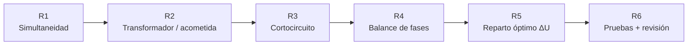

# Plan: Red y CT multi-módulo — simultaneidad, transformador y cortocircuito

> Plan de trabajo (2026-09-24). Continúa `plan_compatibilizacion_planta_general_red_ct.md` (F1–F6).
> Objetivo: que la Red y CT **dimensione la instalación completa** (planta general + N módulos) y no solo calcule caídas de tensión.
> Regla del usuario: **agregar sin destruir**. Todo campo nuevo es opcional y su valor por defecto deja los resultados de hoy **idénticos**.
> Regla de tesis: fórmula con fuente citable + un caso resuelto a mano en test. Nunca "cumple": usar "≥ norma" / "< norma" y citar norma + edición.

---

## 0. Diagnóstico (código verificado 2026-09-24)

| Hallazgo | Dónde |
|---|---|
| La demanda de un TG es la **suma simple** de las demandas máximas de sus hijos (módulos, sub tableros, salidas de la planta). Con 15 módulos eso sobredimensiona el TG, el alimentador y el suministro, y **sobrestima la ΔU**. | `electrical-network/domain/calculations.ts::loadAt` |
| `ElectricalEdge.demandFactor` existe en tipos y en el Form Request, pero **el cálculo nunca lo usa**. | `domain/types.ts`, `UpdateElectricalNetworkRequest.php` |
| No hay potencia del transformador/acometida (kVA), ni reserva, ni % de carga. | — |
| No hay corriente de cortocircuito, ni poder de corte, ni verificación térmica del cable ante falla. | — |
| El balance de fases de la red es manual (R/S/T por circuito). | `ElectricalCtTable.tsx` |

---

## Fases

### R1 — Factor de simultaneidad por tablero
- **Dato nuevo** (opcional): `ElectricalNode.simultaneityFactor` (0 < fs ≤ 1). Ausente = 1 → resultado idéntico al actual.
- **Cálculo**: en el tablero que agrupa, `demanda = demanda propia + fs × Σ demanda de los hijos` (incluye las salidas de la planta, `extraLoads`). La potencia instalada NO se reduce. El factor se aplica en cada tablero donde el usuario lo defina (TG, sub tablero, puerto de módulo con hijos).
- **Propagación**: la corriente, la sección sugerida, el interruptor y la **ΔU** del alimentador de ese tablero y de todos los que están aguas arriba usan la demanda con simultaneidad.
- **Sugerencia (no se aplica sola)**: tabla de factor de simultaneidad asignado de IEC 61439-1 (tablero de distribución, por número de circuitos de salida: 2–3 → 0,9; 4–5 → 0,8; 6–9 → 0,7; ≥ 10 → 0,6). Se muestra como "referencia IEC 61439-1 (verificar edición)"; un clic la aplica. Para vivienda/servicios en Perú, los factores de demanda del CNE-Utilización Sección 050 van **dentro de cada módulo** (motor CT V1), no aquí.
- **UI**: Propiedades del tablero → "Simultaneidad"; resultado "Σ MD hijos → MD con fs".
- **Backend**: regla `data.nodes.*.simultaneityFactor` en el Form Request.
- **Test a mano**: TG con 3 módulos de 10 kW y fs 0,9 → 27 kW, corriente y ΔU proporcionales.

### R2 — Transformador / acometida
- **Datos nuevos** (en el nodo `service`): `transformerKva?`, `transformerUkPercent?` (tensión de cortocircuito), `supplyReservePercent?` (reserva, por defecto 25 %).
- **Cálculo**: `S_demanda (kVA) = P_demanda / cos φ` en cada raíz; potencia sugerida = menor potencia normalizada ≥ S × (1 + reserva); % de carga si el usuario fija el kVA.
- **Serie de potencias**: potencias normalizadas usuales (IEC 60076 R10: 100, 125, 160, 200, 250, 315, 400, 500, 630, 800, 1000, 1250, 1600, 2000 kVA; y las de distribución 25, 37,5, 50, 75 kVA).
- **UI**: tarjeta "Suministro" en el resumen: kVA de demanda, kVA sugerido, % de carga.

### R3 — Cortocircuito trifásico máximo por tablero
- **Método**: IEC 60909-0, método de la impedancia: `Ik3 = c·Un / (√3·|Z|)`, c = 1,05 (BT, tolerancia +6 %; IEC 60909-0 Tabla 1).
  - Red aguas arriba: `S''k` opcional (por defecto 500 MVA).
  - Transformador: `Z_T = uk·U²/S_n` (uk por defecto 4 % si ≤ 630 kVA; IEC 60076-5). Sin pérdidas en carga, se toma como reactancia pura (sobrestima Ik: lado seguro para el poder de corte).
  - Cables: R a 20 °C (máxima Ik), X = 0,08 mΩ/m, ida + vuelta según el número de fases.
- **Verificaciones** (cada una con su fuente):
  - Poder de corte del interruptor ≥ Ik3 (dato del usuario por tablero, `breakingCapacityKa?`).
  - Esfuerzo térmico del cable: `S ≥ Ik·√t / k` (IEC 60364-4-43; k = 115 Cu PVC, 143 Cu XLPE, 76 Al PVC, 94 Al XLPE), t = tiempo de despeje (por defecto 0,1 s, editable).
- **UI**: Ik3 en cada tablero del diagrama y en la tabla CT.

### R4 — Balance de fases automático (red)
- Propone la fase de cada carga monofásica (módulos 1Φ, salidas de la planta) para minimizar el desbalance de cada TG; muestra el % de desbalance `max|I − Ī| / Ī`. Nunca cambia una fase que el usuario fijó a mano.

### R5 — Reparto óptimo de la ΔU en el árbol (aporte de tesis)
- Elegir las secciones de todo el árbol a la vez con la ΔU total ≤ límite, minimizando el cobre (kg·m). Comparar contra el corrector tramo a tramo actual.

### R6 — Pruebas y cierre
- `npx vitest run resources/js/pages/dialux/v2/electrical-network`, `npm run types`, `npm run build`, Pest `ElectricalNetwork`.
- Revisión `dialux-electrical-reviewer` y `dialux-normativa-auditor` (fuentes citadas).
- **Prueba en navegador: la hace el usuario.**

---

## Lo que NO se toca
- El motor CT de la V1 dentro de cada módulo (`wireLengthCalculations.ts`), salvo la corrección de base ya hecha.
- `electrical/engine/formulas.ts`.
- La firma de `calculateElectricalNetwork` (solo se agregan campos opcionales al resultado).

## Estado

| Fase | Estado |
|---|---|
| R1 Simultaneidad | Hecho (2026-09-24) — `calculations.ts` (`simultaneityFactorOf`, `suggestedSimultaneityFactor`), UI en `ElectricalSizingFields.tsx`; falta prueba del usuario |
| R2 Transformador | Hecho (2026-09-24) — `domain/supplySizing.ts`, tarjeta "Suministro" en el resumen y campos en el Suministro; falta prueba del usuario |
| R3 Cortocircuito | Hecho (2026-09-24) — `domain/shortCircuit.ts` (I″k por tablero, Icu, térmica del cable), tiempo de despeje en la configuración de la red; falta prueba del usuario |
| R4 Balance de fases | Hecho (2026-09-24) — `domain/phaseBalance.ts` (LPT, fase fijada nunca cambia, desbalance max\|I−Ī\|/Ī), `components/PhaseBalanceFields.tsx`, campo `ElectricalNode.phase`; falta prueba del usuario |
| R5 Reparto óptimo ΔU | Hecho (2026-09-24) — `domain/sectionOptimizer.ts` (programación dinámica exacta sobre el árbol, validada contra fuerza bruta), `components/SectionOptimizerPanel.tsx` (kg actual / tramo a tramo / óptimo, aplicar); falta prueba del usuario |
| R6 Pruebas | Hecho lo automático (2026-09-24): revisores eléctrico, de cálculo y normativo aplicados (ver abajo); falta prueba del usuario |

### Notas de implementación (R1–R3)
- Campos nuevos, todos opcionales (sin ellos el resultado es idéntico al anterior): `ElectricalNode.simultaneityFactor`, `transformerKva`, `supplyReservePercent`, `transformerUkPercent`, `upstreamShortCircuitMva`, `breakingCapacityKa`; `settings.faultClearingTimeS`. Validados en `UpdateElectricalNetworkRequest.php`.
- `EdgeCalculation` suma `outgoingDemandPowerW` y `simultaneityFactor` (campos nuevos; la firma de `calculateElectricalNetwork` no cambia).
- El cortocircuito usa la potencia fijada del transformador o, si falta, la sugerida por R2; sin ninguna de las dos (sin demanda) no calcula esa raíz y lo dice.
- Aproximaciones declaradas en la interfaz: transformador como reactancia pura (lado seguro), I″k1 de tableros 1Φ con neutro de igual sección y Z0 del Dyn ≈ Z1.
- `ElectricalEdge.demandFactor` sigue sin usarse en el cálculo de la red (se dejó como estaba).

### Notas de implementación (R4–R5)
- R4: carga propia del tablero repartida por igual (el detalle de fases interno vive en el CT V1 del módulo); salidas de la planta en la fase de su fila CT. Aviso si la fase más cargada × fdis supera la ampacidad del alimentador. Límite de desbalance 10 % = criterio de proyecto, **no normativo**.
- R5: restricciones = ΔU propia ≤ límite de alimentador, ΔU acumulada + reserva interna del módulo (su circuito con mayor ΔU propia, opcional) ≤ límite total, ampacidad del catálogo, sección mínima por cortocircuito (R3), 2,5 mm². Objetivo = masa de conductores activos (3 en 3Φ, 2 en 1Φ). ΔU redondeada hacia arriba a 0,01 % (toda solución cumple con valores exactos). Los alimentadores cuya sección fija un cable de la planta no se optimizan (el puente la reimpondría). Se calcula a pedido, no en cada render.
- Evidencia para la tesis: el panel compara kg actual / tramo a tramo / óptimo en el mismo proyecto.
- Pendiente R6: revisión `dialux-electrical-reviewer` + `dialux-normativa-auditor` y prueba del usuario.

### R6 — Resultado de las revisiones (2026-09-24)
- **dialux-electrical-reviewer** (corregido): tramo fijado por la planta que ya supera su límite propio se declaraba "óptimo" → `fixedOverLimitEdgeIds` y no factible; I″k3 dependía de estrella/delta (√3 de más en delta) → siempre c·Un/(√3|Z|); la falla usa la tensión propia del tablero; la térmica se recomprueba con el cortocircuito recalculado con las secciones óptimas (hasta 3 iteraciones).
- **dialux-calc-reviewer** (proyección lineal, corregido): rampas/escaleras ahora son superficies de cálculo (cota media, con aviso); avisos del motor visibles en el panel; Fm editable; aviso de eje aproximado en espacios en L/U (`axisFill < 0,8`); regla W/h con el ancho declarado de rampa/escalera.
- **dialux-normativa-auditor** (corregido): "Alimentadores conformes" → "dentro del límite configurado" (el 2,5 %/4 % CNE-U 050-102 tiene edición/numeral sin confirmar; nota visible junto a los límites); mismas etiquetas en la tabla CT, salidas de la planta y alertas; aviso de que el Ēm "· norma" de exteriores sale de catálogos de INTERIORES (no hay EN 13201/EN 12464-2 cargado); cita NEMA MG 1/IEEE 1159 aclarada como adaptación a corrientes.
- **Pendientes fuera de este alcance** (V1): tests de `compareNormsForActivity` / `findMostStrictNorm` / `resolveApplicableNorms`; `active: true` de `nfpa101`/`ds024` sin catálogo; documentar en `normativa.md` §2 la serie 2,5 %/4 % como otra fuente del límite de ΔU.

