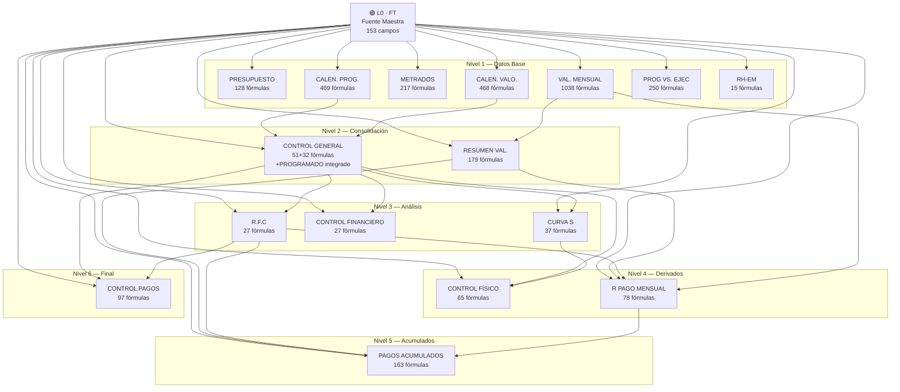

# 📋 Plan Definitivo — Valorización v2 (Campo / Costos)

> **Módulo:** Costos → Campo → Valorizaciones v2  
> **Código (aislado):** `resources/js/features/valorizacion-v2/` + página `resources/js/pages/costos/valorizacion-v2/Index.tsx`  
> **URL:** `/costos/{costoProject}/valorizacion-v2` (tarjeta "Valorización v2" junto a "Cronograma Valorizado")  
> **Backend:** `app/Http/Controllers/ValorizacionV2/ValorizacionV2Controller.php` — no comparte tablas ni rutas con el Cronograma Valorizado en producción  
> **Timezone:** `America/Lima` (UTC-5)  
> **Moneda:** Soles (PEN), `Decimal.js` → 2 dec dinero, 4 dec porcentajes  
> **Excel fuente:** `VALORIZACIÓN N°02 - JUL 2026 (1).xlsx` — 3,364 fórmulas

---

## 0. Decisiones Tomadas

| Decisión | Resolución |
|---|---|
| Hojas `resumen 2`, `resumen 3`, `Hoja2` | **Descartadas** — son de otro proyecto (2014) |
| Hoja `PROGRAMADO` | **Integrada** dentro de Control General y Curva S |
| Hoja `res %` | **Reconstruida** desde datos limpios (tiene #REF! rotos) |
| Total hojas activas | **15 tabs** |

---

## 1. Inventario de Tabs

| # | Hoja Excel | Tab ID | Tipo | Fórmulas | Inputs |
|---|---|---|---|---|---|
| 1 | FT | `ficha-tecnica` | 📄 Formulario | 5 | 153 |
| 2 | PRESUPUESTO | `presupuesto` | 🌳 Árbol | 128 | 618 |
| 3 | CALEN. PROG. | `calendario-programado` | 📅 Calendario+Árbol | 469 | 754 |
| 4 | METRADOS | `metrados` | 🌳 Árbol comparativo | 217 | 620 |
| 5 | CALEN. VALO. | `calendario-valorizado` | 📅 Calendario+Árbol | 468 | 844 |
| 6 | VAL. MENSUAL | `valoracion-mensual` | 📊 Cálculo completo | 1038 | 919 |
| 7 | PROG VS. EJEC | `programado-vs-ejecutado` | 📊 Comparativo | 250 | 806 |
| 8 | CONTROL GEN. AVAN. OBRA. | `control-general` | 📊 Control+Programado | 51+32 | 36+72 |
| 9 | CURVA S | `curva-s` | 📈 Gráfico | 37 | 33 |
| 10 | CONTROL AVAN. FISICO | `control-fisico` | 📊 Control | 65 | 24 |
| 11 | CONTROL FINANCIERO | `control-financiero` | 💰 Control | 27 | 38 |
| 12 | RESUMEN VAL. | `resumen-valoracion` | 📋 Resumen | 179 | 32 |
| 13 | R.F.C | `retencion-fiel-cumplimiento` | 💰 Financiero | 27 | 24 |
| 14 | R PAGO MENSUAL | `resumen-pago-mensual` | 💰 Financiero | 78 | 67 |
| 15 | PAGOS ACUMULADOS | `pagos-acumulados` | 💰 Financiero | 163 | 114 |
| 16 | CONTROL DE PAGOS | `control-pagos` | 💰 Financiero | 97 | 126 |
| 17 | RH-EM | `recursos-humanos` | 📅 Calendario | 15 | 101 |
| — | res % | `resumen-porcentajes` | 📊 Dashboard | ~77 | Reconstruida |

**Total: ~3,364+ fórmulas · 15 tabs activos + 1 dashboard reconstruido**

---

## 2. Mapa de Dependencias



### Orden de Cálculo (Topológico)

```
L0  FT
L1  PRESUPUESTO · CALEN.PROG. · METRADOS · CALEN.VALO. · VAL.MENSUAL · PROG.VS.EJEC · RH-EM
L2  CONTROL GENERAL (+PROGRAMADO) · RESUMEN VAL.
L3  CURVA S · CONTROL FINANCIERO · R.F.C
L4  CONTROL FÍSICO · R PAGO MENSUAL
L5  PAGOS ACUMULADOS
L6  CONTROL DE PAGOS
```

> [!IMPORTANT]
> **FT** es la raíz. Cambiar un dato en FT propaga a todos los niveles. Cambiar un metrado en VAL. MENSUAL propaga desde L2 en adelante.

---

## 3. Reglas Técnicas Transversales

### 3.1 Aritmética Financiera — `Decimal.js`

```typescript
// utils/decimal-helpers.ts
import Decimal from 'decimal.js';

Decimal.set({ precision: 20, rounding: Decimal.ROUND_HALF_UP });

/** Redondear a 2 decimales (dinero) */
export const roundMoney = (v: Decimal): Decimal =>
    v.toDecimalPlaces(2, Decimal.ROUND_HALF_UP);

/** Redondear a 4 decimales (porcentaje) */
export const roundPct = (v: Decimal): Decimal =>
    v.toDecimalPlaces(4, Decimal.ROUND_HALF_UP);

/** Redondear a 0 decimales (detracción, entero) */
export const roundInt = (v: Decimal): Decimal =>
    v.toDecimalPlaces(0, Decimal.ROUND_HALF_UP);

/** Formatear como moneda: S/ 123,456.78 */
export const fmtMoney = (v: Decimal | number | string): string => {
    const d = new Decimal(v);
    return `S/ ${d.toFixed(2).replace(/\B(?=(\d{3})+(?!\d))/g, ',')}`;
};

/** Formatear como porcentaje: 12.34% */
export const fmtPct = (v: Decimal | number | string): string =>
    `${new Decimal(v).mul(100).toFixed(2)}%`;

/** Crear Decimal seguro (acepta null/undefined → 0) */
export const D = (v?: Decimal | number | string | null): Decimal =>
    new Decimal(v ?? 0);
```

> [!CAUTION]
> **Regla absoluta:** `number` nativo NUNCA se usa para operaciones financieras. Todo pasa por `Decimal.js`. El Excel usa `ROUND(...,2)` para dinero y `ROUND(...,4)` para porcentajes — se replican exactamente.

### 3.2 Fechas y Tiempos — `America/Lima`

```typescript
// utils/date-helpers.ts
import { format, parseISO, differenceInDays, addDays } from 'date-fns';
import { es } from 'date-fns/locale';
import { toZonedTime } from 'date-fns-tz';

const TZ = 'America/Lima';

export const toLima = (date: Date | string): Date =>
    toZonedTime(typeof date === 'string' ? parseISO(date) : date, TZ);

export const formatLima = (date: Date | string, fmt = 'dd/MM/yyyy'): string =>
    format(toLima(date), fmt, { locale: es });

export const formatMesAnio = (date: Date | string): string =>
    format(toLima(date), 'MMMM yyyy', { locale: es });

/** Calcular plazo: fecha_fin - fecha_inicio + 1 (días calendario) */
export const calcPlazo = (inicio: Date | string, fin: Date | string): number =>
    differenceInDays(toLima(fin), toLima(inicio)) + 1;

/** Calcular fecha fin: inicio + plazo - 1 */
export const calcFechaFin = (inicio: Date | string, plazo: number): Date =>
    addDays(toLima(inicio), plazo - 1);
```

### 3.3 Fórmulas del Presupuesto (Patrón Centralizado)

Este bloque de cálculo se repite en **PRESUPUESTO, CALEN. PROG., CALEN. VALO., VAL. MENSUAL, PROG VS. EJEC, RESUMEN VAL.** — se centraliza en un solo archivo.

```typescript
// utils/budget-formulas.ts
import Decimal from 'decimal.js';
import { roundMoney, roundPct, D } from './decimal-helpers';

export interface BudgetTotals {
    costoDirecto: Decimal;      // SUM(partidas)
    gastosGenerales: Decimal;   // CD × %GG
    utilidad: Decimal;          // CD × %UTIL
    subTotal: Decimal;          // CD + GG + UTIL
    igv: Decimal;               // SubTotal × %IGV
    total: Decimal;             // SubTotal + IGV
    pctCD: Decimal;             // CD / CD_referencia (para peso %)
}

/**
 * Calcula el bloque presupuestal estándar.
 * Replica exactamente las fórmulas del Excel:
 *   G156 = ROUND(SUM(G12:G155), 2)       → costoDirecto
 *   G157 = ROUND($D157 * G$156, 2)       → gastosGenerales
 *   G158 = ROUND($D158 * G$156, 2)       → utilidad
 *   G159 = ROUND(G156+G157+G158, 2)      → subTotal
 *   G160 = ROUND($D160 * G$159, 2)       → igv
 *   G161 = ROUND(G159+G160, 2)           → total
 *   G162 = ROUND(G156 / $G$156, 4)       → pctCD
 */
export function calcBudgetTotals(
    sumPartidas: Decimal,
    pctGG: Decimal,          // Típicamente 0.075 (7.5%)
    pctUtil: Decimal,        // Típicamente 0.05 (5%)
    pctIGV: Decimal,         // Típicamente 0.18 (18%)
    cdReferencia?: Decimal   // Para calcular pctCD (si es undefined, usa sumPartidas)
): BudgetTotals {
    const costoDirecto = roundMoney(sumPartidas);
    const gastosGenerales = roundMoney(costoDirecto.mul(pctGG));
    const utilidad = roundMoney(costoDirecto.mul(pctUtil));
    const subTotal = roundMoney(costoDirecto.add(gastosGenerales).add(utilidad));
    const igv = roundMoney(subTotal.mul(pctIGV));
    const total = roundMoney(subTotal.add(igv));
    const ref = cdReferencia ?? costoDirecto;
    const pctCD = ref.isZero() ? D(0) : roundPct(costoDirecto.div(ref));

    return { costoDirecto, gastosGenerales, utilidad, subTotal, igv, total, pctCD };
}

/** Fórmula por partida: ROUND(metrado × precioUnitario, 2) */
export const calcPartidaTotal = (metrado: Decimal, pu: Decimal): Decimal =>
    roundMoney(metrado.mul(pu));

/** % avance: ROUND(montoAvance / montoPresupuesto, 4) */
export const calcPctAvance = (avance: Decimal, presupuesto: Decimal): Decimal =>
    presupuesto.isZero() ? D(0) : roundPct(avance.div(presupuesto));
```

### 3.4 Tipo `Partida` (Árbol Compartido)

```typescript
// types/partida.ts
import Decimal from 'decimal.js';

export interface Partida {
    id: string;                    // "01.01.01.01"
    codigo: string;                // "01.01.01.01"
    descripcion: string;
    nivel: number;                 // 0=obra, 1=componente, 2=sub, 3=hoja
    unidad?: string;               // "GLB", "m2", "m3", "und"...
    metrado?: Decimal;             // Solo en hojas (último nivel)
    precioUnitario?: Decimal;      // Solo en hojas
    total?: Decimal;               // ROUND(metrado × P.U., 2)
    esHoja: boolean;               // true = tiene metrado y P.U.
    children: Partida[];
    parentId?: string;
}

export interface PartidaPeriodo {
    partidaId: string;
    monto: Decimal;
    pct: Decimal;                  // % = monto / total_partida
}
```

---

## 4. Estructura de Archivos Completa

> [!IMPORTANT]
> **Estructura vigente (revisión Fase 1, 2026-10-05)** — reemplaza el árbol original de abajo, que queda como referencia histórica.
>
> ```
> resources/js/features/valorizacion-v2/
> ├── lib/          ← cálculo puro sin React (money, dates solo-día, budget, avance, spanishWords) + tests vitest
> ├── utils/        ← formato de UI (fmtMoney, fmtPct, fmtNumber)
> ├── types/        ← SOLO entradas serializables (montos como string, fechas "YYYY-MM-DD")
> ├── data/fixtures ← datos reales del Excel Val. N°02 (oráculo de tests y datos de la página hasta Fase 8)
> ├── store/        ← Zustand creado POR PÁGINA (provider + key); guarda solo entradas
> ├── hooks/        ← useFichaTecnica, useActiveSheet…
> ├── config/       ← sheets.ts: registro único de hojas (grupo, fase, carga diferida)
> ├── sheets/<id>/  ← una carpeta por hoja: compute<Hoja>.ts (puro) + test + <Hoja>Sheet.tsx
> ├── shared/       ← primitivas de UI (Panel, DataRow, Chip)
> ├── components/   ← piezas del módulo (ValorizacionHeader, SheetNav, PendingSheet)
> └── layouts/      ← ValorizacionShell
> ```
>
> **Reglas:** (1) el store guarda solo entradas; todo lo calculado sale de `compute*` puros → la propagación entre hojas es automática, sin el motor de "hojas sucias" de §8.1. (2) Cada `compute*` lleva test con cifras del Excel. (3) Paleta: neutros `stone` (negro/blanco), acento `orange`, resaltados `amber` (amarillo). (4) Nada de `useMemo` manual (React Compiler).
>
> **Corrección de datos:** el pie presupuestal real es **GG 10 % · Utilidad 7 % · IGV 18 %** y el plazo **60 d.c.** (20/06/2026 → 18/08/2026), no 7.5 %/5 %/90 d como decía la Fase 1 original.

```
resources/js/pages/costos/campo/valorizaciones/v2/
│
├── ValorizacionV2Page.tsx              ← Página Inertia principal
│
├── types/
│   ├── index.ts                        ← Re-exports
│   ├── partida.ts                      ← Partida, PartidaPeriodo
│   ├── ficha-tecnica.ts                ← FichaTecnica
│   ├── calendario.ts                   ← CalendarioMes, MesConfig
│   ├── valoracion.ts                   ← ValoracionRow, BudgetTotals
│   ├── control.ts                      ← ControlGeneral, ControlFisico
│   ├── financiero.ts                   ← RFC, PagoMensual, PagoAcumulado, ControlPagos
│   └── recursos-humanos.ts            ← PersonalClave, DiaCalendario
│
├── stores/
│   ├── useValorizacionStore.ts         ← Zustand: estado global
│   └── useCalculationEngine.ts         ← Motor de recálculo con dirty tracking
│
├── hooks/
│   ├── useFichaTecnica.ts              ← Selectors de FT
│   ├── usePartidaTree.ts              ← Expand/collapse, búsqueda, niveles
│   ├── useCalendarioCalc.ts           ← Cálculos calendarios (prog + ejec)
│   ├── useValoracionMensual.ts        ← Cálculo completo de la valorización
│   ├── useControlGeneral.ts           ← Acumulados + estado obra
│   └── useFinancieroCalc.ts           ← RFC, pagos, detracciones
│
├── utils/
│   ├── decimal-helpers.ts              ← D(), roundMoney(), fmtMoney()...
│   ├── date-helpers.ts                 ← toLima(), formatMesAnio()...
│   ├── budget-formulas.ts              ← calcBudgetTotals(), calcPartidaTotal()
│   └── propagation-engine.ts           ← Orden topológico, dirty tracking
│
├── components/
│   ├── layout/
│   │   ├── TabContainer.tsx            ← Sistema de tabs con URL hash
│   │   ├── SheetHeader.tsx             ← Header con datos de FT (reutilizable)
│   │   └── PrintLayout.tsx             ← Wrapper para impresión/export
│   │
│   ├── shared/
│   │   ├── PartidaTreeTable.tsx        ← Tabla-árbol genérica (expand/collapse)
│   │   ├── BudgetSummaryFooter.tsx     ← Footer CD+GG+UTIL+IGV reutilizable
│   │   ├── MoneyCell.tsx               ← Celda S/ con Decimal.js
│   │   ├── PercentCell.tsx             ← Celda % con 4 decimales
│   │   ├── StatusBadge.tsx             ← ATRASADA / ADELANTADA / CULMINADA
│   │   ├── EditableCell.tsx            ← Celda editable con validación
│   │   └── EmptyState.tsx              ← Estado vacío para tabs sin datos
│   │
│   └── tabs/
│       ├── FichaTecnicaTab.tsx          ← Tab 1
│       ├── PresupuestoTab.tsx           ← Tab 2
│       ├── CalendarioProgramadoTab.tsx  ← Tab 3
│       ├── MetradosTab.tsx              ← Tab 4
│       ├── CalendarioValorizadoTab.tsx  ← Tab 5
│       ├── ValoracionMensualTab.tsx     ← Tab 6 ⭐ más complejo
│       ├── ProgVsEjecTab.tsx            ← Tab 7
│       ├── ControlGeneralTab.tsx        ← Tab 8 (incluye PROGRAMADO)
│       ├── CurvaSTab.tsx                ← Tab 9 (incluye datos PROGRAMADO)
│       ├── ControlFisicoTab.tsx         ← Tab 10
│       ├── ControlFinancieroTab.tsx     ← Tab 11
│       ├── ResumenValorizacionTab.tsx   ← Tab 12
│       ├── RetencionFCTab.tsx           ← Tab 13
│       ├── ResumenPagoMensualTab.tsx    ← Tab 14
│       ├── PagosAcumuladosTab.tsx       ← Tab 15
│       ├── ControlPagosTab.tsx          ← Tab 16
│       ├── RecursosHumanosTab.tsx       ← Tab 17
│       └── ResumenPorcentajesTab.tsx    ← Dashboard (reconstruida de res %)
```

---

## 5. Fases de Implementación

---

### FASE 1 — Fundamentos, Store y Ficha Técnica

**Objetivo:** Crear la arquitectura base, utils, store global y la hoja FT como fuente maestra de la que dependen todas las demás.

**Estimado:** 3-4 sesiones

#### 1.1 Scaffolding del Proyecto

| Tarea | Detalle |
|---|---|
| Crear estructura de carpetas | Todo bajo `v2/` |
| Verificar dependencias | `decimal.js`, `date-fns`, `date-fns-tz`, `zustand`, `recharts` |
| Crear `decimal-helpers.ts` | `D()`, `roundMoney()`, `roundPct()`, `roundInt()`, `fmtMoney()`, `fmtPct()` |
| Crear `date-helpers.ts` | `toLima()`, `formatLima()`, `formatMesAnio()`, `calcPlazo()` |
| Crear `budget-formulas.ts` | `calcBudgetTotals()`, `calcPartidaTotal()`, `calcPctAvance()` |
| Crear tipos base | `types/index.ts`, `types/partida.ts`, `types/ficha-tecnica.ts` |

#### 1.2 Store Global — `useValorizacionStore.ts`

```typescript
interface ValorizacionState {
    // Datos fuente
    fichaTecnica: FichaTecnica;
    partidas: Partida[];

    // Datos por periodo
    mesesConfig: MesConfig[];           // Meses de la valorización
    calendarioProgramado: Map<string, PartidaPeriodo[]>;  // mesKey → partidas
    calendarioValorizado: Map<string, PartidaPeriodo[]>;
    metradosMensuales: Map<string, MetradoMes[]>;

    // Valorización mensual
    valoracionActual: ValoracionRow[];
    valoracionAnterior: ValoracionRow[];

    // Controles (calculados)
    controlGeneral: ControlGeneralRow[];
    controlFinanciero: ControlFinancieroRow[];

    // Financiero
    rfc: RetenciónFC;
    pagoMensual: PagoMensual;
    pagosAcumulados: PagoAcumuladoRow[];
    controlPagos: ControlPagosRow[];

    // Recursos humanos
    personalClave: PersonalClave[];

    // Acciones
    setFichaTecnica: (ft: FichaTecnica) => void;
    setPartidas: (partidas: Partida[]) => void;
    updateMetradoActual: (partidaId: string, metrado: Decimal) => void;
    recalculate: (fromLevel?: number) => void;
}
```

#### 1.3 Tab `ficha-tecnica`

**Naturaleza:** Formulario de solo lectura, organizado en secciones.

**Datos que almacena (153 campos):**

| Sección | Campos Clave | Ejemplo |
|---|---|---|
| A. Datos Generales | Entidad, Obra, CUI, Modalidad | MUNICIPALIDAD DISTRITAL DE PILLCO MARCA |
| B. Datos Económicos | Valor referencial, Monto contrato (incl. IGV) | S/ 638,827.47 |
| C. Porcentajes | %GG, %UTIL, %IGV, %Supervisión | 7.5%, 5%, 18% |
| D. Plazos | Plazo (días), Fecha inicio, Fecha fin | 90 días, 20/06/2026 |
| E. Personal | Residente, Supervisor, Ing. Supervisor | Nombres |

**Fórmulas (5):**

| Celda | Fórmula | Implementación |
|---|---|---|
| `E26` | `=+E25` | Copia de fecha |
| `E44` | `=+E43` | Copia de fecha |
| `E51` | `=+E49+E50-1` | `calcPlazo(inicio, fin)` = inicio + plazo - 1 |
| `E58` | `=+CONTROL_GENERAL.L14` | % avance programado acumulado (cross-tab) |
| `E59` | `=+CONTROL_GENERAL.N14` | % avance ejecutado acumulado (cross-tab) |

**Diseño UI:**
- Layout de 2 columnas con secciones colapsables
- Sección A/B/C en lectura, con opción de edición inline
- Sección D con cálculo automático de plazo
- Sección E con datos de personal

#### 1.4 Página Principal `ValorizacionV2Page.tsx`

```typescript
const TABS = [
    { id: 'ficha-tecnica', label: 'Ficha Técnica', icon: '📄' },
    { id: 'presupuesto', label: 'Presupuesto', icon: '🌳' },
    { id: 'calendario-programado', label: 'Cal. Programado', icon: '📅' },
    { id: 'metrados', label: 'Metrados', icon: '📏' },
    { id: 'calendario-valorizado', label: 'Cal. Valorizado', icon: '📅' },
    { id: 'valoracion-mensual', label: 'Val. Mensual', icon: '⭐' },
    { id: 'programado-vs-ejecutado', label: 'Prog vs Ejec', icon: '📊' },
    { id: 'control-general', label: 'Control General', icon: '📊' },
    { id: 'curva-s', label: 'Curva S', icon: '📈' },
    { id: 'control-fisico', label: 'Control Físico', icon: '📊' },
    { id: 'control-financiero', label: 'Control Financiero', icon: '💰' },
    { id: 'resumen-valoracion', label: 'Resumen Val.', icon: '📋' },
    { id: 'retencion-fc', label: 'R.F.C', icon: '💰' },
    { id: 'resumen-pago', label: 'R. Pago Mensual', icon: '💰' },
    { id: 'pagos-acumulados', label: 'Pagos Acumulados', icon: '💰' },
    { id: 'control-pagos', label: 'Control Pagos', icon: '💰' },
    { id: 'recursos-humanos', label: 'RH-EM', icon: '👷' },
    { id: 'resumen-porcentajes', label: 'Resumen %', icon: '📊' },
] as const;
```

- Tab activo se persiste en URL hash (`#ficha-tecnica`)
- Lazy loading de tabs con `React.lazy`
- `SheetHeader.tsx` reutilizable renderiza: Obra, Entidad, Ejecutor, Supervisor, Residente, V.R., Monto contrato — leídos de FT

#### Verificación Fase 1

- [x] `npm run types` → 0 errores en valorizacion-v2
- [x] `npm run build` → compila (hoja FT en chunk diferido propio)
- [x] FT renderiza con datos reales del Excel (fixture `valorizacion02Jul2026`)
- [x] Store por página (provider + key por proyecto)
- [x] `roundMoney('123.455')` → `123.46` (ROUND de Excel)
- [x] `formatDate('2026-07-15')` → `15/07/2026` en cualquier zona horaria (bug de corrimiento corregido)
- [x] `calcBudgetTotals` cuadra con PRESUPUESTO (638,827.47) y con el bloque ACTUAL de VAL. MENSUAL (224,198.55)
- [x] Ruta aislada `/costos/{id}/valorizacion-v2` + tarjeta en Cronogramas + Pest (owner/403/guest)
- [ ] Prueba visual del usuario en navegador

---

### FASE 2 — Presupuesto y Componente Árbol

**Objetivo:** Construir el árbol de partidas reutilizable y la hoja de presupuesto. Este componente se usa en 7+ tabs.

**Estimado:** 3-4 sesiones

#### 2.1 Tab `presupuesto`

**Naturaleza:** Tabla-árbol de ~155 partidas con 4 niveles de jerarquía.

**Estructura del árbol:**
```
01  CREACION DE PISTAS Y VEREDAS JR LOS CEDROS
├── 01.01  OBRAS PROVISIONALES Y TRABAJOS PRELIMINARES
│   ├── 01.01.01  OBRAS PROVISIONALES
│   │   ├── 01.01.01.01  ALQUILER DE ALMACEN...     GLB  1.00  ×  2500.00  =  2500.00
│   │   ├── 01.01.01.02  CARTEL DE IDENTIFICACION    und  1.00  ×  1050.00  =  1050.00
│   │   └── ...
│   └── 01.01.02  TRABAJOS PRELIMINARES
│       └── ...
└── 01.02  MOVIMIENTO DE TIERRAS
    └── ...
```

**Fórmulas (128):**

| Patrón | Fórmula | Cantidad | Implementación |
|---|---|---|---|
| Total partida | `ROUND(E×F, 2)` = metrado × P.U. | 117 | `calcPartidaTotal()` |
| Costo directo | `ROUND(SUM(G12:G155), 2)` | 1 | `SUM(partidas.total)` |
| Gastos generales | `ROUND($D157×G$156, 2)` | 1 | `CD × %GG` |
| Utilidad | `ROUND($D158×G$156, 2)` | 1 | `CD × %UTIL` |
| Sub total | `ROUND(G156+G157+G158, 2)` | 1 | `CD + GG + UTIL` |
| IGV | `ROUND($D160×G$159, 2)` | 1 | `SubTotal × %IGV` |
| Total presupuesto | `ROUND(G159+G160, 2)` | 1 | `SubTotal + IGV` |
| Datos FT | `=+FT!$E$N` | 7 | Lee del store |

**Diseño UI:**

```
┌────────────────────────────────────────────────────────────────────────┐
│  PRESUPUESTO DE OBRA                                                   │
│  Obra: [de FT]    Entidad: [de FT]    V.R.: S/ XXX    Contrato: S/ X │
├──────┬───────────────────────────────┬─────┬──────┬────────┬──────────┤
│ ITEM │ DESCRIPCION                   │ UND │ MET. │  P.U.  │  TOTAL   │
├──────┼───────────────────────────────┼─────┼──────┼────────┼──────────┤
│▶ 01  │ CREACION DE PISTAS...         │     │      │        │          │
│ ▶01.01│ OBRAS PROVISIONALES...       │     │      │        │          │
│  ▶01.01.01│ OBRAS PROVISIONALES      │     │      │        │          │
│   01.01.01.01│ ALQUILER DE ALMACEN   │ GLB │ 1.00 │2,500.00│ 2,500.00│
│   01.01.01.02│ CARTEL DE IDENTIF.    │ und │ 1.00 │1,050.00│ 1,050.00│
│  ...                                                                   │
├──────┴───────────────────────────────┴─────┴──────┴────────┼──────────┤
│ COSTO DIRECTO                                              │ XXX,XXX │
│ GASTOS GENERALES (7.50%)                                   │  XX,XXX │
│ UTILIDAD (5.00%)                                           │  XX,XXX │
│ SUB TOTAL                                                  │ XXX,XXX │
│ IGV (18.00%)                                               │  XX,XXX │
│ TOTAL PRESUPUESTO                                          │ XXX,XXX │
└────────────────────────────────────────────────────────────┴──────────┘
```

#### 2.2 Componentes Reutilizables

**`PartidaTreeTable.tsx`** — Props genéricas:
```typescript
interface PartidaTreeTableProps {
    partidas: Partida[];
    columns: ColumnDef[];              // Columnas dinámicas por tab
    expandedIds: Set<string>;
    onToggle: (id: string) => void;
    footer?: ReactNode;                // BudgetSummaryFooter u otro
    highlightEditable?: boolean;       // Resaltar celdas editables
}
```

**`BudgetSummaryFooter.tsx`** — Footer estándar:
```typescript
interface BudgetSummaryFooterProps {
    totals: BudgetTotals;
    columns?: number;                  // Cuántas columnas span
    showPct?: boolean;                 // Mostrar fila de % peso
}
```

#### Verificación Fase 2

- [x] Árbol se expande/colapsa por nivel (Obra / Componentes / Subtítulos / Todo) + búsqueda sin tildes
- [x] Cada partida hoja: `ROUND(metrado × P.U., 2)` (tests con empates 2890.215 → 2890.22)
- [x] Costo directo = SUM exacto de partidas; títulos muestran subtotal + % de incidencia
- [x] Los 13 componentes cuadran con RESUMEN VAL.; CD 462,717.27 y total 638,827.47 = contrato vigente
- [x] `PartidaTreeTable` genérica (columnas y bandas de cabecera dinámicas, ÍTEM/DESCRIPCIÓN fijas)
- [x] `BudgetSummaryFooter` con N celdas (1 en presupuesto; 1 por mes en F3; 5 bloques en F4)
- [x] Fixture completo (144 filas, 103 partidas, hasta nivel 5) generado desde el .xlsx
- [x] **Importar Excel**: `lib/import/parsePresupuestoRows.ts` (puro, detecta cabecera y tasas del pie, valida total por partida) + `data/importers/readPresupuestoExcel.ts` (SheetJS bajo demanda); test contra el .xlsx real
- [x] **Edición del árbol por clic derecho / botón ⋮**: agregar hijo, hermano arriba/abajo, subir nivel (nieto → hijo → raíz), bajar nivel (entra en el anterior), mover arriba/abajo, eliminar con contenido — `lib/presupuestoOps.ts`
- [x] **Modelo con identidad estable**: cada partida tiene `id` + `parentId`; el `codigo` se renumera solo por posición. Fases 3+ enlazan por `id`, nunca por código
- [x] **Regla de hoja**: nodo sin hijos = partida (unidad/metrado/P.U. editables y obligatorios); nodo con hijos = título (esos datos se limpian solos, con confirmación si tenían valores)
- [x] Espacio/responsive: ancho completo, menú de hojas plegable, DESCRIPCIÓN fija solo desde tablet
- [ ] Persistencia de ediciones/importación (Fase 8): hoy se pierden al recargar
- [ ] `npm run build` (bloqueado por archivo de Wayfinder retenido por el dev server, no por el código)
- [ ] Prueba visual del usuario

---

### FASE 3 — Calendarios Programado y Valorizado

**Objetivo:** Los dos calendarios de distribución mensual. Comparten la misma estructura pero uno es programado y otro ejecutado.

**Estimado:** 3-4 sesiones

#### 3.1 Tab `calendario-programado`

**Naturaleza:** Árbol de partidas + distribución por mes (Jun, Jul, Ago 2026).

**Fórmulas (469):**

| Patrón | Fórmula | Cant. | Descripción |
|---|---|---|---|
| Total partida | `ROUND(E×F, 2)` | 117 | metrado × P.U. |
| % partida/mes | `ROUND(J / $G, 4)` | ~117 por mes | monto_mes / total_partida |
| CD mes | `ROUND(SUM(J12:J155), 2)` | 1/mes | Sum partidas del mes |
| GG mes | `ROUND($D157×J$156, 2)` | 1/mes | CD_mes × %GG |
| UTIL mes | `ROUND($D158×J$156, 2)` | 1/mes | CD_mes × %UTIL |
| SubTotal mes | `ROUND(J156+J157+J158, 2)` | 1/mes | CD+GG+UTIL |
| IGV mes | `ROUND($D160×J$159, 2)` | 1/mes | SubTotal × %IGV |
| Total mes | `ROUND(J159+J160, 2)` | 1/mes | SubTotal+IGV |
| % peso mes | `ROUND(J156/$G156, 4)` | 1/mes | CD_mes / CD_total |
| % acumulado | `=+J163+M162` | 1/mes | % mes anterior + % mes actual |
| Datos FT | `=+FT!$E$N` | 9 | Obra, fechas, etc. |

**Diseño UI:**
```
┌──────┬──────────────────┬──PRESUPUESTO──┬──JUN 2026──┬──JUL 2026──┬──AGO 2026──┐
│ ITEM │ DESCRIPCION      │ UND│MET│P.U│TOT│  %  │MONTO│  %  │MONTO│  %  │MONTO│
├──────┼──────────────────┼────┼───┼───┼───┼─────┼─────┼─────┼─────┼─────┼─────┤
│...   │...               │    │   │   │   │     │     │     │     │     │     │
├──────┴──────────────────┴────┴───┴───┼───┼─────┼─────┼─────┼─────┼─────┼─────┤
│ CD                                   │TOT│ % p │MON 1│ % p │MON 2│ % p │MON 3│
│ GG (7.5%)                           │   │     │     │     │     │     │     │
│ UTIL (5%)                            │   │     │     │     │     │     │     │
│ SubTotal                             │   │     │     │     │     │     │     │
│ IGV (18%)                            │   │     │     │     │     │     │     │
│ TOTAL                                │   │     │     │     │     │     │     │
│ % Peso                               │   │  %  │     │  %  │     │  %  │     │
│ % Acumulado                          │   │  %  │     │  %  │     │  %  │     │
└──────────────────────────────────────┴───┴─────┴─────┴─────┴─────┴─────┴─────┘
```

#### 3.2 Tab `calendario-valorizado`

**Idéntica estructura** al programado pero con valores ejecutados reales.

- **468 fórmulas** — Mismo patrón
- **Diferencia:** Los montos por mes son los REALMENTE ejecutados
- Comparte el componente `CalendarioGrid` con prop `tipo: 'ejecutado'`

#### 3.3 Componente Compartido `CalendarioGrid.tsx`

```typescript
interface CalendarioGridProps {
    partidas: Partida[];
    meses: MesConfig[];                           // [{fecha, label, rangoInicio, rangoFin}]
    valoresPorMes: Map<string, PartidaPeriodo[]>; // mesKey → [{partidaId, monto, pct}]
    tipo: 'programado' | 'ejecutado';
    pctGG: Decimal;
    pctUtil: Decimal;
    pctIGV: Decimal;
    onCellEdit?: (mesKey: string, partidaId: string, monto: Decimal) => void;
}
```

#### Verificación Fase 3

- [x] Totales mensuales cuadran con Excel: programado 157,550.32 · 203,396.72 · 277,880.43; ejecutado 400,648.29 · 224,198.55
- [x] % acumulado progresivo (programado 24.66 → 56.50 → 100 %; ejecutado 62.72 → 97.82 %)
- [x] Pie CD+GG+UTIL+IGV por mes (`BudgetSummaryFooter` con N celdas + fila "Avance acumulado")
- [x] Cabeceras "Jun-26 · 20/06 – 30/06" derivadas de la FT (`lib/periodos.ts`); mes valorizado resaltado
- [x] Un solo `CalendarioSheet` para ambos tipos; montos sin redondear (como el Excel) enlazados por `id` de partida
- [x] Edición de montos: acepta monto ("1600") o % del total ("25%"); control Σ % / saldo por partida (programado = 100 %, ejecutado ≤ 100 %)
- [x] Importar Excel de CALEN. PROG. / CALEN. VALO. (enlace por código contra el presupuesto cargado) + test contra el .xlsx real
- [x] Deshacer/rehacer global (Ctrl+Z / Ctrl+Y, 100 pasos) en `lib/history.ts` + store
- [x] FT E58/E59 y KPIs de cabecera ahora salen de los calendarios (56.50 % / 97.82 % → ADELANTADA EN 41.32 %)
- [ ] Nota: el Excel pone "19-Ago" como fin del último mes, pero la FT dice término 18/08 (inicio + 60 − 1); la v2 usa la FT
- [ ] Prueba visual del usuario

---

### FASE 4 — Metrados y Valorización Mensual

**Objetivo:** Las dos hojas más intensivas en datos. Metrados alimenta a VAL. MENSUAL, que es la hoja central del sistema.

**Estimado:** 4-5 sesiones

#### 4.1 Tab `metrados`

**Naturaleza:** Árbol de partidas con columnas de metrado por mes.

**Fórmulas (217):**

| Patrón | Fórmula | Cant. | Descripción |
|---|---|---|---|
| Acumulado | `=+G+I+K` | ~110 | Sum de 3 meses de metrado |
| Saldo | `=+E-M` | ~98 | Contratado − acumulado |
| Datos FT | `=+FT!$E$N` | 9 | Encabezados |

**Diseño UI:**
```
┌──────┬───────────────┬─CONTRATADO─┬──JUN 2026──┬──JUL 2026──┬──ACUMULADO──┬──SALDO──┐
│ ITEM │ DESCRIPCION   │ UND │ MET  │  METRADO   │  METRADO   │  METRADO    │ POR MET │
├──────┼───────────────┼─────┼──────┼────────────┼────────────┼─────────────┼─────────┤
│...   │...            │     │      │   [input]  │   [input]  │  (calculado)│(calcul.)│
└──────┴───────────────┴─────┴──────┴────────────┴────────────┴─────────────┴─────────┘
```

- Columnas de metrado mensual son **editables** (inputs)
- Acumulado y saldo se **calculan automáticamente**
- Color diferente para celdas editables vs calculadas

#### 4.2 Tab `valoracion-mensual` ⭐ HOJA CENTRAL

**Naturaleza:** La hoja más compleja del sistema. 1038 fórmulas. Combina presupuesto, anterior, actual y saldos.

**Estructura de 5 bloques de columnas:**

| Bloque | Cols | Contenido | Editable |
|---|---|---|---|
| **Presupuesto** | B-G | Item, Desc, UND, Metrado, P.U., Total | No |
| **Acum. Anterior** | I-K | Metrado, Costo, % | No (viene de val. anterior) |
| **Actual** | M-O | Metrado, Costo, % | **M = input** |
| **Acum. Actual** | Q-S | Metrado, Costo, % | No (calculado) |
| **Saldo** | U-W | Metrado, Costo, % | No (calculado) |

**Fórmulas clave (1038):**

| Patrón | Fórmula | Cant. | Implementación |
|---|---|---|---|
| Total presupuesto | `ROUND(E×F, 2)` | 117 | `calcPartidaTotal()` |
| Metrado actual (algunos) | `=+E{n}` (copia metrado pres.) | ~70 | Valor por defecto del presupuesto |
| Costo actual | `ROUND(M×$F, 2)` | 117 | `met_actual × P.U.` |
| % actual | `ROUND(N/$G, 4)` | 117 | `costo_actual / total_pres` |
| Met. acumulado | `=+I+M` | 117 | `met_anterior + met_actual` |
| Costo acumulado | `=+J+N` | 117 | `costo_anterior + costo_actual` |
| % acumulado | `=+K+O` | 117 | `% anterior + % actual` |
| Met. saldo | `=+E-Q` | 117 | `met_pres - met_acumulado` |
| Costo saldo | `=+G-R` | 117 | `total_pres - costo_acumulado` |
| % saldo | `=1-S` | 117 | `1 - % acumulado` |
| Footer (×5 bloques) | CD+GG+UTIL+IGV | 35 | `calcBudgetTotals()` ×5 |

**Motor de cálculo por fila:**

```typescript
interface ValoracionRow {
    partidaId: string;
    // Presupuesto (inmutable)
    metPresupuesto: Decimal;
    pu: Decimal;
    totalPresupuesto: Decimal;          // ROUND(met × PU, 2)
    // Anterior (inmutable, viene de val. anterior)
    metAnterior: Decimal;
    costoAnterior: Decimal;
    pctAnterior: Decimal;               // ROUND(costoAnt / totalPres, 4)
    // Actual (metrado es INPUT del usuario)
    metActual: Decimal;                 // ← EDITABLE
    costoActual: Decimal;               // = ROUND(metActual × PU, 2)
    pctActual: Decimal;                 // = ROUND(costoActual / totalPres, 4)
    // Acumulado (calculado)
    metAcumulado: Decimal;              // = metAnterior + metActual
    costoAcumulado: Decimal;            // = costoAnterior + costoActual
    pctAcumulado: Decimal;              // = pctAnterior + pctActual
    // Saldo (calculado)
    metSaldo: Decimal;                  // = metPresupuesto - metAcumulado
    costoSaldo: Decimal;               // = totalPresupuesto - costoAcumulado
    pctSaldo: Decimal;                  // = 1 - pctAcumulado
}
```

**Diseño UI:**
```
┌──────┬───────────┬──PRESUPUESTO──┬──ACUM.ANTERIOR──┬──ACTUAL──────┬──ACUM.ACTUAL─┬──SALDO───────┐
│ ITEM │ DESC      │UND│MET│PU│TOT│MET│COSTO│  %    │MET│COSTO│ % │MET│COSTO│  %  │MET│COSTO│ % │
├──────┼───────────┼───┼───┼──┼───┼───┼─────┼───────┼───┼─────┼───┼───┼─────┼─────┼───┼─────┼───┤
│...   │...        │   │   │  │   │   │     │       │[✏]│ aut │aut│aut│ aut │ aut │aut│ aut │aut│
├──────┴───────────┴───┴───┴──┼───┼───┼─────┼───────┼───┼─────┼───┼───┼─────┼─────┼───┼─────┼───┤
│ COSTO DIRECTO               │TOT│   │     │       │   │     │   │   │     │     │   │     │   │
│ GASTOS GENERALES            │   │   │     │       │   │     │   │   │     │     │   │     │   │
│ UTILIDAD                    │   │   │     │       │   │     │   │   │     │     │   │     │   │
│ SUB TOTAL                   │   │   │     │       │   │     │   │   │     │     │   │     │   │
│ IGV                         │   │   │     │       │   │     │   │   │     │     │   │     │   │
│ TOTAL                       │   │   │     │       │   │     │   │   │     │     │   │     │   │
└─────────────────────────────┴───┴───┴─────┴───────┴───┴─────┴───┴───┴─────┴─────┴───┴─────┴───┘
```

> [!WARNING]
> El campo `[✏] MET` (metrado actual) es el **único input** del usuario en esta hoja. Al cambiarlo, se recalcula TODA la fila y se propaga a L2+ (CONTROL GENERAL, RESUMEN VAL, etc.).

#### Verificación Fase 4

- [x] **Fuente única de avance = metrado ejecutado por mes** (verificado: CALEN. VALO. = ROUND(met × PU, 2) y VAL. MENSUAL anterior/actual = METRADOS en las 103 partidas, 0 diferencias). El calendario ejecutado ya no se ingresa: se deriva
- [x] Metrados: acumulado = Σ meses, saldo = contratado − acumulado, % avance y estado (sin avance / en curso / completo / excedido)
- [x] VAL. MENSUAL: anterior (meses previos), actual (metrado del mes, editable aquí o en Metrados: mismo dato), acumulado y saldo por fila
- [x] Pies de los 5 bloques cuadran con el Excel: anterior 400,648.29 · actual 224,198.55 · acumulado 624,846.84 (97.82 %) · saldo 13,980.63 (2.18 %); acumulado = suma de pies y saldo = presupuesto − acumulado, como el Excel
- [x] Importar METRADOS desde Excel (meses por fecha de cabecera; avisa si el contratado difiere del presupuesto) + test contra el .xlsx real
- [x] Clic derecho (agregar/mover/eliminar ramas) disponible en Presupuesto, calendarios, Metrados y VAL. MENSUAL: siempre edita el presupuesto (fuente única de ítems)
- [ ] ⚠ Hallazgo para Fase 6: la hoja RESUMEN VAL. del Excel tiene referencias rotas en 01.09–01.13 (p. ej. 01.11 anterior 4.30 vs 16,380.56 real); la v2 la calculará desde VAL. MENSUAL
- [ ] Prueba visual del usuario

---

### FASE 5 — Controles de Avance, Curva S y Programado

**Objetivo:** Las hojas de control que consolidan programado vs ejecutado, incluyendo la integración de la hoja PROGRAMADO.

**Estimado:** 3-4 sesiones

#### 5.1 Tab `programado-vs-ejecutado`

**Naturaleza:** Mismo árbol con 2 pares de columnas (programado mes, ejecutado mes).

**Fórmulas (250):**

| Patrón | Cantidad | Descripción |
|---|---|---|
| `ROUND(E×F, 2)` | 117 | Total presupuesto por partida |
| `ROUND(J/$G, 4)` | ~60 | % programado del mes |
| `ROUND(M/$G, 4)` | ~60 | % ejecutado del mes |
| Footer (×2) | ~13 | CD+GG+UTIL+IGV prog y ejec |

#### 5.2 Tab `control-general` (+ PROGRAMADO integrado)

**Naturaleza:** Tabla resumen compacta (NO es árbol). Una fila por mes de valorización.

**Fórmulas (51 de CONTROL GENERAL + 32 de PROGRAMADO):**

| Columna | Contenido | Fórmula Origen |
|---|---|---|
| C | Mes | Lee de `CALEN.PROG.` headers |
| D | Programado mensual (S/) | `=+CALEN.PROG.!J161` (total mes) |
| E | Prog. acumulado (S/) | `D[mes] + E[mes-1]` |
| F | % prog. mensual | `ROUND(D / D_total, 4)` |
| G | % prog. acumulado | `F[mes] + G[mes-1]` |
| H | Ejecutado mensual (S/) | `=+CALEN.VALO.!J161` (total mes) |
| I | Ejec. acumulado (S/) | `H[mes] + I[mes-1]` |
| J | % ejec. mensual | `ROUND(H / D_total, 4)` |
| K | % ejec. acumulado | `J[mes] + K[mes-1]` |
| L | % prog. acum. (ref) | `= G` |
| M | Límite 80% | `ROUND(L × 0.8, 4)` |
| N | % ejec. acum. (ref) | `= K` |
| O | Diferencia | `N - L` |
| P | Estado | `IF(K<G, "ATRASADA", IF(K=100%, "CULMINADA", "ADELANTADA"))` |

**Integración PROGRAMADO** (32 fórmulas adicionales):
- Sección inferior con resumen de avance físico y financiero
- Programado vs Ejecutado en formato compacto con % y acumulados
- Datos de 6 meses máximo

**Diseño UI:**
```
┌──────────────────────────────────────────────────────────────────────────────┐
│ CONTROL GENERAL DE AVANCE DE OBRA                                           │
├────┬────────┬─────────PROGRAMADO──────────┬──────────EJECUTADO────────┬─────┤
│ N° │  MES   │ MENSUAL │ ACUM.│% MEN│% ACU │ MENSUAL │ ACUM.│% MEN│% ACU│ESTADO│
├────┼────────┼─────────┼──────┼─────┼──────┼─────────┼──────┼─────┼─────┼──────┤
│ 1  │JUN 2026│ XXX,XXX │  ... │0.XXX│0.XXX │ XXX,XXX │  ... │0.XXX│0.XXX│🟢 AD│
│ 2  │JUL 2026│ XXX,XXX │  ... │0.XXX│0.XXX │ XXX,XXX │  ... │0.XXX│0.XXX│🔴 AT│
├────┴────────┼─────────┼──────┼─────┼──────┼─────────┼──────┼─────┼─────┼──────┤
│ TOTAL       │ XXX,XXX │      │1.000│      │ XXX,XXX │      │0.XXX│      │      │
├─────────────┴─────────┴──────┴─────┴──────┴─────────┴──────┴─────┴─────┴──────┤
│ AVANCE PROGRAMADO VS EJECUTADO (Físico y Financiero)                          │
│ ... (datos integrados de hoja PROGRAMADO)                                     │
└───────────────────────────────────────────────────────────────────────────────┘
```

#### 5.3 Tab `curva-s` (+ datos PROGRAMADO)

**Naturaleza:** Gráfico Curva S + tabla de datos fuente.

**Fórmulas (37):**

| Dato | Fuente | Fórmula |
|---|---|---|
| Mes | CONTROL GENERAL.C | Nombre del mes |
| Prog. monto | CONTROL GENERAL.D | Monto programado |
| % prog. mensual | `ROUND(D / D_total, 4)` | % del mes |
| % prog. acumulado | `E[mes] + F[mes-1]` | Acumulado |
| Límite 80% | `0.8 × F` | 80% del programado |
| Ejec. monto | CONTROL GENERAL.H | Monto ejecutado |
| % ejec. mensual | `ROUND(H / D_total, 4)` | % del mes |
| % ejec. acumulado | `I[mes] + J[mes-1]` | Acumulado |
| Estado | CONTROL GENERAL.P | ATRASADA/ADELANTADA/CULMINADA |

**Gráfico (Recharts):**
- **Eje X:** Meses (Jun, Jul, Ago...)
- **Eje Y:** % acumulado (0% → 100%)
- **Línea azul:** % programado acumulado
- **Línea verde:** % ejecutado acumulado
- **Línea naranja punteada:** Límite 80%
- **Área sombreada** entre programado y ejecutado

**Integración PROGRAMADO:**
- Datos de avance financiero del PROGRAMADO se incluyen como segunda vista/gráfico

#### 5.4 Tab `control-fisico`

**Naturaleza:** Resumen de avance físico + mini Curva S embebida.

**Fórmulas (65) — Lee de CURVA S y CONTROL GENERAL:**

| Cálculo | Fórmula |
|---|---|
| Ejecutado por mes | `=+CONTROL_GENERAL.H[mes]` |
| % ejec. por mes | `=+CONTROL_GENERAL.J[mes]` |
| Sum ejecutado | `=SUM(D11:D12)` |
| Saldo por ejecutar | `= Monto_contrato - Sum_ejecutado` |
| % saldo | `= 1 - Sum_%_ejecutado` |
| Datos Curva S | Lee 45 celdas de CURVA S |

**Diseño:** Tabla superior + gráfico embebido inferior (mismo de Curva S en miniatura)

#### 5.5 Tab `control-financiero`

**Naturaleza:** Control de devengados vs facturables.

**Fórmulas (27):**

| Columna | Fórmula |
|---|---|
| Monto facturable | Lee de CONTROL GENERAL.H (ejecutado) |
| Devengado acumulado | `=+D[mes]` → `=+D[mes] + E[mes-1]` |
| % devengado | `= E_acum / monto_contrato` |
| Pendiente por devengar | `= monto_contrato - E_total` |
| % pendiente | `= 1 - % devengado` |

```
┌────┬──────────────────┬──────────┬────────────┬────┬─────────────┐
│ N° │ Periodo          │ Facturabl│ Devengado  │  % │ Pendiente   │
├────┼──────────────────┼──────────┼────────────┼────┼─────────────┤
│ AD │ Adelanto directo │      0.00│        0.00│  0%│             │
│ AM │ Adelanto mater.  │      0.00│        0.00│  0%│             │
│ V1 │ Valorización N°01│ XXX,XXX  │   XXX,XXX  │ XX%│             │
│ V2 │ Valorización N°02│ XXX,XXX  │   XXX,XXX  │ XX%│             │
├────┴──────────────────┼──────────┼────────────┼────┼─────────────┤
│ TOTAL                 │ XXX,XXX  │   XXX,XXX  │ XX%│   XXX,XXX   │
│ SALDO                 │          │            │ XX%│   XXX,XXX   │
└───────────────────────┴──────────┴────────────┴────┴─────────────┘
```

#### Verificación Fase 5

- [x] Control General cuadra con el Excel: % sobre el total programado con IGV (D14), programado 24.66/56.50/100 %, ejecutado 62.72/97.82 %, 80 % = ROUND(L×0.8,4) → 19.73/45.20 %, adelanto +38.06/+41.32 %, OBRA ADELANTADA
- [x] Curva S (recharts): programado vs ejecutado + curva 80 % como referencia punteada; paleta validada con el script de dataviz (azul #1d4ed8 / naranja #ea580c pasan CVD y contraste en claro y oscuro); leyenda + etiqueta directa + tooltip
- [x] Avance físico: tabla por valorización, acumulado 624,846.84 (97.82 %), saldo 13,980.63 (2.18 %), barra de composición (reemplaza la torta 3D) y Curva S
- [x] Avance financiero: devengado = dato marcado por valorización (checkbox, con deshacer); pendiente, acumulado y saldo cuadran (saldo devengado 238,179.18 · 37.28 %)
- [x] Programado vs ejecutado por partida con selector de mes (por defecto el valorizado) y columna de diferencia
- [x] FT E58/E59 ahora se lee de Control General (como el Excel)
- [x] Excel PROG VS. EJEC: la columna "% ejecutado" tenía metrados de junio; la v2 muestra % = ROUND(costo/total, 4) y una columna "Metrado" con el metrado REAL del mes elegido
- [x] Revisado por el usuario → se pasó a la Fase 6

---

### FASE 6 — Resúmenes y Flujo de Pagos

**Objetivo:** El flujo financiero completo — desde la valorización hasta el pago líquido al contratista.

**Estimado:** 4-5 sesiones

#### 6.1 Tab `resumen-valoracion`

**Naturaleza:** Las ~155 partidas agrupadas en 13 componentes. Lee 72 fórmulas de VAL. MENSUAL.

**Fórmulas (179):**

| Patrón | Fórmula | Descripción |
|---|---|---|
| Agrupación | `SUM(VAL_MENSUAL.G13:G27)` | Sum de partidas por componente |
| % anterior | `ROUND(H / E, 4)` | monto_ant / monto_contratado |
| % actual | `ROUND(K / E, 4)` | monto_actual / monto_contratado |
| Acum. monto | `= H + K` | anterior + actual |
| Acum. % | `= G + J` | % anterior + % actual |
| Saldo monto | `= E - N` | contratado − acumulado |
| Saldo % | `= 1 - M` | 1 − % acumulado |
| Footer | CD+GG+UTIL+IGV×3 bloques | Anterior, Actual, Acumulado |

**Diseño UI:**
```
┌──────┬────────────────────┬──CONTRAT.──┬──ACUM.ANTERIOR──┬───ACTUAL───┬──ACUM.ACTUAL──┬───SALDO────┐
│ ITEM │ DESCRIPCIÓN        │  MONTO     │   %   │  MONTO  │  %  │MONTO│   %   │ MONTO │  %  │MONTO│
├──────┼────────────────────┼────────────┼───────┼─────────┼─────┼─────┼───────┼───────┼─────┼─────┤
│01.01 │Obras provisionales │  XX,XXX    │ 0.XXX │  X,XXX  │0.XXX│X,XXX│ 0.XXX │ X,XXX │0.XXX│X,XXX│
│01.02 │Movimiento tierras  │  XX,XXX    │ 0.XXX │  X,XXX  │0.XXX│X,XXX│ 0.XXX │ X,XXX │0.XXX│X,XXX│
│...   │...                 │            │       │         │     │     │       │       │     │     │
├──────┴────────────────────┼────────────┼───────┼─────────┼─────┼─────┼───────┼───────┼─────┼─────┤
│ COSTO DIRECTO             │  XXX,XXX   │       │         │     │     │       │       │     │     │
│ GG + UTIL + IGV           │  ...       │       │         │     │     │       │       │     │     │
│ TOTAL VALORIZADO          │  XXX,XXX   │       │         │     │     │       │       │     │     │
└───────────────────────────┴────────────┴───────┴─────────┴─────┴─────┴───────┴───────┴─────┴─────┘
```

#### 6.2 Tab `retencion-fiel-cumplimiento`

**Naturaleza:** Cálculo de retención de garantía MYPE (Art. 114 Reglamento Ley N°32069).

**Fórmulas (27):**

| Cálculo | Fórmula | Nota |
|---|---|---|
| Monto garantía | `ROUND(monto_contrato × 10%, 2)` | 10% del contrato |
| Tope retención | `= monto_garantía` | Primera mitad de pagos |
| Ejecutado por val. | Lee `CONTROL_GENERAL.H[mes]` | Monto ejecutado |
| Retención por val. | `IF(D < E, D, E)` | Menor entre ejecutado y tope |
| Retención acumulada | `SUM(retenciones)` | Suma de todas las val. |
| Saldo garantía | `= monto_garantía - retención_acum` | Pendiente de retener |

**Diseño UI:** Texto legal + tabla de retenciones + resumen

#### 6.3 Tab `resumen-pago-mensual`

**Naturaleza:** Cálculo del monto líquido a pagar al contratista.

**Fórmulas (78):**

```
A. Componentes (13 ítems)                    ← Lee de RESUMEN VAL.
   ───────────────────────────────────
B. COSTO DIRECTO = SUM(componentes)
C. GASTOS GENERALES = ROUND(%GG × B, 2)
D. UTILIDAD = ROUND(%UTIL × B, 2)
E. SUB TOTAL = B + C + D
F. IGV = ROUND(%IGV × E, 2)
G. TOTAL VALORIZADO = E + F                  ← Valorización bruta
   ───────────────────────────────────
H. (+) Reintegros = 0                        ← Input manual si aplica
I. MONTO BRUTO = G + H
   ───────────────────────────────────
J. (-) Amortizaciones
   J.1 Adelanto directo = 0
   J.2 Adelanto materiales = 0
K. (-) Deducciones
   K.1 R.F.C = lee de R.F.C                  ← Retención del mes
   K.2 Detracción = ROUND(I × 4%, 0)         ← ⚠ Entero!
L. (-) Otros descuentos
   L.1 Penalidades = 0
   L.2 Otros = 0
   ═══════════════════════════════════
M. MONTO LÍQUIDO A PAGAR = I - J - K - L     ← Resultado final
```

> [!WARNING]
> **Detracción:** `ROUND(monto × 4%, 0)` — redondeo a ENTERO sin decimales. Usar `roundInt()`.

**Diseño UI:**
```
┌────┬───────────────────────────────────┬────────────┐
│ A  │ COMPONENTES                       │            │
│    │ 01.01 Obras provisionales         │      X,XXX │
│    │ 01.02 Movimiento tierras          │     XX,XXX │
│    │ ...                               │            │
├────┼───────────────────────────────────┼────────────┤
│ B  │ COSTO DIRECTO                     │    XXX,XXX │
│ C  │ GASTOS GENERALES (7.50%)          │     XX,XXX │
│ D  │ UTILIDAD (5.00%)                  │     XX,XXX │
│ E  │ SUB TOTAL                         │    XXX,XXX │
│ F  │ IGV (18.00%)                      │     XX,XXX │
│ G  │ TOTAL VALORIZADO                  │    XXX,XXX │
├────┼───────────────────────────────────┼────────────┤
│ H  │ (-) AMORTIZACIONES               │          0 │
│ I  │ (-) DEDUCCIONES                   │            │
│    │   · R.F.C                         │     XX,XXX │
│    │   · Detracción (4%)               │      X,XXX │
│ J  │ (-) OTROS DESCUENTOS              │          0 │
╞════╪═══════════════════════════════════╪════════════╡
│ K  │ MONTO LÍQUIDO A PAGAR            │  ████████  │
└────┴───────────────────────────────────┴────────────┘
```

#### 6.4 Tab `pagos-acumulados`

**Naturaleza:** Historial completo acumulando todas las valorizaciones.

**Fórmulas (163):**

| Columna | Contenido | Fuente |
|---|---|---|
| E | Monto contratado | RESUMEN VAL. |
| F | Acumulado anterior (literal) | Datos históricos |
| G | Val. actual | RESUMEN VAL. |
| H | Acum. actual = F + G | Calculado |
| I | Saldo = E - H | Calculado |

**Incluye secciones:** Componentes → CD+GG+UTIL+IGV → Reintegros → Amortizaciones → Deducciones (R.F.C, Detracción) → Descuentos → Líquido

#### 6.5 Tab `control-pagos`

**Naturaleza:** Valorizaciones tramitadas y pagadas con desglose fiscal.

**Fórmulas (97):**

| Cálculo | Fórmula |
|---|---|
| Val. bruta | Lee de CONTROL GENERAL |
| Neta facturable | `= Bruta - Amortizaciones` |
| Base imponible | `ROUND(Neto / 1.18, 2)` |
| IGV | `= Neto - Base imponible` |
| Monto a pagar | `= Neta - R.F.C - Penalidades - Detracciones` |

> [!IMPORTANT]
> La referencia externa `'[12]CGO-OP'!H27` (otra hoja de cálculo) se reemplazará por un input manual o se dejará en 0 hasta tener el dato disponible.

**Diseño UI:** 2 secciones (contractuales + adicionales) con subtotales y gran total

#### Verificación Fase 6

- [x] Resumen por componentes desde VAL. MENSUAL (corrige las referencias rotas del Excel en 01.09–01.13: p. ej. 01.11 anterior 16,380.56, no 4.30)
- [x] R.F.C: 10 % = 63,882.75; modo "primer pago" (Excel) o "prorrateo en la primera mitad"; efectiva = MIN(valorizado, programada); texto legal con monto en letras
- [x] R PAGO MENSUAL A→K: detracción ROUND(F × 4 %, 0) = 8,968 (entero); líquido 215,230.55; ajustes manuales (reajuste, reintegro, deducciones, amortizaciones, penalidades) editables
- [x] PAGOS ACUMULADOS: anterior = suma de pagos previos (en el Excel era un número tecleado); contratado 549,391.72 · acumulado 535,970.09 · saldo 13,421.63. NO se replica el error del Excel F = C + D + E (se usa C − D − E)
- [x] CONTROL DE PAGOS: base = ROUND(líquido/(1+IGV), 2), IGV = líquido − base (271,813.17 / 48,926.37…), comprobantes (factura, comprobante, fecha) editables; se elimina la referencia externa [12]CGO-OP
- [ ] Adicionales/mayores gastos generales: sección vacía (en el Excel estaba en cero) → registro con la persistencia (Fase 8)
- [ ] Prueba visual del usuario

---

### FASE 7 — Recursos Humanos y Dashboard

**Objetivo:** Cronograma de personal y el dashboard de porcentajes reconstruido.

**Estimado:** 2 sesiones

#### 7.1 Tab `recursos-humanos`

**Naturaleza:** Cronograma visual de personal clave por día del mes.

**Fórmulas (15):** Mayormente refs a FT.

**Datos:**
- Lista de personal con roles
- Días del mes marcados con presencia
- Domingos resaltados en rojo
- Grid de 31 columnas (días) × N filas (personal)

**Diseño UI:**
```
┌──────────────────────────────────────────────────────────────┐
│ CRONOGRAMA DE PARTICIPACIÓN DE PERSONAL CLAVE - JULIO 2026  │
├───┬──────────────┬──────────┬─┬─┬─┬─┬─┬─┬─┬─┬─┬─┬─┬─┬─┬──┤
│ # │ PERSONAL     │ CARGO    │1│2│3│4│5│6│7│8│...        │31│
├───┼──────────────┼──────────┼─┼─┼─┼─┼─┼─┼─┼─┼─┼─┼─┼─┼─┼──┤
│ 1 │ Nombre       │ Residente│█│█│█│█│█│ │🔴│█│          │  │
│ 2 │ Nombre       │ Asist.   │█│█│█│█│█│ │🔴│█│          │  │
└───┴──────────────┴──────────┴─┴─┴─┴─┴─┴─┴─┴─┴─┴─┴─┴─┴─┴──┘
█ = día laborado    🔴 = domingo (D)    (vacío) = no laborado
```

#### 7.2 Tab `resumen-porcentajes` (Reconstruida)

**Naturaleza:** Dashboard visual con los % clave del proyecto. Reconstruida sin #REF!.

**Datos que consolida (del store):**

| Dato | Fuente |
|---|---|
| % avance programado acumulado | CONTROL GENERAL.G |
| % avance ejecutado acumulado | CONTROL GENERAL.K |
| % financiero acumulado | CONTROL FINANCIERO.F |
| Diferencia prog vs ejec | CONTROL GENERAL.O |
| Monto contratado vs ejecutado | CONTROL GENERAL.D vs H |

**Diseño UI:** Cards con indicadores grandes + mini gráficos sparkline

#### Verificación Fase 7

- [x] RH-EM: grilla del mes valorizado (julio: 31 días, domingos 5/12/19/26 en rojo), clic = marcar/quitar falta; solo se guardan faltas → días asistidos calculados (corrige el Excel que decía 01 vs 31); días fuera del plazo de obra deshabilitados; residente vinculado a la FT; agregar/editar/quitar profesionales
- [x] Tablero (reconstruye "res %", 100 % #REF! en el Excel): avance físico vs programado (97.82 / 56.50 %), avance del plazo (42/60 días = 70 %), valorización y líquido del mes, devengado/pendiente, garantía retenida, saldo de obra, Curva S y avance por componente (anterior/actual/saldo)
- [x] Sin #REF!: todo sale de los cálculos de las demás hojas

---

### FASE 8 — Motor de Propagación y Persistencia

**Objetivo:** Conectar todas las hojas para que los datos fluyan automáticamente y persistir en backend.

**Estimado:** 3-4 sesiones

#### 8.1 Motor de Propagación Reactivo

```typescript
// utils/propagation-engine.ts
import { ValorizacionState } from '../stores/useValorizacionStore';

type TabId = string;

/** Mapa de dependencias: tab → tabs que dependen de él */
const DEPENDENCY_MAP: Record<TabId, TabId[]> = {
    'ficha-tecnica': ['presupuesto', 'calendario-programado', 'metrados',
        'calendario-valorizado', 'valoracion-mensual', 'programado-vs-ejecutado',
        'control-general', 'curva-s', 'control-fisico', 'control-financiero',
        'resumen-valoracion', 'retencion-fc', 'resumen-pago', 'pagos-acumulados',
        'control-pagos', 'recursos-humanos'],
    'calendario-programado': ['control-general'],
    'calendario-valorizado': ['control-general'],
    'control-general': ['curva-s', 'control-fisico', 'control-financiero',
        'retencion-fc', 'control-pagos'],
    'curva-s': ['control-fisico'],
    'valoracion-mensual': ['resumen-valoracion', 'resumen-pago', 'pagos-acumulados'],
    'resumen-valoracion': ['resumen-pago', 'pagos-acumulados'],
    'retencion-fc': ['resumen-pago', 'pagos-acumulados', 'control-pagos'],
    'resumen-pago': ['pagos-acumulados'],
};

/** Obtiene todos los tabs que deben recalcularse (orden topológico) */
export function getDirtyTabs(changedTab: TabId): TabId[] {
    const dirty = new Set<TabId>();
    const queue = [changedTab];
    while (queue.length > 0) {
        const current = queue.shift()!;
        for (const dep of DEPENDENCY_MAP[current] ?? []) {
            if (!dirty.has(dep)) {
                dirty.add(dep);
                queue.push(dep);
            }
        }
    }
    // Ordenar por nivel topológico
    return CALCULATION_ORDER.filter(t => dirty.has(t));
}

const CALCULATION_ORDER: TabId[] = [
    'ficha-tecnica',
    'presupuesto', 'calendario-programado', 'metrados',
    'calendario-valorizado', 'valoracion-mensual',
    'programado-vs-ejecutado', 'recursos-humanos',
    'control-general', 'resumen-valoracion',
    'curva-s', 'control-financiero', 'retencion-fc',
    'control-fisico', 'resumen-pago',
    'pagos-acumulados',
    'control-pagos',
];
```

#### 8.2 Optimización de Performance

| Técnica | Aplicación |
|---|---|
| Dirty tracking | Solo recalcular tabs afectados |
| `useMemo` | Cálculos pesados (budget totals, tree traversal) |
| `useCallback` | Event handlers de edición |
| Batch updates | Zustand `set()` con merge |
| Virtualización | Árboles de >100 filas con `react-window` si es necesario |
| Web Workers | Futuro: mover cálculo pesado a worker thread |

#### 8.3 Backend — Persistencia

**Migración:**
```sql
-- Tabla para almacenar valorizaciones
CREATE TABLE valorizaciones_v2 (
    id BIGINT UNSIGNED AUTO_INCREMENT PRIMARY KEY,
    proyecto_id BIGINT UNSIGNED NOT NULL,
    numero INT NOT NULL,                    -- N° de valorización
    mes DATE NOT NULL,                      -- Mes de valorización
    estado ENUM('borrador','aprobada','pagada') DEFAULT 'borrador',
    ficha_tecnica JSON NOT NULL,            -- Datos FT
    partidas JSON NOT NULL,                 -- Árbol de partidas
    metrados_mensuales JSON NOT NULL,       -- Metrados por mes
    valoracion_data JSON NOT NULL,          -- Datos editables de la valorización
    control_pagos_extras JSON NULL,         -- Datos manuales adicionales
    created_at TIMESTAMP,
    updated_at TIMESTAMP,
    FOREIGN KEY (proyecto_id) REFERENCES proyectos(id),
    UNIQUE KEY (proyecto_id, numero)
);
```

**Endpoints:**
```
GET    /api/costos/campo/valorizaciones-v2/{proyecto}
GET    /api/costos/campo/valorizaciones-v2/{proyecto}/{numero}
POST   /api/costos/campo/valorizaciones-v2/{proyecto}
PUT    /api/costos/campo/valorizaciones-v2/{proyecto}/{numero}
POST   /api/costos/campo/valorizaciones-v2/{proyecto}/{numero}/aprobar
```

**Auto-save:** Debounce de 2 segundos tras edición, PATCH parcial

#### Verificación Fase 8

- [x] Propagación: no hizo falta el motor de "hojas sucias" de §8.1 — todo es derivado puro del store de entradas (metrado → VAL. MENSUAL → … → CONTROL DE PAGOS)
- [x] Backend aislado: tablas tenant `valorizacion_v2_documentos` (datos JSON + revision + schema_version) y `valorizacion_v2_cortes` (copias aprobadas); middleware EnsureValorizacionV2Schema (dueño + módulo + crea tablas si faltan); rutas GET/PUT /costos/{id}/valorizacion-v2, POST /cortes, DELETE /cortes/{numero}; Form Requests
- [x] Autoguardado 1.5 s con indicador (Guardado/Guardando/Sin guardar/Error) y detección de conflictos 409 (otra pestaña guardó): el usuario elige "usar la versión guardada" o "conservar mis cambios"; aviso al cerrar con cambios pendientes
- [x] Pantalla de inicio cuando el proyecto no tiene documento: "Empezar desde cero" (FT con nombre/fechas del proyecto) o "Cargar el ejemplo" (Val. N°02)
- [x] `normalizarInput` + SCHEMA_VERSION: documentos guardados con versiones anteriores se completan con valores por defecto sin perder datos (tests)
- [x] Selector de valorización (N°01, N°02, N°03…) en la cabecera: cambia el mes valorizado y todo se recalcula
- [x] Aprobar / reabrir valorización (copia congelada en el servidor) desde Resumen de pago + chip "Aprobada"
- [x] Ficha Técnica editable (todos los campos, ampliaciones/suspensiones, parámetros GG/UT/IGV)
- [x] Adicionales en Control de pagos (Vb, Vn, efectivo/(1+IGV), IGV, total) + total pagado general
- [x] Migración verificada en una base MySQL temporal; Pest: invitado/403 corren aquí, guardar/409/aprobar quedan para MySQL (TestCase fuerza sqlite)
- [x] **Ficha dinámica para cualquier proyecto**: montos del contrato automáticos (`resolverContrato`: referencial = total presupuesto, principal = referencial, vigente = principal + adicionales − deductivos de obra; un valor escrito manda), plazo contractual automático (= plazo de ejecución), lista de adicionales/deductivos de obra, pre-llenado desde el proyecto de Costos (unidad ejecutora, CUI, ubigeo, centro poblado, fechas), `validarFicha` (completitud de 14 obligatorios + alertas de coherencia: fechas fuera de orden, contrato ≠ presupuesto, presupuesto vacío, valorización fuera de plazo) con panel en la FT y chip en la cabecera; forma de valorización fija MENSUAL
- [x] Todas las hojas (garantía, financiero, físico, tablero, cabecera) leen el contrato resuelto desde `useValorizacionBase`
- [x] FT editable "como Excel": cada dato se ve formateado y se edita con un clic (EditableCell con `display`), sin modo aparte; cabecera común con los datos del expediente que el Excel repite en cada hoja (entidad, ejecutor, supervisor, residente, ing. supervisor, VR, plazo); nuevos derivados en la FT: vigente/original, % de adelantos sobre el contrato, plazo vigente, días transcurridos/restantes al cierre del mes, avance físico vs avance del plazo (`avanceDelPlazo`, compartido con el tablero)
- [x] Editor por tipo (`EditableCell kind`): fechas con selector de calendario (ISO), dinero con "S/", miles y 2 decimales (redondeo ROUND), enteros para días/cantidades; montos/plazo AUTOMÁTICOS de solo lectura (los manuales heredados se editan y tienen "Usar automático")
- [x] Navegación multi-proyecto: selector de obra en la cabecera (otros proyectos del usuario con Cronograma Valorizado), "Volver al proyecto", "Todos mis proyectos", "Crear un proyecto nuevo"; también en la pantalla de inicio; antes de navegar se guarda lo pendiente (router.on('before'))
- [x] **Varias valorizaciones por proyecto** (como mantenimiento): `/costos/{id}/valorizacion-v2` = lista (crear vacía/ejemplo, renombrar, duplicar, eliminar) y `/costos/{id}/valorizacion-v2/{ULID}` = editor; rutas por documento (guardar, aprobar, reabrir); selector de cabecera con las valorizaciones de la obra + otras obras; smoke test del controlador en base temporal
- [ ] Prueba del usuario en el navegador

---

### FASE 9 — Validación, Testing y UX Final

**Objetivo:** Robustez, validaciones de negocio, tests y pulido visual.

**Estimado:** 2-3 sesiones

#### 9.1 Validaciones de Negocio

| Validación | Regla | Acción |
|---|---|---|
| Metrado excedido | `met_acumulado > met_contratado` | ⚠ Warning amarillo |
| % > 100% | `pct_acumulado > 1.0000` | 🔴 Error rojo |
| Valorización > Contrato | `total_val > monto_contrato` | 🔴 Bloquea guardado |
| Retención > 10% | `rfc_acumulada > monto_garantia` | 🔴 Error |
| Saldo negativo | `saldo < 0` | ⚠ Warning |
| Fechas inválidas | `fecha_fin < fecha_inicio` | 🔴 Error |

#### 9.2 Tests

**Unit tests (Pest / Vitest):**
```
tests/
├── js/
│   ├── decimal-helpers.test.ts         ← roundMoney, roundPct, fmtMoney
│   ├── budget-formulas.test.ts         ← calcBudgetTotals con datos reales
│   ├── date-helpers.test.ts            ← toLima, calcPlazo
│   ├── propagation-engine.test.ts      ← getDirtyTabs
│   └── valoracion-row.test.ts          ← Cálculo completo de una fila
├── Feature/
│   └── ValorizacionV2Test.php          ← CRUD, validaciones backend
```

**Comparación con Excel:** Tomar 5 partidas del Excel real, calcular manualmente y verificar que el sistema produce los mismos resultados.

#### 9.3 UX Polish

| Mejora | Detalle |
|---|---|
| Celdas editables | Fondo celeste claro, borde al hacer focus |
| Celdas calculadas | Fondo gris claro, cursor `not-allowed` |
| Tooltips | Al hover, mostrar la fórmula aplicada |
| Formato moneda | `S/ 123,456.78` con separador de miles |
| Formato % | `12.34%` con 2 decimales visibles |
| Negativos | Color rojo, entre paréntesis: `(S/ 1,234.56)` |
| Impresión | `PrintLayout.tsx` con estilos `@media print` |
| Export | Botón para exportar tab actual a Excel/PDF |
| Breadcrumb | Costos > Campo > Valorizaciones > Val. N°02 - Jul 2026 |
| Responsive | Scroll horizontal en tablas anchas, tabs como dropdown en mobile |

#### Verificación Fase 9

- [x] Validaciones de negocio (`validation/validarValorizacion.ts` + test): mayor metrado (aviso), avance > 100 % (error), programado > presupuesto (error), valorizado > contrato vigente (error), retención > garantía (error), amortización > adelanto y líquido negativo (aviso), penalidades > 10 % del contrato (aviso), fechas/plazo inválidos (error), mes fuera de plazo o sin metrados (aviso)
- [x] Decisión: los errores **bloquean APROBAR**, no el autoguardado (bloquear el guardado perdería trabajo). Chip en la cabecera con la lista y enlace a la hoja donde se corrige; panel en Resumen de pago en lugar del botón Aprobar
- [x] Imprimir / PDF: A4 apaisado, solo la hoja + encabezado del expediente, tablas sin scroll, siempre en tema claro; PDF = "Guardar como PDF" del navegador (sin librería nueva)
- [x] Tooltips con la fórmula en el pie presupuestal (CD, GG, UT, IGV, total); breadcrumb ya existente
- [x] Tests unitarios: 115 (vitest) · backend `--filter=ValorizacionV2`: 2 pasan, 3 omitidos (requieren MySQL)
- [x] tsc 0 errores en el módulo · eslint limpio
- [ ] `npm run build` (no se corre con `npm run dev` activo)
- [ ] Prueba del usuario: impresión de cada hoja y Excel exportado
- [x] Exportar la valorización COMPLETA con el **formato formal del expediente del cliente** (`export/libro/`): 17 pestañas con los mismos nombres y orden (FT … RH-EM), cada una construida desde los datos calculados (`compute/derivarValorizacion.ts`, la misma cadena que usan los hooks), no desde la pantalla. Banda de título azul, encabezado del expediente (obra, entidad, ejecutor, supervisor, residente, ing. supervisor + VR/monto/plazo), cabeceras celestes, ítems morado/rojo/azul por nivel, pie presupuestal, textos legales/montos en letras, fuente Agency FB, sin cuadrícula, A4 ajustado al ancho, cabecera repetida al imprimir. Gráficos (Curva S, torta de avance físico, torta de control financiero) dibujados como SVG con el estilo del expediente e insertados como PNG (ExcelJS no crea gráficos nativos). Test: pestañas, cifras clave, imágenes y escritura del .xlsx; imprimir sigue siendo por hoja

---

## 6. Cronograma Resumen

| Fase | Contenido | Sesiones | Acumulado |
|---|---|---|---|
| **F1** | Fundamentos + FT | 3-4 | 3-4 |
| **F2** | Presupuesto + Árbol | 3-4 | 6-8 |
| **F3** | Calendarios Prog. + Val. | 3-4 | 9-12 |
| **F4** | Metrados + Val. Mensual ⭐ | 4-5 | 13-17 |
| **F5** | Controles + Curva S + Programado | 3-4 | 16-21 |
| **F6** | Resúmenes + Pagos | 4-5 | 20-26 |
| **F7** | RH-EM + Dashboard | 2 | 22-28 |
| **F8** | Propagación + Backend | 3-4 | 25-32 |
| **F9** | Testing + UX | 2-3 | 27-35 |

**Total estimado: 27-35 sesiones de trabajo**

---

## 7. Dependencias NPM a Verificar

| Paquete | Uso | Verificar en `package.json` |
|---|---|---|
| `decimal.js` | Aritmética financiera | ¿Ya existe? |
| `date-fns` | Manipulación de fechas | ¿Ya existe? |
| `date-fns-tz` | Timezone America/Lima | ¿Ya existe? |
| `zustand` | Store global | ¿Ya existe? |
| `recharts` | Gráficos (Curva S) | ¿Ya existe? |

> [!NOTE]
> No se instala ninguna dependencia sin aprobación previa. Verificar primero si ya están en el proyecto.

---

## 8. Riesgos y Mitigaciones

| Riesgo | Impacto | Mitigación |
|---|---|---|
| Diferencia de redondeo vs Excel | Alto | Tests con datos reales del Excel |
| Performance con 155 partidas × 15 campos × 6 niveles | Medio | Dirty tracking, memoización |
| Referencia externa `[12]CGO-OP` | Bajo | Input manual temporal |
| Hojas legacy con #REF! | Bajo | Ya descartadas/reconstruidas |
| Migración de datos existentes | Medio | Importar desde Excel con parser |
