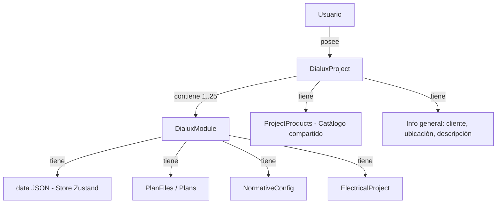
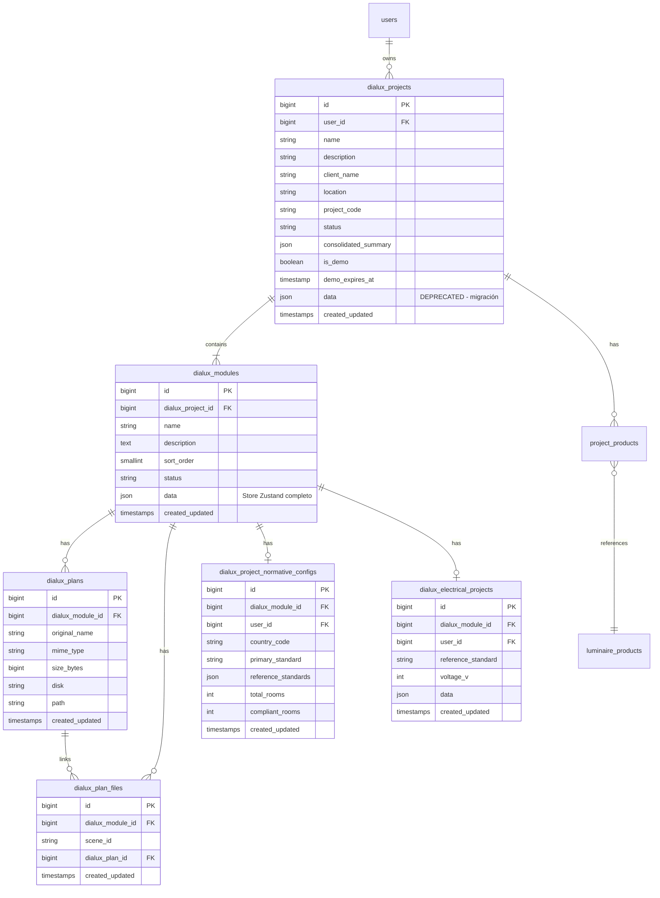
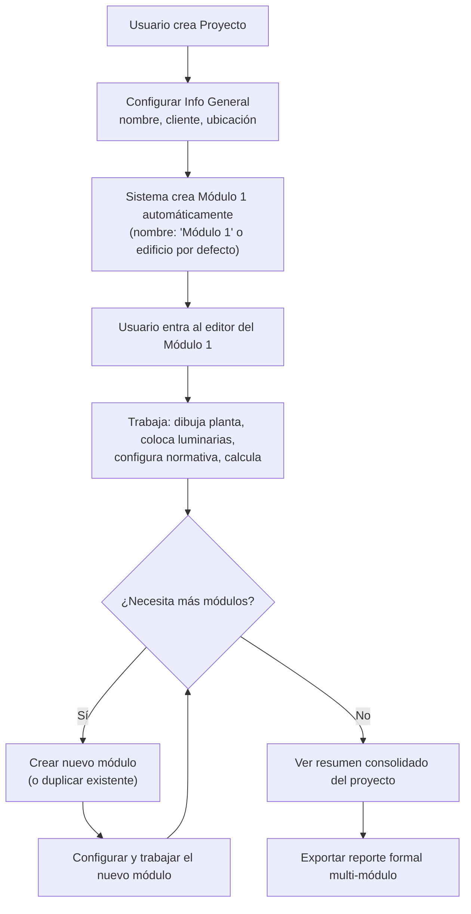

# DIALux 2.0 — Arquitectura Modular (Proyecto → Módulos)

## Contexto y Problema

El sistema DIALux actual almacena toda la información de un proyecto de iluminación en una única entidad `DialuxProject` con un campo JSON `data` que contiene el snapshot completo del store Zustand (scenes, walls, rooms, fixtures, etc.). Las tablas auxiliares (`dialux_electrical_projects`, `dialux_project_normative_configs`, `project_products`, `dialux_plan_files`) también están vinculadas directamente al proyecto.

**Limitación:** Un proyecto solo puede representar un edificio/instalación. No es posible agrupar múltiples edificios o zonas independientes bajo un mismo proyecto padre.

**Objetivo v2.0:** Introducir una capa intermedia de **Módulos** que permita que un proyecto contenga entre 1 y 25 sub-proyectos independientes, cada uno con su propia geometría, cálculos, y resultados, pero compartiendo información general del proyecto padre.

---

## Decisiones de Diseño Importantes

> [!IMPORTANT]
> ### Decisiones que requieren tu confirmación antes de implementar
>
> 1. **¿Qué representa un "módulo" en el contexto real del usuario?**
>    - Opción A: Un **edificio o bloque** dentro de un complejo (ej. "Torre A", "Torre B", "Estacionamiento")
>    - Opción B: Un **piso o zona** independiente dentro de un mismo edificio
>    - Opción C: Un **tipo de estudio** diferente del mismo espacio (ej. "Iluminación interior", "Iluminación de emergencia", "Exterior")
>    - Opción D: Flexible — el usuario decide qué significa cada módulo
>
> 2. **¿Los módulos comparten luminarias del catálogo del proyecto?**
>    - Opción A: Sí — el catálogo de productos (`luminaire_products` / `project_products`) se gestiona a nivel de proyecto y cada módulo selecciona del catálogo compartido
>    - Opción B: No — cada módulo tiene su propio catálogo independiente
>
> 3. **¿Se puede copiar un módulo entre proyectos diferentes?**
>    - Esto implica duplicar el JSON `data` completo y re-vincular plan files, normativa y datos eléctricos
>
> 4. **¿El proyecto padre puede tener un estado/status global?**
>    - Ej. "En progreso", "En revisión", "Finalizado" — derivado automáticamente del estado de sus módulos, o controlado manualmente
>
> 5. **¿Qué datos se consolidan a nivel proyecto?**
>    - ¿Reporte PDF unificado de todos los módulos?
>    - ¿Resumen de potencia total instalada, cantidad total de luminarias, cumplimiento normativo global?

---

## 1. Modelo de Dominio

### Jerarquía Conceptual



### Entidades Principales

| Entidad | Nivel | Descripción |
|---------|-------|-------------|
| `DialuxProject` | Padre | Información general: nombre, cliente, ubicación, configuración global |
| `DialuxModule` | Hijo | **Nueva entidad**. Contiene el `data` JSON (scenes, rooms, fixtures), nombre del módulo, orden, estado |
| `DialuxPlan` / `DialuxPlanFile` | Módulo | Planos de planta asociados a cada módulo |
| `DialuxNormativeConfig` | Módulo | Configuración normativa por módulo |
| `DialuxElectricalProject` | Módulo | Proyecto eléctrico por módulo |
| `ProjectProducts` | Proyecto | Catálogo de luminarias compartido entre módulos |
| `LuminaireProduct` | Global/Usuario | Catálogo de productos de luminarias |
| `OutletProduct` | Global/Usuario | Catálogo de productos de tomacorrientes |

### Distribución de Información

**A nivel de Proyecto (compartido):**
- Nombre del proyecto
- Cliente / empresa
- Ubicación geográfica
- Catálogo de productos asignados
- Configuración de demo / expiración
- Metadata general

**A nivel de Módulo (independiente):**
- Nombre del módulo (ej. "Edificio A", "Sector Oficinas")
- Datos geométricos y de iluminación (`data` JSON — el store Zustand completo)
- Planos de planta (plan files)
- Configuración normativa
- Proyecto eléctrico
- Estado del módulo
- Orden de visualización (`sort_order`)
- Resultados de cálculo

---

## 2. Arquitectura de Base de Datos

### 2.1 Tabla `dialux_projects` (modificada)

Se añaden campos de información general que antes viajaban dentro del JSON `data`:

```php
Schema::table('dialux_projects', function (Blueprint $table) {
    // Nuevos campos de proyecto padre
    $table->string('description')->nullable()->after('name');
    $table->string('client_name')->nullable()->after('description');
    $table->string('location')->nullable()->after('client_name');
    $table->string('project_code')->nullable()->after('location');
    $table->string('status', 32)->default('draft')->after('project_code');
    // Métricas consolidadas (cache calculado)
    $table->json('consolidated_summary')->nullable()->after('status');
});
```

> [!NOTE]
> El campo `data` JSON **se mantiene** temporalmente para compatibilidad con v1 durante la migración, pero dejará de usarse a favor del `data` en cada módulo.

### 2.2 Nueva Tabla `dialux_modules`

```php
Schema::create('dialux_modules', function (Blueprint $table) {
    $table->id();
    $table->foreignId('dialux_project_id')
        ->constrained('dialux_projects')
        ->cascadeOnDelete();
    $table->string('name');
    $table->text('description')->nullable();
    $table->unsignedSmallInteger('sort_order')->default(0);
    $table->string('status', 32)->default('draft');
    // Snapshot completo del store Zustand (scenes, walls, rooms, fixtures)
    $table->json('data')->nullable();
    $table->timestamps();

    $table->index(['dialux_project_id', 'sort_order']);
});
```

### 2.3 Tablas Dependientes — Re-vinculación

Las tablas que hoy referencian `dialux_project_id` (como string UUID del store) necesitan migrar a referenciar `dialux_module_id`:

| Tabla actual | FK actual | FK nueva | Estrategia |
|---|---|---|---|
| `dialux_plan_files` | `dialux_project_id` (FK int) | `dialux_module_id` (FK int) | Migración: añadir columna, poblar, drop vieja |
| `dialux_plans` | `dialux_project_id` (FK int) | `dialux_module_id` (FK int) | Migración: añadir columna, poblar, drop vieja |
| `dialux_project_normative_configs` | `dialux_project_id` (string) | `dialux_module_id` (FK int) | Migración: match por project, vincular al módulo |
| `dialux_electrical_projects` | `dialux_project_id` (string) | `dialux_module_id` (FK int) | Migración: match por project, vincular al módulo |
| `project_products` | `project_id` (string) | Mantiene `dialux_project_id` (FK int) | Se mantiene a nivel de proyecto |

### 2.4 Diagrama ER



### 2.5 Integridad Referencial

| Acción | Comportamiento |
|---|---|
| Eliminar Proyecto | `CASCADE` → elimina todos los módulos y sus datos dependientes |
| Eliminar Módulo | `CASCADE` → elimina plans, plan_files, normative_config, electrical_project del módulo |
| Proyecto sin módulos | Temporalmente permitido durante creación. La UI debe forzar crear al menos 1 módulo antes de editar |
| Máximo de módulos | Validado por `FormRequest`: max 25 módulos por proyecto |

---

## 3. Modelo de Datos — Entidades Eloquent

### 3.1 `DialuxProject` (modificado)

```php
// app/Models/Dialux/DialuxProject.php
class DialuxProject extends Model
{
    protected $fillable = [
        'user_id', 'name', 'description', 'client_name',
        'location', 'project_code', 'status',
        'consolidated_summary', 'data',
        'is_demo', 'demo_expires_at',
    ];

    protected function casts(): array
    {
        return [
            'data' => 'array',
            'consolidated_summary' => 'array',
            'is_demo' => 'boolean',
            'demo_expires_at' => 'datetime',
        ];
    }

    public function user(): BelongsTo { ... }
    public function modules(): HasMany
    {
        return $this->hasMany(DialuxModule::class)
            ->orderBy('sort_order');
    }
    public function products(): HasMany { ... }
}
```

### 3.2 `DialuxModule` (nueva)

```php
// app/Models/Dialux/DialuxModule.php
class DialuxModule extends Model
{
    protected $fillable = [
        'dialux_project_id', 'name', 'description',
        'sort_order', 'status', 'data',
    ];

    protected function casts(): array
    {
        return [
            'data' => 'array',
            'sort_order' => 'integer',
        ];
    }

    public function project(): BelongsTo
    {
        return $this->belongsTo(DialuxProject::class, 'dialux_project_id');
    }

    public function plans(): HasMany
    {
        return $this->hasMany(DialuxPlan::class);
    }

    public function planFiles(): HasMany
    {
        return $this->hasMany(DialuxPlanFile::class);
    }

    public function normativeConfig(): HasOne
    {
        return $this->hasOne(DialuxNormativeConfig::class);
    }

    public function electricalProject(): HasOne
    {
        return $this->hasOne(DialuxElectricalProject::class);
    }
}
```

---

## 4. Backend y API — Endpoints

### 4.1 Rutas Propuestas

```
Prefijo: /dialux

# ─── Proyectos ─────────────────────────────────────
GET    /dialux                                    → index (lista proyectos)
POST   /dialux                                    → store (crear proyecto)
GET    /dialux/{project}                           → show (vista proyecto con módulos)
PATCH  /dialux/{project}                           → update (editar info general)
DELETE /dialux/{project}                           → destroy

# ─── Módulos de un Proyecto ─────────────────────────
GET    /dialux/{project}/modules                   → modules.index
POST   /dialux/{project}/modules                   → modules.store
GET    /dialux/{project}/modules/{module}           → modules.show (editor del módulo)
PATCH  /dialux/{project}/modules/{module}           → modules.update (autosave data)
DELETE /dialux/{project}/modules/{module}           → modules.destroy
POST   /dialux/{project}/modules/{module}/duplicate → modules.duplicate
PATCH  /dialux/{project}/modules/reorder            → modules.reorder

# ─── Plan Files (ahora por módulo) ──────────────────
POST   /dialux/{project}/modules/{module}/plans/{sceneId}      → plans.store
POST   /dialux/{project}/modules/{module}/plans/{sceneId}/link  → plans.link
GET    /dialux/{project}/modules/{module}/plans/{sceneId}       → plans.show
DELETE /dialux/{project}/modules/{module}/plans/{sceneId}       → plans.destroy

# ─── Normativa (ahora por módulo) ───────────────────
GET    /dialux/normative/requirements              → normative.requirements
GET    /dialux/{project}/modules/{module}/normative → normative.show
POST   /dialux/{project}/modules/{module}/normative → normative.store
PATCH  /dialux/{project}/modules/{module}/normative/compliance → normative.compliance.update

# ─── Eléctrico (ahora por módulo) ───────────────────
POST   /dialux/{project}/modules/{module}/electrical          → electrical.store
GET    /dialux/{project}/modules/{module}/electrical          → electrical.show
GET    /dialux/{project}/modules/{module}/electrico           → electrical.workspace

# ─── Productos (a nivel proyecto — compartido) ──────
GET    /dialux/products                            → products.index
POST   /dialux/products/import                     → products.import
...etc (se mantiene igual)

# ─── Consolidación ──────────────────────────────────
GET    /dialux/{project}/summary                   → project.summary
POST   /dialux/{project}/export-formal             → project.formalExport (multi-módulo)
```

### 4.2 Controladores Nuevos

| Controlador | Responsabilidad |
|---|---|
| [`ProjectController`](file:///c:/laragon/www/proyectopcl/app/Http/Controllers/Dialux/ProjectController.php) | CRUD de proyecto (modificado para incluir módulos) |
| `ModuleController` (NUEVO) | CRUD, duplicación, reordenamiento de módulos |
| Controladores existentes | Migrados para recibir `dialux_module_id` en lugar de `dialux_project_id` |

### 4.3 Form Requests

| Request | Validaciones clave |
|---|---|
| `StoreDialuxModuleRequest` | `name` required, max:255. Validar que el proyecto no tenga ya 25 módulos |
| `UpdateDialuxModuleRequest` | `name` optional, `data` optional (JSON), `status` optional |
| `ReorderDialuxModulesRequest` | `modules` required array, cada item tiene `id` y `sort_order` |
| `DuplicateDialuxModuleRequest` | `name` optional (default: "{original} (copia)") |

---

## 5. Flujo de Usuario

### 5.1 Flujo de Creación



### 5.2 Flujo de Navegación

```
/dialux                          → Lista de proyectos (cards)
/dialux/{id}                     → Vista de proyecto con sidebar de módulos
/dialux/{id}/modules/{moduleId}  → Editor del módulo (canvas 2D/3D)
```

---

## 6. Propuesta de Interfaz

### 6.1 Vista del Proyecto — Layout con Sidebar de Módulos

La opción recomendada es un **sidebar colapsable de módulos** a la izquierda del editor, porque:
- Escala bien hasta 25 módulos (scroll vertical)
- Permite ver el módulo activo mientras se trabaja
- Consistente con el patrón "explorador de archivos" familiar
- Se puede colapsar para maximizar el canvas

```
┌─────────────────────────────────────────────────────────┐
│  DIAlux > Proyecto Centro Comercial San Isidro          │
├──────────┬──────────────────────────────────────────────┤
│ MÓDULOS  │                                              │
│ ┌──────┐ │            EDITOR 2D / 3D                    │
│ │ ★ M1 │ │         (módulo seleccionado)                │
│ │Edif A│ │                                              │
│ └──────┘ │     ┌─────────────────────────────┐          │
│ ┌──────┐ │     │                             │          │
│ │  M2  │ │     │    Canvas del módulo activo  │          │
│ │Edif B│ │     │    (scenes, rooms, fixtures) │          │
│ └──────┘ │     │                             │          │
│ ┌──────┐ │     └─────────────────────────────┘          │
│ │  M3  │ │                                              │
│ │Parking│ │                                             │
│ └──────┘ │                                              │
│          │                                              │
│ [+ Nuevo]│    Toolbar / Sidebar derecho (propiedades)    │
│ [Resumen]│                                              │
├──────────┴──────────────────────────────────────────────┤
│  Status Bar                                             │
└─────────────────────────────────────────────────────────┘
```

### 6.2 Cada Módulo en el Sidebar

```
┌────────────────────┐
│  📦 Edificio A     │  ← nombre editable
│  ● En progreso     │  ← estado (badge de color)
│  5 ambientes       │  ← resumen rápido
│  ⋮                 │  ← menú contextual (renombrar, duplicar, eliminar)
└────────────────────┘
```

### 6.3 Menú Contextual de Módulo

- Renombrar
- Duplicar
- Mover arriba / abajo
- Ver resumen
- Eliminar (con confirmación)

### 6.4 Vista de Resumen del Proyecto

Página consolidada con cards para cada módulo mostrando:
- Total de ambientes
- Total de luminarias
- Potencia instalada
- Estado normativo (cumple / no cumple)
- Acceso rápido al editor de cada módulo

---

## 7. Estrategia de Migración (v1 → v2)

### Principio Fundamental

> Cada proyecto v1 existente se convierte automáticamente en un proyecto v2 con **un único módulo** que hereda todos los datos del proyecto original.

### 7.1 Migración de Datos

```php
// Migración: 2026_xx_xx_create_dialux_modules_and_migrate.php

// 1. Crear tabla dialux_modules
Schema::create('dialux_modules', function (Blueprint $table) {
    // ... (esquema descrito arriba)
});

// 2. Para cada proyecto existente, crear un módulo con sus datos
DB::table('dialux_projects')->orderBy('id')->each(function ($project) {
    $moduleId = DB::table('dialux_modules')->insertGetId([
        'dialux_project_id' => $project->id,
        'name' => 'Módulo Principal',
        'sort_order' => 0,
        'status' => 'draft',
        'data' => $project->data,  // Mover el JSON al módulo
        'created_at' => $project->created_at,
        'updated_at' => $project->updated_at,
    ]);

    // 3. Re-vincular plan_files al módulo
    DB::table('dialux_plan_files')
        ->where('dialux_project_id', $project->id)
        ->update(['dialux_module_id' => $moduleId]);

    // 4. Re-vincular plans al módulo
    DB::table('dialux_plans')
        ->where('dialux_project_id', $project->id)
        ->update(['dialux_module_id' => $moduleId]);

    // 5. Re-vincular normative configs (usa string UUID como ID)
    DB::table('dialux_project_normative_configs')
        ->where('dialux_project_id', (string) $project->id)
        ->update(['dialux_module_id' => $moduleId]);

    // 6. Re-vincular electrical projects (usa string UUID como ID)
    DB::table('dialux_electrical_projects')
        ->where('dialux_project_id', (string) $project->id)
        ->update(['dialux_module_id' => $moduleId]);
});
```

### 7.2 Pasos de Migración (reversible)

1. **Añadir columnas** `dialux_module_id` (nullable) a tablas dependientes
2. **Crear** tabla `dialux_modules`
3. **Poblar** módulos desde proyectos existentes
4. **Actualizar** FK en tablas dependientes
5. **Drop** columnas `dialux_project_id` de tablas dependientes (solo cuando se confirme que v2 funciona)
6. **Nullificar** el campo `data` en `dialux_projects` (mantener backup temporal)

### 7.3 Compatibilidad

- La columna `data` en `dialux_projects` se mantiene como backup durante la transición
- El frontend debe poder trabajar con proyectos que tengan un solo módulo de forma transparente
- Si un proyecto tiene un único módulo, la UI puede omitir el sidebar de módulos y mostrarlo directamente

---

## 8. Reglas de Negocio

| Regla | Decisión |
|---|---|
| Proyecto sin módulos | Permitido temporalmente durante creación. Al crear un proyecto, se genera automáticamente un "Módulo 1" |
| Máximo de módulos | 25 por proyecto (validado en `FormRequest`) |
| Identificación de módulos | `id` auto-incremental + `sort_order` para el orden visual. El nombre es libre |
| Duplicación de módulo | Sí — copia `name` + " (copia)", clona `data` JSON, NO clona plan_files ni normative/electrical (empiezan vacíos) |
| Copiar módulo entre proyectos | v2.0 inicial: No. Puede añadirse en v2.1 como feature |
| Eliminar último módulo | Bloqueado — siempre debe haber mínimo 1 módulo |
| Eliminar proyecto | Cascade delete de todos los módulos y datos dependientes. Confirmación doble en UI |
| Información compartida | Catálogo de productos (`project_products`), datos del cliente, ubicación, configuración de demo |
| Estados del módulo | `draft` → `in_progress` → `completed` → `archived` |
| Estado del proyecto | Derivado automáticamente: `draft` si todos draft, `in_progress` si alguno en progreso, `completed` si todos completed |

---

## 9. Rendimiento y Escalabilidad

### 9.1 Carga Diferida de Módulos

- **Lista de módulos**: Solo `id`, `name`, `sort_order`, `status` + métricas básicas (sin `data`)
- **Módulo activo**: Se carga `data` JSON solo del módulo seleccionado
- **Cambio de módulo**: El frontend descarta el store del módulo anterior y siembra el nuevo (o mantiene en memoria si hay suficiente RAM)

### 9.2 Guardado por Módulo

```typescript
// El autosave actual (useDialuxProjectSync) se modifica para guardar por módulo:
// PATCH /dialux/{project}/modules/{module}  body: { data: {...} }

// Solo se envía el JSON del módulo activo, no de todos
```

### 9.3 Consultas Optimizadas

```php
// ❌ No cargar data de todos los módulos al listar
DialuxModule::where('dialux_project_id', $projectId)
    ->select(['id', 'name', 'sort_order', 'status', 'updated_at'])
    ->get();

// ✅ Cargar data solo del módulo activo
DialuxModule::findOrFail($moduleId);
```

### 9.4 Consolidación de Resultados

- Se calcula bajo demanda (`GET /dialux/{project}/summary`)
- Se puede cachear en `consolidated_summary` JSON del proyecto
- Se invalida cuando cualquier módulo se modifica (event/observer)

### 9.5 Procesamiento Independiente

- Cada módulo se calcula de forma independiente (ya es así — el motor de cálculo opera sobre un `Project` JSON)
- La consolidación es una agregación simple de resultados

---

## 10. Impacto en el Frontend

### 10.1 Store Zustand

El store actual ya trabaja con un `Project` que contiene `scenes[]`. La adaptación principal es:

- **Nuevo concepto**: `ModuleId` activo dentro de un `ProjectId`
- **Autosave**: Cambia de `PATCH /dialux/{project}` a `PATCH /dialux/{project}/modules/{module}`
- **Inicialización**: `Show.tsx` recibe `module.data` en vez de `project.data`

### 10.2 Nuevas Páginas Inertia

| Página | Ruta | Descripción |
|---|---|---|
| `dialux/Index.tsx` | `/dialux` | Se mantiene — lista de proyectos |
| `dialux/Project.tsx` (NUEVA) | `/dialux/{project}` | Vista del proyecto con sidebar de módulos |
| `dialux/Module.tsx` (NUEVA o renombrada de Show.tsx) | `/dialux/{project}/modules/{module}` | Editor de un módulo (actual Show.tsx adaptado) |

### 10.3 Nuevos Componentes

| Componente | Ubicación |
|---|---|
| `ModuleSidebar.tsx` | Panel lateral con lista de módulos |
| `ModuleCard.tsx` | Card de módulo en el sidebar |
| `ModuleContextMenu.tsx` | Menú contextual (duplicar, renombrar, eliminar) |
| `ProjectSummaryView.tsx` | Vista consolidada de todos los módulos |
| `CreateModuleDialog.tsx` | Dialog para crear nuevo módulo |

---

## 11. Riesgos Técnicos

| Riesgo | Impacto | Mitigación |
|---|---|---|
| **Migración de datos corrupta** | Alto — pérdida de proyectos existentes | Migración reversible + backup de tabla `data` antes de nullificar |
| **JSON `data` muy grande** | Medio — módulos con 20+ pisos y cientos de luminarias | Comprimir JSON (gzip) o paginación de scenes por separado |
| **Autosave race conditions** | Medio — si el usuario cambia de módulo rápido | Cancelar autosave pendiente al cambiar módulo, usar `AbortController` |
| **Tablas auxiliares con FK string** | Medio — `normative_configs` y `electrical_projects` usan `dialux_project_id` como string | Migración cuidadosa para re-vincular |
| **Rendimiento de PDF multi-módulo** | Medio — reportes de 25 módulos pueden ser enormes | Generar PDF por módulo y fusionar con FPDI (patrón existente en [`Editor2DController`](file:///c:/laragon/www/proyectopcl/app/Http/Controllers/Dialux/Editor2DController.php)) |
| **Complejidad de UI** | Bajo — 25 módulos deben ser manejables | Sidebar con scroll, búsqueda/filtro, colapsar |
| **Cuota de proyectos** | Bajo — ¿los módulos cuentan como proyectos para la cuota? | Definir: cuota por proyectos, no por módulos. Un proyecto con 25 módulos = 1 proyecto |

---

## 12. Roadmap de Implementación

### Fase 1 — Modelo de Datos (3-4 días)
- [x] Crear migración para tabla `dialux_modules`
- [x] Crear modelo `DialuxModule` con relaciones
- [x] Añadir relación `modules()` a `DialuxProject`
- [x] Añadir campos nuevos a `dialux_projects` (description, client, status)
- [x] Crear `DialuxProjectFactory` y `DialuxModuleFactory` actualizados
- [x] Tests unitarios de relaciones

### Fase 2 — CRUD de Módulos (3-4 días)
- [x] `ModuleController` con index/store/show/update/destroy
- [x] `StoreDialuxModuleRequest`, `UpdateDialuxModuleRequest`
- [x] Endpoint de duplicación (`POST .../duplicate`)
- [x] Endpoint de reordenamiento (`PATCH .../reorder`)
- [x] Registrar rutas en `web.php`
- [x] Tests de feature para cada endpoint

> [!NOTE]
> Durante la transición, estos endpoints viven bajo `/dialux-v2` y usan nombres
> `dialux-v2.*`. El editor y las rutas `/dialux` de v1 permanecen sin cambios.

### Fase 3 — Adaptación de Lógica Existente (4-5 días)
- [x] Migrar `PlanFileController` para trabajar con `dialux_module_id`
- [x] Migrar `NormativeConfigController` para módulo
- [x] Migrar `ElectricalProjectController` para módulo
- [x] Migrar `Editor2DController` (exportación formal) para módulo
- [x] Actualizar trait `AuthorizesDialuxProject` → añadir `AuthorizesDialuxModule`
- [x] Actualizar `ProjectQuotaService` (módulos no cuentan como proyectos)
- [x] Tests de feature actualizados

> [!NOTE]
> La cuota ya se calculaba contando filas de `dialux_projects`; se conservó esa
> implementación y se añadió una regresión que crea 25 módulos sin consumir
> cupos adicionales. Las columnas y controladores v1 permanecen disponibles.

### Fase 4 — Interfaz de Navegación (5-6 días)
- [x] Nueva página `dialux/v2/Project.tsx` — dashboard del proyecto con sidebar
- [x] Componente `ModuleSidebar.tsx`
- [x] Componente `ModuleCard.tsx` con menú contextual
- [x] Adaptar `Show.tsx` → `dialux/v2/Module.tsx` para editor por módulo
- [x] Adaptar `useDialuxProjectSync` → `useDialuxModuleSync` (autosave por módulo)
- [x] Actualizar breadcrumbs: `DIALux v2 > Proyecto > Módulo`
- [x] Adaptar store Zustand para recibir `moduleId`

> [!NOTE]
> La interfaz v2 vive en `resources/js/pages/dialux/v2` y `/dialux-v2`.
> `dialux/Show.tsx`, su autosave y las rutas `/dialux` de v1 no se modifican.

### Fase 5 — Migración de Proyectos Existentes (2-3 días)
- [ ] Migración que convierte cada proyecto v1 en proyecto + 1 módulo
- [ ] Re-vincular plan_files, plans, normative_configs, electrical_projects
- [ ] Añadir `dialux_module_id` a tablas dependientes
- [ ] Script de verificación post-migración
- [ ] Tests de migración

### Fase 6 — Consolidación y Reporte (3-4 días)
- [ ] Endpoint `GET /dialux/{project}/summary`
- [ ] Componente `ProjectSummaryView.tsx` con cards de resumen por módulo
- [ ] Adaptar exportación formal PDF para multi-módulo
- [ ] Cache de `consolidated_summary` con invalidación

### Fase 7 — Pruebas de Rendimiento (2-3 días)
- [ ] Test con proyecto de 25 módulos, cada uno con 10+ scenes
- [ ] Benchmark de carga diferida vs carga completa
- [ ] Benchmark de autosave con módulos grandes
- [ ] Benchmark de generación PDF multi-módulo
- [ ] Optimización de queries N+1

### Fase 8 — Despliegue de DIALux 2.0 (2-3 días)
- [ ] Revisión final de migración en staging
- [ ] Ejecutar migración en producción
- [ ] Monitoreo de errores post-despliegue
- [ ] Documentación de cambios para usuarios
- [ ] Cleanup: eliminar campo `data` de `dialux_projects` una vez confirmada estabilidad

---

## Resumen de Archivos a Crear/Modificar

### Nuevos Archivos
| Archivo | Tipo |
|---|---|
| `app/Models/Dialux/DialuxModule.php` | Modelo |
| `app/Http/Controllers/Dialux/ModuleController.php` | Controlador |
| `app/Http/Requests/Dialux/StoreDialuxModuleRequest.php` | Form Request |
| `app/Http/Requests/Dialux/UpdateDialuxModuleRequest.php` | Form Request |
| `app/Http/Requests/Dialux/ReorderDialuxModulesRequest.php` | Form Request |
| `app/Concerns/AuthorizesDialuxModule.php` | Trait |
| `database/migrations/xxxx_create_dialux_modules_table.php` | Migración |
| `database/migrations/xxxx_migrate_projects_to_modules.php` | Migración de datos |
| `database/factories/Dialux/DialuxModuleFactory.php` | Factory |
| `resources/js/pages/dialux/Project.tsx` | Página Inertia |
| `resources/js/pages/dialux/components/ModuleSidebar.tsx` | Componente |
| `resources/js/pages/dialux/components/ModuleCard.tsx` | Componente |
| `resources/js/pages/dialux/components/CreateModuleDialog.tsx` | Componente |
| `resources/js/pages/dialux/components/ProjectSummaryView.tsx` | Componente |
| `resources/js/pages/dialux/hooks/useDialuxModuleSync.ts` | Hook |

### Archivos a Modificar
| Archivo | Cambio |
|---|---|
| [`DialuxProject.php`](file:///c:/laragon/www/proyectopcl/app/Models/Dialux/DialuxProject.php) | Añadir relación `modules()`, nuevos fillable |
| [`DialuxPlan.php`](file:///c:/laragon/www/proyectopcl/app/Models/Dialux/DialuxPlan.php) | FK cambia a `dialux_module_id` |
| [`DialuxPlanFile.php`](file:///c:/laragon/www/proyectopcl/app/Models/Dialux/DialuxPlanFile.php) | FK cambia a `dialux_module_id` |
| [`DialuxNormativeConfig.php`](file:///c:/laragon/www/proyectopcl/app/Models/Dialux/DialuxNormativeConfig.php) | FK cambia a `dialux_module_id` |
| [`DialuxElectricalProject.php`](file:///c:/laragon/www/proyectopcl/app/Models/Dialux/DialuxElectricalProject.php) | FK cambia a `dialux_module_id` |
| [`ProjectController.php`](file:///c:/laragon/www/proyectopcl/app/Http/Controllers/Dialux/ProjectController.php) | Adaptar `show()` para incluir módulos |
| [`PlanFileController.php`](file:///c:/laragon/www/proyectopcl/app/Http/Controllers/Dialux/PlanFileController.php) | Recibir `module` en lugar de `project` |
| [`NormativeConfigController.php`](file:///c:/laragon/www/proyectopcl/app/Http/Controllers/Dialux/NormativeConfigController.php) | Recibir `module` en lugar de `project` |
| [`ElectricalProjectController.php`](file:///c:/laragon/www/proyectopcl/app/Http/Controllers/Dialux/ElectricalProjectController.php) | Recibir `module` en lugar de `project` |
| [`Editor2DController.php`](file:///c:/laragon/www/proyectopcl/app/Http/Controllers/Dialux/Editor2DController.php) | Adaptar exportación para módulos |
| [`routes/web.php`](file:///c:/laragon/www/proyectopcl/routes/web.php) | Nuevas rutas de módulos |
| [`Show.tsx`](file:///c:/laragon/www/proyectopcl/resources/js/pages/dialux/Show.tsx) | Renombrar a Module.tsx, adaptar props |
| [`Index.tsx`](file:///c:/laragon/www/proyectopcl/resources/js/pages/dialux/Index.tsx) | Mostrar count de módulos por proyecto |
| [`useDialuxProjectSync`](file:///c:/laragon/www/proyectopcl/resources/js/pages/dialux/hooks) | Adaptar autosave para módulo |

---

## Estimación Total

| Fase | Duración estimada |
|---|---|
| Fase 1: Modelo de datos | 3-4 días |
| Fase 2: CRUD de módulos | 3-4 días |
| Fase 3: Adaptación lógica existente | 4-5 días |
| Fase 4: Interfaz de navegación | 5-6 días |
| Fase 5: Migración datos existentes | 2-3 días |
| Fase 6: Consolidación y reportes | 3-4 días |
| Fase 7: Pruebas de rendimiento | 2-3 días |
| Fase 8: Despliegue | 2-3 días |
| **Total estimado** | **24-32 días laborables** |
